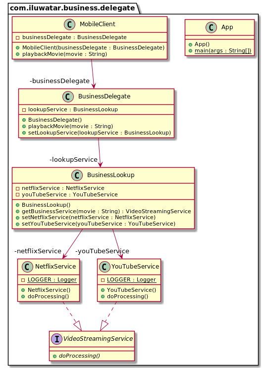

## 意图

业务委托模式在表示层和业务层之间添加了一个抽象层。 通过使用该模式，我们获得了各层之间的松散耦合，并封装了有关如何定位，连接到组成应用程序的业务对象以及与之交互的逻辑。

## 解释

真实世界例子

> 手机应用程序承诺将现有的任何电影流式传输到您的手机。它捕获用户的搜索字符串，并将其传递给业务委托层。业务委托层选择最合适的视频流服务，然后从那里播放视频。

通俗的说

> 业务委托模式在表示层和业务层之间添加了一个抽象层。 

维基百科说

> 业务委托是一种Java EE设计模式。 该模式旨在减少业务服务与连接的表示层之间的耦合，并隐藏服务的实现细节（包括EJB体系结构的查找和可访问性）。 业务代表充当适配器，以从表示层调用业务对象。

**程序示例**

首先，我们有视频流服务的抽象类和一些它的实现。

```java
public interface VideoStreamingService {
  void doProcessing();
}

@Slf4j
public class NetflixService implements VideoStreamingService {
  @Override
  public void doProcessing() {
    LOGGER.info("NetflixService is now processing");
  }
}

@Slf4j
public class YouTubeService implements VideoStreamingService {
  @Override
  public void doProcessing() {
    LOGGER.info("YouTubeService is now processing");
  }
}
```

然后我们有一个查找服务来决定我们使用哪个视频流服务。

```java
@Setter
public class BusinessLookup {

  private NetflixService netflixService;
  private YouTubeService youTubeService;

  public VideoStreamingService getBusinessService(String movie) {
    if (movie.toLowerCase(Locale.ROOT).contains("die hard")) {
      return netflixService;
    } else {
      return youTubeService;
    }
  }
}
```

业务委托类使用业务查找服务将电影播放请求路由到合适的视频流服务。

```java
@Setter
public class BusinessDelegate {

  private BusinessLookup lookupService;

  public void playbackMovie(String movie) {
    VideoStreamingService videoStreamingService = lookupService.getBusinessService(movie);
    videoStreamingService.doProcessing();
  }
}
```

移动客户端利用业务委托来调用业务层。

```java
public class MobileClient {

  private final BusinessDelegate businessDelegate;

  public MobileClient(BusinessDelegate businessDelegate) {
    this.businessDelegate = businessDelegate;
  }

  public void playbackMovie(String movie) {
    businessDelegate.playbackMovie(movie);
  }
}
```

最后我们展示完整示例。

```java
  public static void main(String[] args) {

    // prepare the objects
    var businessDelegate = new BusinessDelegate();
    var businessLookup = new BusinessLookup();
    businessLookup.setNetflixService(new NetflixService());
    businessLookup.setYouTubeService(new YouTubeService());
    businessDelegate.setLookupService(businessLookup);

    // create the client and use the business delegate
    var client = new MobileClient(businessDelegate);
    client.playbackMovie("Die Hard 2");
    client.playbackMovie("Maradona: The Greatest Ever");
  }
```

这是控制台的输出。

```
21:15:33.790 [main] INFO com.iluwatar.business.delegate.NetflixService - NetflixService is now processing
21:15:33.794 [main] INFO com.iluwatar.business.delegate.YouTubeService - YouTubeService is now processing
```

## 类图



## 相关模式

* [服务定位器模式](https://java-design-patterns.com/patterns/service-locator/)

## 适用性

使用业务委托模式当

* 你希望表示层和业务层之间的松散耦合
* 你想编排对多个业务服务的调用
* 你希望封装查找服务和服务调用

## 教程

* [Business Delegate Pattern at TutorialsPoint](https://www.tutorialspoint.com/design_pattern/business_delegate_pattern.htm)

## 鸣谢

* [J2EE Design Patterns](https://www.amazon.com/gp/product/0596004273/ref=as_li_tl?ie=UTF8&camp=1789&creative=9325&creativeASIN=0596004273&linkCode=as2&tag=javadesignpat-20&linkId=48d37c67fb3d845b802fa9b619ad8f31)
* [Core J2EE Patterns: Best Practices and Design Strategies](https://www.amazon.com/gp/product/0130648841/ref=as_li_qf_asin_il_tl?ie=UTF8&tag=javadesignpat-20&creative=9325&linkCode=as2&creativeASIN=0130648841&linkId=a0100de2b28c71ede8db1757fb2b5947)
