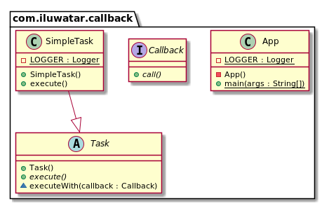

## 目的
回调是一部分被当为参数来传递给其他代码的可执行代码，接收方的代码可以在一些方便的时候来调用它。

## 解释

真实世界例子

> 我们需要被通知当执行的任务结束时。我们为调用者传递一个回调方法然后等它调用通知我们。

通俗的讲


> 回调是一个用来传递给调用者的方法，它将在定义的时刻被调用。 

维基百科说

> 在计算机编程中，回调又被称为“稍后调用”函数，可以是任何可执行的代码用来作为参数传递给其他代码；其它代码被期望在给定时间内调用回调方法。

**编程示例**

回调是一个只有一个方法的简单接口。

```java
public interface Callback {

  void call();
}
```

下面我们定义一个任务它将在任务执行完成后执行回调。

```java
public abstract class Task {

  final void executeWith(Callback callback) {
    execute();
    Optional.ofNullable(callback).ifPresent(Callback::call);
  }

  public abstract void execute();
}

public final class SimpleTask extends Task {

  private static final Logger LOGGER = getLogger(SimpleTask.class);

  @Override
  public void execute() {
    LOGGER.info("Perform some important activity and after call the callback method.");
  }
}
```

最后这里是我们如何执行一个任务然后接收一个回调当它完成时。

```java
    var task = new SimpleTask();
    task.executeWith(() -> LOGGER.info("I'm done now."));
```
## 类图


## 适用性
使用回调模式当
* 当一些同步或异步架构动作必须在一些定义好的活动执行后执行时。

## Java例子

* [CyclicBarrier](http://docs.oracle.com/javase/7/docs/api/java/util/concurrent/CyclicBarrier.html#CyclicBarrier%28int,%20java.lang.Runnable%29) 构造函数可以接受回调，该回调将在每次障碍被触发时触发。
