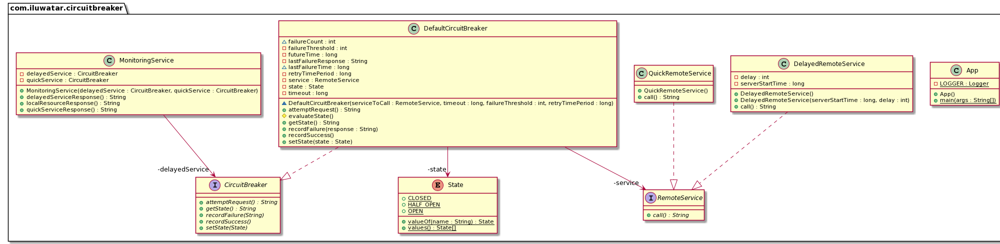

## 意图

以这样一种方式处理昂贵的远程服务调用，即单个服务/组件的故障不会导致整个应用程序宕机，我们可以尽快重新连接到服务。

## 解释

真实世界例子

> 想象一个 Web 应用程序，它同时具有用于获取数据的本地文件/图像和远程服务。 这些远程服务有时可能健康且响应迅速，或者由于各种原因可能在某 个时间点变得缓慢和无响应。因此，如果其中一个远程服务缓慢或未成功响应，我们的应用程序将尝试使用多个线程/进程从远程服务获取响应，很快它们都会挂起（也称为 [线程饥饿][thread starvation](https://en.wikipedia.org/wiki/Starvation_(computer_science)))导致我们的整个 Web 应用程序崩溃。我们应该能够检测到这种情况并向用户显示适当的消息，以便他/她可以探索不受远程服务故障影响的应用程序的其他部分。 同时，其他正常工作的服务应保持正常运行，不受此故障的影响。
>

通俗地说

> 断路器允许优雅地处理失败的远程服务。当我们应用程序的所有部分彼此高度解耦时，它特别有用，一个组件的故障并不意味着其他部分将停止工作。

维基百科说

> 断路器是现代软件开发中使用的一种设计模式。 它用于检测故障并封装防止故障不断重复发生、维护期间、临时外部系统故障或意外系统困难的逻辑。

## 程序示例

So, how does this all come together? With the above example in mind we will imitate the 
functionality in a simple example. A monitoring service mimics the web app and makes both local and 
remote calls.

那么，这一切是如何结合在一起的呢？ 记住上面的例子，我们将在一个简单的例子中模仿这个功能。 监控服务模仿 Web 应用程序并进行本地和远程调用。

服务架构如下：


在代码方面，最终用户应用程序是：

```java
@Slf4j
public class App {

  private static final Logger LOGGER = LoggerFactory.getLogger(App.class);

  /**
   * Program entry point.
   *
   * @param args command line args
   */
  public static void main(String[] args) {

    var serverStartTime = System.nanoTime();

    var delayedService = new DelayedRemoteService(serverStartTime, 5);
    var delayedServiceCircuitBreaker = new DefaultCircuitBreaker(delayedService, 3000, 2,
        2000 * 1000 * 1000);

    var quickService = new QuickRemoteService();
    var quickServiceCircuitBreaker = new DefaultCircuitBreaker(quickService, 3000, 2,
        2000 * 1000 * 1000);

    // 创建一个可以进行本地和远程调用的监控服务对象
    var monitoringService = new MonitoringService(delayedServiceCircuitBreaker,
        quickServiceCircuitBreaker);

    // 获取本地资源
    LOGGER.info(monitoringService.localResourceResponse());

    // 从延迟服务中获取响应 2 次，以满足失败阈值
    LOGGER.info(monitoringService.delayedServiceResponse());
    LOGGER.info(monitoringService.delayedServiceResponse());

    // 在超过故障阈值限制后获取延迟服务断路器的当前状态
    // 现在是打开状态
    LOGGER.info(delayedServiceCircuitBreaker.getState());

     // 同时，延迟服务宕机，从健康快速服务获取响应
    LOGGER.info(monitoringService.quickServiceResponse());
    LOGGER.info(quickServiceCircuitBreaker.getState());

    // 等待延迟的服务响应
    try {
      LOGGER.info("Waiting for delayed service to become responsive");
      Thread.sleep(5000);
    } catch (InterruptedException e) {
      e.printStackTrace();
    }
    // 检查延时断路器的状态，应该是HALF_OPEN
    LOGGER.info(delayedServiceCircuitBreaker.getState());

    // 从延迟服务中获取响应，现在应该是健康的
    LOGGER.info(monitoringService.delayedServiceResponse());
    // 获取成功响应后，它的状态应该是关闭。
    LOGGER.info(delayedServiceCircuitBreaker.getState());
  }
}
```

监控服务类:

```java
public class MonitoringService {

  private final CircuitBreaker delayedService;

  private final CircuitBreaker quickService;

  public MonitoringService(CircuitBreaker delayedService, CircuitBreaker quickService) {
    this.delayedService = delayedService;
    this.quickService = quickService;
  }

  // 假设：本地服务不会失败，无需将其包装在断路器逻辑中
  public String localResourceResponse() {
    return "Local Service is working";
  }

  /**
   * Fetch response from the delayed service (with some simulated startup time).
   *
   * @return response string
   */
  public String delayedServiceResponse() {
    try {
      return this.delayedService.attemptRequest();
    } catch (RemoteServiceException e) {
      return e.getMessage();
    }
  }

  /**
   * Fetches response from a healthy service without any failure.
   *
   * @return response string
   */
  public String quickServiceResponse() {
    try {
      return this.quickService.attemptRequest();
    } catch (RemoteServiceException e) {
      return e.getMessage();
    }
  }
}
```
可以看出，它直接调用获取本地资源，但它将对远程（昂贵）服务的调用包装在断路器对象中，防止故障如下：

```java
public class DefaultCircuitBreaker implements CircuitBreaker {

    private final long timeout;
    private final long retryTimePeriod;
    private final RemoteService service;
    long lastFailureTime;
    private String lastFailureResponse;
    int failureCount;
    private final int failureThreshold;
    private State state;
    private final long futureTime = 1000 * 1000 * 1000 * 1000;

    /**
     * Constructor to create an instance of Circuit Breaker.
     *
     * @param timeout          Timeout for the API request. Not necessary for this simple example
     * @param failureThreshold Number of failures we receive from the depended service before changing
     *                         state to 'OPEN'
     * @param retryTimePeriod  Time period after which a new request is made to remote service for
     *                         status check.
     */
    DefaultCircuitBreaker(RemoteService serviceToCall, long timeout, int failureThreshold,
                          long retryTimePeriod) {
        this.service = serviceToCall;
        //  我们从关闭状态开始希望一切都是正常的
        this.state = State.CLOSED;
        this.failureThreshold = failureThreshold;
        // API的超时时间.
        // 用于在超过限制时中断对远程资源的调用
        this.timeout = timeout;
        this.retryTimePeriod = retryTimePeriod;
        //An absurd amount of time in future which basically indicates the last failure never happened
        this.lastFailureTime = System.nanoTime() + futureTime;
        this.failureCount = 0;
    }

    // 重置所有
    @Override
    public void recordSuccess() {
        this.failureCount = 0;
        this.lastFailureTime = System.nanoTime() + futureTime;
        this.state = State.CLOSED;
    }

    @Override
    public void recordFailure(String response) {
        failureCount = failureCount + 1;
        this.lastFailureTime = System.nanoTime();
        // Cache the failure response for returning on open state
        this.lastFailureResponse = response;
    }

    // 根据 failureThreshold、failureCount 和 lastFailureTime 评估当前状态。
    protected void evaluateState() {
        if (failureCount >= failureThreshold) { //Then something is wrong with remote service
            if ((System.nanoTime() - lastFailureTime) > retryTimePeriod) {
                // 我们已经等得够久了，应该尝试检查服务是否已启动
                state = State.HALF_OPEN;
            } else {
                // 服务可能仍会出现故障
                state = State.OPEN;
            }
        } else {
            // 一切正常
            state = State.CLOSED;
        }
    }

    @Override
    public String getState() {
        evaluateState();
        return state.name();
    }

    /**
     * Break the circuit beforehand if it is known service is down Or connect the circuit manually if
     * service comes online before expected.
     *
     * @param state State at which circuit is in
     */
    @Override
    public void setState(State state) {
        this.state = state;
        switch (state) {
            case OPEN -> {
                this.failureCount = failureThreshold;
                this.lastFailureTime = System.nanoTime();
            }
            case HALF_OPEN -> {
                this.failureCount = failureThreshold;
                this.lastFailureTime = System.nanoTime() - retryTimePeriod;
            }
            default -> this.failureCount = 0;
        }
    }

    /**
     * Executes service call.
     *
     * @return Value from the remote resource, stale response or a custom exception
     */
    @Override
    public String attemptRequest() throws RemoteServiceException {
        evaluateState();
        if (state == State.OPEN) {
            // 如果电路处于打开状态，则返回缓存的响应
            return this.lastFailureResponse;
        } else {
            // 如果电路未打开，则发出 API 请求
            try {
                //在实际应用程序中，这将在线程中运行，并且将利用断路器的超时参数来了解服务
                // 是否正在工作。 在这里，我们根据服务器响应本身模拟
                var response = service.call();
                // api 响应正常，重置所有。
                recordSuccess();
                return response;
            } catch (RemoteServiceException ex) {
                recordFailure(ex.getMessage());
                throw ex;
            }
        }
    }
}
```

上述模式如何防止失败？ 让我们通过它实现的这个有限状态机来理解。


- 我们使用某些参数初始化断路器对象：`timeout`、`failureThreshold` 和 `retryTimePeriod`，这有助于确定 API 的弹性。
- 最初，我们处于“关闭”状态，没有发生对 API 的远程调用。
- 每次调用成功时，我们都会将状态重置为开始时的状态。
- 如果失败次数超过某个阈值，我们将进入“open”状态，这就像开路一样，阻止远程服务调用，从而节省资源。  （这里，我们从 API 返回名为 ```stale response``` 的响应）
- 一旦超过重试超时时间，我们就会进入“半开”状态并再次调用远程服务以检查服务是否正常工作，以便我们可以提供新鲜内容。 失败将其设置回“打开”状态，并在重试超时时间后进行另一次尝试，而成功将其设置为“关闭”状态，以便一切重新开始正常工作。

## 类图



## 适用性

在以下情况下使用断路器模式

- 构建一个容错应用程序，其中某些服务的故障不应导致整个应用程序宕机。
- 构建一个持续运行（永远在线）的应用程序，这样它的组件就可以在不完全关闭的情况下升级。

## 相关模式

- [Retry Pattern](https://github.com/iluwatar/java-design-patterns/tree/master/retry)

## 真实世界例子

* [Spring Circuit Breaker module](https://spring.io/guides/gs/circuit-breaker)
* [Netflix Hystrix API](https://github.com/Netflix/Hystrix)

## 鸣谢

* [Understanding Circuit Breaker Pattern](https://itnext.io/understand-circuitbreaker-design-pattern-with-simple-practical-example-92a752615b42)
* [Martin Fowler on Circuit Breaker](https://martinfowler.com/bliki/CircuitBreaker.html)
* [Fault tolerance in a high volume, distributed system](https://medium.com/netflix-techblog/fault-tolerance-in-a-high-volume-distributed-system-91ab4faae74a)
* [Circuit Breaker pattern](https://docs.microsoft.com/en-us/azure/architecture/patterns/circuit-breaker)
