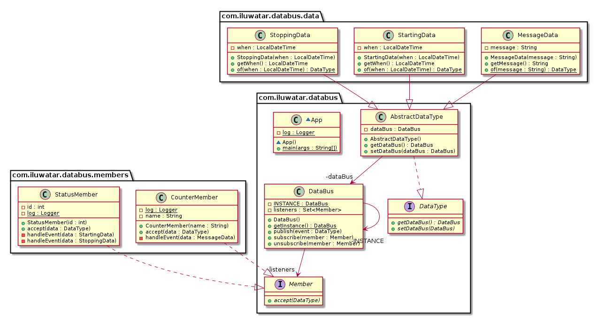

## 含义

数据总线模式（译者：实际上，就是 Event-Bus 消息总线模式）允许在一个应用程序的组件之间收发消息/事件，而不需要这些组件相互感知，它们只需要知道所发送/接收的消息/事件的类型即可。

## 类图

## 适用场景
可以在以下场景使用数据总线模式：

* 你希望由你的组件自己决定要接收哪些信息/事件
* 你希望实现多对多的通信
* 你希望你的组件不需要感知彼此

## 相关模式
数据总线类似于以下设计模式：

* 中介者模式（Mediator pattern），由数据总线成员自己决定是否要接受任何给定的消息。
* 观察者模式（Observer pattern），但进一步支持了多对多的通信。
* 发布/订阅模式（Publish/Subscribe pattern），但是数据总线将发布者和订阅者解耦。