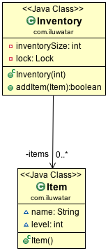

## 含义
通过先测试锁定标准（"锁提示"）而不实际获取锁的方式来减少获取锁的开销。只有当锁定标准检查表明需要锁定时，才进行实际的锁定逻辑。

## 类图

## 适用场景
在以下场景适合使用双重锁检查模式：

* 在创建对象时有存在并发的访问。如单例模式中，你想创建同一个类的单个实例，如果存在两个或更多的线程对实例进行判空，仅仅检查该该实例是否为空可能是不够的。
* 在一个方法上存在并发访问，该方法的行为是根据一些约束条件而改变，而这些约束条件在该方法中也会发生变化。