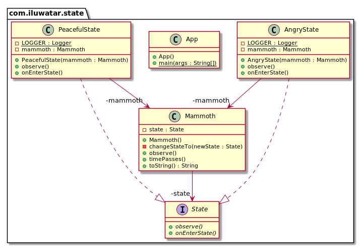

## 又被称为
对象状态

## 目的
允许对象在内部状态改变时改变它的行为。对象看起来好像修改了它的类。

## 解释
真实世界例子

> 当在长毛象的自然栖息地观察长毛象时，似乎它会根据情况来改变自己的行为。它开始可能很平静但是随着时间推移当它检测到威胁时它会对周围的环境感到愤怒和危险。

通俗的说

> 状态模式允许对象改变它的行为。

维基百科说

> 状态模式是一种允许对象在内部状态改变时改变它的行为的行为型设计模式。这种模式接近于有限状态机的概念。状态模式可以被理解为策略模式，它能够通过调用在模式接口中定义的方法来切换策略。

**编程示例**

这里是模式接口和它具体的实现。

```java
public interface State {

  void onEnterState();

  void observe();
}

public class PeacefulState implements State {

  private static final Logger LOGGER = LoggerFactory.getLogger(PeacefulState.class);

  private final Mammoth mammoth;

  public PeacefulState(Mammoth mammoth) {
    this.mammoth = mammoth;
  }

  @Override
  public void observe() {
    LOGGER.info("{} is calm and peaceful.", mammoth);
  }

  @Override
  public void onEnterState() {
    LOGGER.info("{} calms down.", mammoth);
  }
}

public class AngryState implements State {

  private static final Logger LOGGER = LoggerFactory.getLogger(AngryState.class);

  private final Mammoth mammoth;

  public AngryState(Mammoth mammoth) {
    this.mammoth = mammoth;
  }

  @Override
  public void observe() {
    LOGGER.info("{} is furious!", mammoth);
  }

  @Override
  public void onEnterState() {
    LOGGER.info("{} gets angry!", mammoth);
  }
}
```

然后这里是包含状态的长毛象。

```java
public class Mammoth {

  private State state;

  public Mammoth() {
    state = new PeacefulState(this);
  }

  public void timePasses() {
    if (state.getClass().equals(PeacefulState.class)) {
      changeStateTo(new AngryState(this));
    } else {
      changeStateTo(new PeacefulState(this));
    }
  }

  private void changeStateTo(State newState) {
    this.state = newState;
    this.state.onEnterState();
  }

  @Override
  public String toString() {
    return "The mammoth";
  }

  public void observe() {
    this.state.observe();
  }
}
```

然后这里是长毛象随着时间的推移后的整个行为示例。

```java
    var mammoth = new Mammoth();
    mammoth.observe();
    mammoth.timePasses();
    mammoth.observe();
    mammoth.timePasses();
    mammoth.observe();
    
    // The mammoth gets angry!
    // The mammoth is furious!
    // The mammoth calms down.
    // The mammoth is calm and peaceful.
```

## 类图


## 适用性

在以下两种情况下，请使用State模式

* 对象的行为取决于它的状态，并且它必须在运行时根据状态更改其行为。
* 根据对象状态的不同，操作有大量的条件语句。此状态通常由一个或多个枚举常量表示。通常，几个操作将包含此相同的条件结构。状态模式把条件语句的分支分别放入单独的类中。这样一来，你就可以将对象的状态视为独立的对象，该对象可以独立于其他对象而变化。

## Java中例子

* [javax.faces.lifecycle.Lifecycle#execute()](http://docs.oracle.com/javaee/7/api/javax/faces/lifecycle/Lifecycle.html#execute-javax.faces.context.FacesContext-) controlled by [FacesServlet](http://docs.oracle.com/javaee/7/api/javax/faces/webapp/FacesServlet.html), the behavior is dependent on current phase of lifecycle.
* [JDiameter - Diameter State Machine](https://github.com/npathai/jdiameter/blob/master/core/jdiameter/api/src/main/java/org/jdiameter/api/app/State.java)

## 鸣谢

* [Design Patterns: Elements of Reusable Object-Oriented Software](https://www.amazon.com/gp/product/0201633612/ref=as_li_tl?ie=UTF8&camp=1789&creative=9325&creativeASIN=0201633612&linkCode=as2&tag=javadesignpat-20&linkId=675d49790ce11db99d90bde47f1aeb59)
* [Head First Design Patterns: A Brain-Friendly Guide](https://www.amazon.com/gp/product/0596007124/ref=as_li_tl?ie=UTF8&camp=1789&creative=9325&creativeASIN=0596007124&linkCode=as2&tag=javadesignpat-20&linkId=6b8b6eea86021af6c8e3cd3fc382cb5b)
* [Refactoring to Patterns](https://www.amazon.com/gp/product/0321213351/ref=as_li_tl?ie=UTF8&camp=1789&creative=9325&creativeASIN=0321213351&linkCode=as2&tag=javadesignpat-20&linkId=2a76fcb387234bc71b1c61150b3cc3a7)
