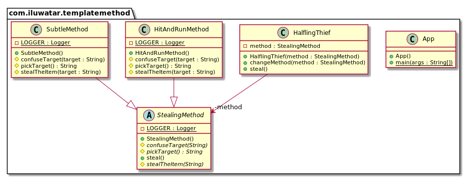

## 目的
在一个操作中定义算法的骨架，将某些步骤推迟到子类。模板方法允许子类重新定义算法的某些步骤，而无需更改算法的结构。

## 解释
真实世界例子

> 偷东西的一般步骤是相同的。 首先，选择目标，然后以某种方式使其迷惑，最后，你偷走了该物品。然而这些步骤有很多实现方式。

通俗的说

> 模板方法模式在父类中列出一般的步骤然后让具体的子类定义实现细节。

维基百科说

> 在面向对象的编程中，模板方法是Gamma等人确定的行为设计模式之一。在《设计模式》一书中。模板方法是父类中一个方法，通常是一个抽象父类，根据许多高级步骤定义了操作的骨架。这些步骤本身由与模板方法在同一类中的其他帮助程序方法实现。

**编程示例**

让我们首先介绍模板方法类及其具体实现。

```java
public abstract class StealingMethod {

  private static final Logger LOGGER = LoggerFactory.getLogger(StealingMethod.class);

  protected abstract String pickTarget();

  protected abstract void confuseTarget(String target);

  protected abstract void stealTheItem(String target);

  public void steal() {
    var target = pickTarget();
    LOGGER.info("The target has been chosen as {}.", target);
    confuseTarget(target);
    stealTheItem(target);
  }
}

public class SubtleMethod extends StealingMethod {

  private static final Logger LOGGER = LoggerFactory.getLogger(SubtleMethod.class);

  @Override
  protected String pickTarget() {
    return "shop keeper";
  }

  @Override
  protected void confuseTarget(String target) {
    LOGGER.info("Approach the {} with tears running and hug him!", target);
  }

  @Override
  protected void stealTheItem(String target) {
    LOGGER.info("While in close contact grab the {}'s wallet.", target);
  }
}

public class HitAndRunMethod extends StealingMethod {

  private static final Logger LOGGER = LoggerFactory.getLogger(HitAndRunMethod.class);

  @Override
  protected String pickTarget() {
    return "old goblin woman";
  }

  @Override
  protected void confuseTarget(String target) {
    LOGGER.info("Approach the {} from behind.", target);
  }

  @Override
  protected void stealTheItem(String target) {
    LOGGER.info("Grab the handbag and run away fast!");
  }
}
```

这是包含模板方法的半身贼类。

```java
public class HalflingThief {

  private StealingMethod method;

  public HalflingThief(StealingMethod method) {
    this.method = method;
  }

  public void steal() {
    method.steal();
  }

  public void changeMethod(StealingMethod method) {
    this.method = method;
  }
}
```
最后，我们展示半身人贼如何利用不同的偷窃方法。

```java
    var thief = new HalflingThief(new HitAndRunMethod());
    thief.steal();
    thief.changeMethod(new SubtleMethod());
    thief.steal();
```

## 类图


## 适用性

使用模板方法模式可以

* 一次性实现一个算法中不变的部分并将其留给子类来实现可能变化的行为。
* 子类之间的共同行为应分解并集中在一个共同类中，以避免代码重复。如Opdyke和Johnson所描述的，这是“重构概括”的一个很好的例子。你首先要确定现有代码中的差异，然后将差异拆分为新的操作。最后，将不同的代码替换为调用这些新操作之一的模板方法。
* 控制子类扩展。您可以定义一个模板方法，该方法在特定点调用“ 钩子”操作，从而仅允许在这些点进行扩展

## 教程

* [Template-method Pattern Tutorial](https://www.journaldev.com/1763/template-method-design-pattern-in-java)

## Java例子

* [javax.servlet.GenericServlet.init](https://jakarta.ee/specifications/servlet/4.0/apidocs/javax/servlet/GenericServlet.html#init--): 
Method `GenericServlet.init(ServletConfig config)` calls the parameterless method `GenericServlet.init()` which is intended to be overridden in subclasses.
Method `GenericServlet.init(ServletConfig config)` is the template method in this example.

## 鸣谢

* [Design Patterns: Elements of Reusable Object-Oriented Software](https://www.amazon.com/gp/product/0201633612/ref=as_li_tl?ie=UTF8&camp=1789&creative=9325&creativeASIN=0201633612&linkCode=as2&tag=javadesignpat-20&linkId=675d49790ce11db99d90bde47f1aeb59)
* [Head First Design Patterns: A Brain-Friendly Guide](https://www.amazon.com/gp/product/0596007124/ref=as_li_tl?ie=UTF8&camp=1789&creative=9325&creativeASIN=0596007124&linkCode=as2&tag=javadesignpat-20&linkId=6b8b6eea86021af6c8e3cd3fc382cb5b)
* [Refactoring to Patterns](https://www.amazon.com/gp/product/0321213351/ref=as_li_tl?ie=UTF8&camp=1789&creative=9325&creativeASIN=0321213351&linkCode=as2&tag=javadesignpat-20&linkId=2a76fcb387234bc71b1c61150b3cc3a7)
