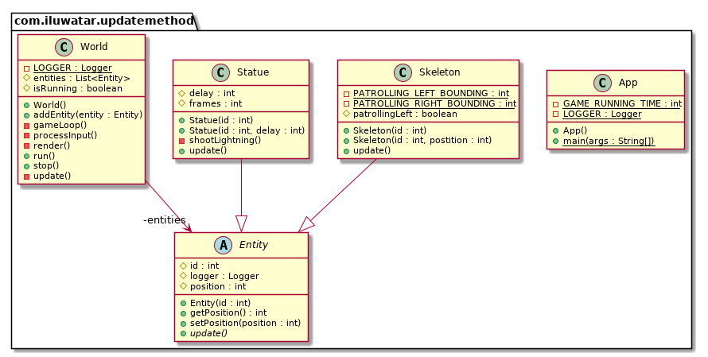

---  
title: Update Method
category: Behavioral
language: zn
tag:  
 - Game programming
---  

## 又被称为
更新方法

## 目的
更新方法模式通过告诉每个对象一次处理一个行为帧来模拟一组独立的对象。

## 解释
游戏世界维护了一个对象的集合。每个对象都实现了一个更新方法，用来模拟该对象行为的一帧。在每一帧中，游戏会更新集合中的每一个对象。

要了解更多关于游戏循环是如何运行的，以及何时调用更新方法，请参考“游戏循环模式”。

## 类图

## 应用 
如果说游戏循环模式是自切面包以来最好的东西，那么更新方法模式就是它的黄油。有很多玩家与动态实体互动的游戏都以某种形式使用这个模式。如果游戏里有宇航兵、龙、火星人、幽灵或运动员，那么它很可能使用了这种模式。

然而，如果游戏更为抽象，且移动的部分不像是生动的角色，而更像是棋盘上的棋子，那么这种模式往往并不合适。在像国际象棋这样的游戏中，你不需要同时模拟所有的棋子，也可能不需要告诉每一个兵卒在每一帧都更新自己。

当以下情况发生时，更新方法工作得很好：

- 你的游戏中有许多对象或系统需要同时运行。
- 每个对象的行为大部分都独立于其他对象。
- 这些对象需要随时间进行模拟。

## 鸣谢
  
* [Game Programming Patterns - Update Method](http://gameprogrammingpatterns.com/update-method.html)
