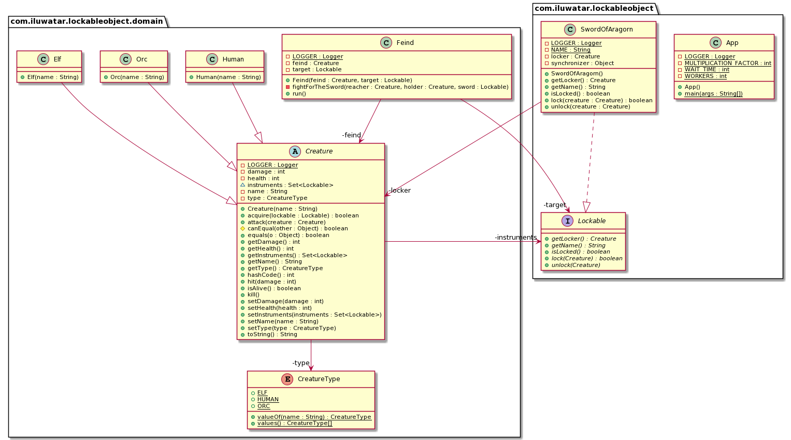

## Intent

The lockable object design pattern ensures that there is only one user using the target object. Compared to the built-in synchronization mechanisms such as using the `synchronized` keyword, this pattern can lock objects for an undetermined time and is not tied to the duration of the request.

## Explanation


Real-world example

>The Sword Of Aragorn is a legendary object that only one creature can possess at the time.
>Every creature in the middle earth wants to possess is, so as long as it's not locked, every creature will fight for it.

Under the hood

>In this particular module, the SwordOfAragorn.java is a class that implements the Lockable interface.
It reaches the goal of the Lockable-Object pattern by implementing unlock() and unlock() methods using
thread-safety logic. The thread-safety logic is implemented with the built-in monitor mechanism of Java.
The SwordOfAaragorn.java has an Object property called "synchronizer". In every crucial concurrency code block,
it's synchronizing the block by using the synchronizer.


**Programmatic Example**

```java
/** This interface describes the methods to be supported by a lockable object. */
public interface Lockable {

  /**
   * Checks if the object is locked.
   *
   * @return true if it is locked.
   */
  boolean isLocked();

  /**
   * locks the object with the creature as the locker.
   *
   * @param creature as the locker.
   * @return true if the object was locked successfully.
   */
  boolean lock(Creature creature);

  /**
   * Unlocks the object.
   *
   * @param creature as the locker.
   */
  void unlock(Creature creature);

  /**
   * Gets the locker.
   *
   * @return the Creature that holds the object. Returns null if no one is locking.
   */
  Creature getLocker();

  /**
   * Returns the name of the object.
   *
   * @return the name of the object.
   */
  String getName();
}

```

We have defined that according to our context, the object must implement the Lockable interface.

For example, the SwordOfAragorn class:

```java
public class SwordOfAragorn implements Lockable {

  private Creature locker;
  private final Object synchronizer;
  private static final String NAME = "The Sword of Aragorn";

  public SwordOfAragorn() {
    this.locker = null;
    this.synchronizer = new Object();
  }

  @Override
  public boolean isLocked() {
    return this.locker != null;
  }

  @Override
  public boolean lock(@NonNull Creature creature) {
    synchronized (synchronizer) {
      LOGGER.info("{} is now trying to acquire {}!", creature.getName(), this.getName());
      if (!isLocked()) {
        locker = creature;
        return true;
      } else {
        if (!locker.getName().equals(creature.getName())) {
          return false;
        }
      }
    }
    return false;
  }

  @Override
  public void unlock(@NonNull Creature creature) {
    synchronized (synchronizer) {
      if (locker != null && locker.getName().equals(creature.getName())) {
        locker = null;
        LOGGER.info("{} is now free!", this.getName());
      }
      if (locker != null) {
        throw new LockingException("You cannot unlock an object you are not the owner of.");
      }
    }
  }

  @Override
  public Creature getLocker() {
    return this.locker;
  }

  @Override
  public String getName() {
    return NAME;
  }
}
```

According to our context, there are creatures that are looking for the sword, so must define the parent class:

```java
public abstract class Creature {

  private String name;
  private CreatureType type;
  private int health;
  private int damage;
  Set<Lockable> instruments;

  protected Creature(@NonNull String name) {
    this.name = name;
    this.instruments = new HashSet<>();
  }

  /**
   * Reaches for the Lockable and tried to hold it.
   *
   * @param lockable as the Lockable to lock.
   * @return true of Lockable was locked by this creature.
   */
  public boolean acquire(@NonNull Lockable lockable) {
    if (lockable.lock(this)) {
      instruments.add(lockable);
      return true;
    }
    return false;
  }

  /** Terminates the Creature and unlocks all of the Lockable that it posses. */
  public synchronized void kill() {
    LOGGER.info("{} {} has been slayed!", type, name);
    for (Lockable lockable : instruments) {
      lockable.unlock(this);
    }
    this.instruments.clear();
  }

  /**
   * Attacks a foe.
   *
   * @param creature as the foe to be attacked.
   */
  public synchronized void attack(@NonNull Creature creature) {
    creature.hit(getDamage());
  }

  /**
   * When a creature gets hit it removed the amount of damage from the creature's life.
   *
   * @param damage as the damage that was taken.
   */
  public synchronized void hit(int damage) {
    if (damage < 0) {
      throw new IllegalArgumentException("Damage cannot be a negative number");
    }
    if (isAlive()) {
      setHealth(getHealth() - damage);
      if (!isAlive()) {
        kill();
      }
    }
  }

  /**
   * Checks if the creature is still alive.
   *
   * @return true of creature is alive.
   */
  public synchronized boolean isAlive() {
    return getHealth() > 0;
  }

}
```

As mentioned before, we have classes that extend the Creature class, such as Elf, Orc,  and Human.

Finally, the following program will simulate a battle for the sword:

```java
public class App implements Runnable {

  private static final int WAIT_TIME = 3;
  private static final int WORKERS = 2;
  private static final int MULTIPLICATION_FACTOR = 3;

  /**
   * main method.
   *
   * @param args as arguments for the main method.
   */
  public static void main(String[] args) {
    var app = new App();
    app.run();
  }

  @Override
  public void run() {
    // The target object for this example.
    var sword = new SwordOfAragorn();
    // Creation of creatures.
    List<Creature> creatures = new ArrayList<>();
    for (var i = 0; i < WORKERS; i++) {
      creatures.add(new Elf(String.format("Elf %s", i)));
      creatures.add(new Orc(String.format("Orc %s", i)));
      creatures.add(new Human(String.format("Human %s", i)));
    }
    int totalFiends = WORKERS * MULTIPLICATION_FACTOR;
    ExecutorService service = Executors.newFixedThreadPool(totalFiends);
    // Attach every creature and the sword is a Fiend to fight for the sword.
    for (var i = 0; i < totalFiends; i = i + MULTIPLICATION_FACTOR) {
      service.submit(new Feind(creatures.get(i), sword));
      service.submit(new Feind(creatures.get(i + 1), sword));
      service.submit(new Feind(creatures.get(i + 2), sword));
    }
    // Wait for program to terminate.
    try {
      if (!service.awaitTermination(WAIT_TIME, TimeUnit.SECONDS)) {
        LOGGER.info("The master of the sword is now {}.", sword.getLocker().getName());
      }
    } catch (InterruptedException e) {
      LOGGER.error(e.getMessage());
      Thread.currentThread().interrupt();
    } finally {
      service.shutdown();
    }
  }
}
```

## Applicability

The Lockable Object pattern is ideal for non distributed applications, that needs to be thread-safe
and keeping their domain models in memory(in contrast to persisted models such as databases).

## Class diagram




## Credits

* [Lockable Object - Chapter 10.3, J2EE Design Patterns, O'Reilly](http://ommolketab.ir/aaf-lib/axkwht7wxrhvgs2aqkxse8hihyu9zv.pdf)
