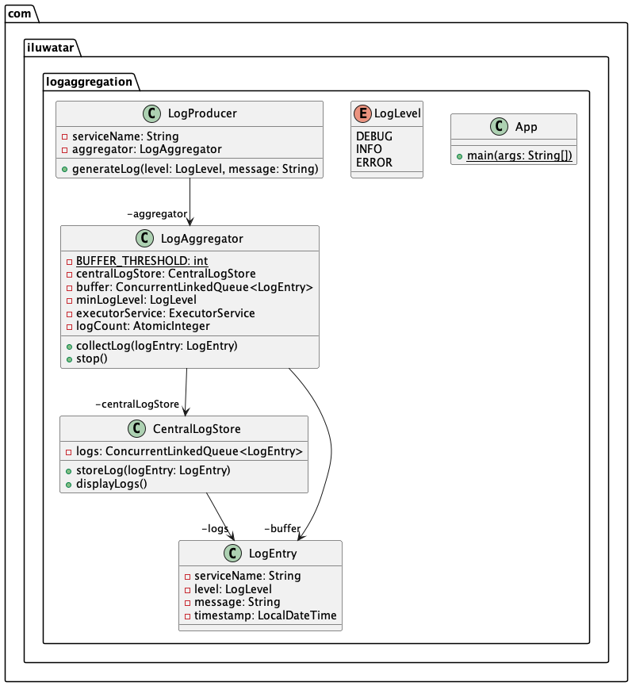

## Also known as

* Centralized Logging
* Log Management

## Intent

Log Aggregation is a pattern that centralizes the collection, storage, and analysis of logs from multiple sources to facilitate monitoring, debugging, and operational intelligence.

## Explanation

Real-world example

> AWS CloudWatch aggregates logs from various AWS services for monitoring and alerting.

In plain words

> The Log Aggregation design pattern centralizes the collection and analysis of log data from multiple applications or services to simplify monitoring and troubleshooting.

Wikipedia says

> You have applied the Microservice architecture pattern. The application consists of multiple services and service instances that are running on multiple machines. Requests often span multiple service instances. Each service instance generates writes information about what it is doing to a log file in a standardized format. The log file contains errors, warnings, information and debug messages.

**Programmatic example**

# Log Aggregation Design Pattern

Log Aggregation is a pattern that centralizes the collection, storage, and analysis of logs from multiple sources to facilitate monitoring, debugging, and operational intelligence. It is particularly useful in distributed systems where logs from various components need to be centralized for better management and analysis.

In this example, we will demonstrate the Log Aggregation pattern using a simple Java application. The application consists of multiple services that generate logs. These logs are collected by a log aggregator and stored in a central log store.

The Central Log Store is responsible for storing the logs collected from various services. In this example, we are using an in-memory store for simplicity.

```java
public class CentralLogStore {

  private final List<LogEntry> logs = new ArrayList<>();

  public void storeLog(LogEntry logEntry) {
    logs.add(logEntry);
  }

  public void displayLogs() {
    logs.forEach(System.out::println);
  }
}
```

The Log Aggregator collects logs from various services and stores them in the Central Log Store. It filters logs based on their log level.

```java
public class LogAggregator {

  private final CentralLogStore centralLogStore;
  private final LogLevel minimumLogLevel;

  public LogAggregator(CentralLogStore centralLogStore, LogLevel minimumLogLevel) {
    this.centralLogStore = centralLogStore;
    this.minimumLogLevel = minimumLogLevel;
  }

  public void collectLog(LogEntry logEntry) {
    if (logEntry.getLogLevel().compareTo(minimumLogLevel) >= 0) {
      centralLogStore.storeLog(logEntry);
    }
  }
}
```

The Log Producer represents a service that generates logs. It sends the logs to the Log Aggregator.

```java
public class LogProducer {

  private final String serviceName;
  private final LogAggregator logAggregator;

  public LogProducer(String serviceName, LogAggregator logAggregator) {
    this.serviceName = serviceName;
    this.logAggregator = logAggregator;
  }

  public void generateLog(LogLevel logLevel, String message) {
    LogEntry logEntry = new LogEntry(serviceName, logLevel, message, LocalDateTime.now());
    logAggregator.collectLog(logEntry);
  }
}
```

The main application creates services, generates logs, aggregates, and finally displays the logs.

```java
public class App {

  public static void main(String[] args) throws InterruptedException {
    final CentralLogStore centralLogStore = new CentralLogStore();
    final LogAggregator aggregator = new LogAggregator(centralLogStore, LogLevel.INFO);

    final LogProducer serviceA = new LogProducer("ServiceA", aggregator);
    final LogProducer serviceB = new LogProducer("ServiceB", aggregator);

    serviceA.generateLog(LogLevel.INFO, "This is an INFO log from ServiceA");
    serviceB.generateLog(LogLevel.ERROR, "This is an ERROR log from ServiceB");
    serviceA.generateLog(LogLevel.DEBUG, "This is a DEBUG log from ServiceA");

    centralLogStore.displayLogs();
  }
}
```

In this example, the `LogProducer` services generate logs of different levels. The `LogAggregator` collects these logs and stores them in the `CentralLogStore` if they meet the minimum log level requirement. Finally, the logs are displayed by the `CentralLogStore`.

## Class diagram



## Applicability

* Useful in distributed systems where logs from various components need to be centralized for better management and analysis.
* Applicable in environments where compliance and auditing require consolidated log data.
* Beneficial in systems that require high availability and resilience, ensuring that log data is preserved and accessible despite individual component failures.

## Known Uses

* Java applications using frameworks like Log4j2 or SLF4J paired with centralized log management tools like Elasticsearch, Logstash, and Kibana (ELK stack) or Splunk.
* Microservices architectures where each service outputs logs that are aggregated into a single system to provide a unified view of the system’s health and behavior.

## Consequences

Benefits:

* Improves debuggability and traceability of issues across multiple services or components.
* Enhances monitoring capabilities by providing a centralized platform for log analysis.
* Facilitates compliance with regulatory requirements for log retention and auditability.

Trade-offs:

* Introduces a potential single point of failure if the log aggregation system is not adequately resilient.
* Can lead to high data volumes requiring significant storage and processing resources.

## Related Patterns

* Messaging Patterns: Log Aggregation often utilizes messaging systems to transport log data, facilitating decoupling and asynchronous data processing.
* Microservices: Often employed in microservice architectures to handle logs from various services efficiently.
* Publish/Subscribe: Utilizes a pub/sub model for log data collection where components publish logs and the aggregation system subscribes to them.

## Credits

* [Cloud Native Java: Designing Resilient Systems with Spring Boot, Spring Cloud, and Cloud Foundry](https://amzn.to/44vDTat)
* [Logging in Action: With Fluentd, Kubernetes and more](https://amzn.to/3JQLzdT)
* [Release It! Design and Deploy Production-Ready Software](https://amzn.to/3Uul4kF)
* [Pattern: Log aggregation](https://microservices.io/patterns/observability/application-logging.html)
