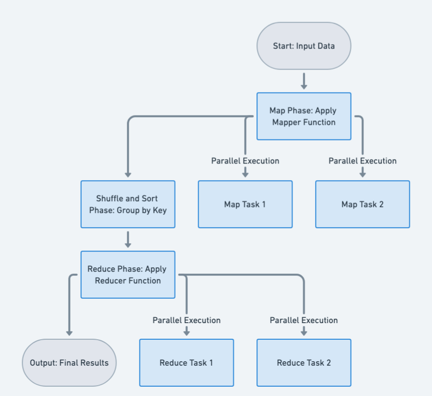

## Also known as

* Map-Reduce
* Divide and Conquer for Data Processing

## Intent of Map Reduce Design Pattern

To efficiently process large-scale datasets by dividing computation into two phases: map and reduce, which can be executed in parallel and distributed across multiple nodes.

## Detailed Explanation of Map Reduce Pattern with Real-World Examples

Real-world example

> Imagine a large e-commerce company that wants to analyze its sales data across multiple regions. They have terabytes of transaction data stored across hundreds of servers. Using MapReduce, they can efficiently process this data to calculate total sales by product category. The Map function would process individual sales records, emitting key-value pairs of (category, sale amount). The Reduce function would then sum up all sale amounts for each category, producing the final result.

In plain words

> MapReduce splits a large problem into smaller parts, processes them in parallel, and then combines the results.

Wikipedia says

> MapReduce is a programming model and associated implementation for processing and generating big data sets with a parallel, distributed algorithm on a cluster. MapReduce consists of two main steps:
The Map step: The master node takes the input, divides it into smaller sub-problems, and distributes them to worker nodes. A worker node may do this again in turn, leading to a multi-level tree structure. The worker node processes the smaller problem, and passes the answer back to its master node. The Reduce step: The master node then collects the answers to all the sub-problems and combines them in some way to form the output – the answer to the problem it was originally trying to solve. This approach allows for efficient processing of vast amounts of data across multiple machines, making it a fundamental technique in big data analytics and distributed computing.

Flowchart



## Programmatic Example of Map Reduce in Java

### 1. Map Phase (Splitting & Processing Data)

* Each input string is split into words, normalized, and counted.
* Output: A map `{word → count}` for each input string.

#### `Mapper.java`

```java
public class Mapper {
    public static Map<String, Integer> map(String input) {
        Map<String, Integer> wordCount = new HashMap<>();
        String[] words = input.split("\\s+");
        for (String word : words) {
            word = word.toLowerCase().replaceAll("[^a-z]", "");
            if (!word.isEmpty()) {
                wordCount.put(word, wordCount.getOrDefault(word, 0) + 1);
            }
        }
        return wordCount;
    }
}
```

Example Input: ```"Hello world hello"```
Output: ```{hello=2, world=1}```

### 2. Shuffle Phase – Grouping Words Across Inputs

* Takes results from all mappers and groups values by word.
* Output: A map `{word → list of counts}`.

#### `Shuffler.java`

```java
public class Shuffler {
    public static Map<String, List<Integer>> shuffleAndSort(List<Map<String, Integer>> mapped) {
        Map<String, List<Integer>> grouped = new HashMap<>();
        for (Map<String, Integer> map : mapped) {
            for (Map.Entry<String, Integer> entry : map.entrySet()) {
                grouped.putIfAbsent(entry.getKey(), new ArrayList<>());
                grouped.get(entry.getKey()).add(entry.getValue());
            }
        }
        return grouped;
    }
}
```

Example Input: 

```
[
    {"hello": 2, "world": 1},
    {"hello": 1, "java": 1}
]
```

Output: 

```
{
    "hello": [2, 1],
    "world": [1],
    "java": [1]
}
```

### 3. Reduce Phase – Aggregating Counts

* Sums the list of counts for each word.
* Output: A sorted list of word counts in descending order.

#### `Reducer.java`

```java
public class Reducer {
    public static List<Map.Entry<String, Integer>> reduce(Map<String, List<Integer>> grouped) {
        Map<String, Integer> reduced = new HashMap<>();
        for (Map.Entry<String, List<Integer>> entry : grouped.entrySet()) {
            reduced.put(entry.getKey(), entry.getValue().stream().mapToInt(Integer::intValue).sum());
        }

        List<Map.Entry<String, Integer>> result = new ArrayList<>(reduced.entrySet());
        result.sort(Map.Entry.comparingByValue(Comparator.reverseOrder()));
        return result;
    }
}
```

Example Input:

```
{
    "hello": [2, 1],
    "world": [1],
    "java": [1]
}
```

Output:

```
[
    {"hello": 3},
    {"world": 1},
    {"java": 1}
]
```

### 4. MapReduce Coordinator – Running the Whole Pipeline

* Coordinates map, shuffle, and reduce phases.

#### `MapReduce.java`

```java
public class MapReduce {
    public static List<Map.Entry<String, Integer>> mapReduce(List<String> inputs) {
        List<Map<String, Integer>> mapped = new ArrayList<>();
        for (String input : inputs) {
            mapped.add(Mapper.map(input));
        }

        Map<String, List<Integer>> grouped = Shuffler.shuffleAndSort(mapped);

        return Reducer.reduce(grouped);
    }
}
```

### 5. Main Execution – Example Usage

* Runs the MapReduce process and prints results.

#### `Main.java`

```java
  public static void main(String[] args) {
    List<String> inputs = Arrays.asList(
            "Hello world hello",
            "MapReduce is fun",
            "Hello from the other side",
            "Hello world"
    );
    List<Map.Entry<String, Integer>> result = MapReduce.mapReduce(inputs);
    for (Map.Entry<String, Integer> entry : result) {
        System.out.println(entry.getKey() + ": " + entry.getValue());
    }
}
```

Output:

```
hello: 4
world: 2
the: 1
other: 1
side: 1
mapreduce: 1
is: 1
from: 1
fun: 1
```

## When to Use the Map Reduce Pattern in Java

Use MapReduce when:

* When processing large datasets that can be broken into independent chunks.
* When data operations can be naturally divided into map (transformation) and reduce (aggregation) phases.
* When horizontal scalability and parallelization are essential, especially in distributed or big data environments.
* When leveraging Java-based distributed computing platforms like Hadoop or Spark.

## Map Reduce Pattern Java Tutorials

* [MapReduce Tutorial(Apache Hadoop)](https://hadoop.apache.org/docs/stable/hadoop-mapreduce-client/hadoop-mapreduce-client-core/MapReduceTutorial.html)
* [MapReduce Example(Simplilearn)](https://www.youtube.com/watch?v=l2clwKnrtO8)

## Benefits and Trade-offs of Map Reduce Pattern

Benefits:

* Enables massive scalability by distributing processing across nodes.
* Encourages a functional style, promoting immutability and stateless operations.
* Simplifies complex data workflows by separating transformation (map) from aggregation (reduce).
* Fault-tolerant due to isolated, recoverable processing tasks.

Trade-offs:

* Requires a suitable problem structure — not all tasks fit the map/reduce paradigm.
* Data shuffling between map and reduce phases can be performance-intensive.
* Higher complexity in debugging and optimizing distributed jobs.
* Intermediate I/O can become a bottleneck in large-scale operations.

## Real-World Applications of Map Reduce Pattern in Java

* Hadoop MapReduce: Java-based framework for distributed data processing using MapReduce.
* Apache Spark: Utilizes similar map and reduce transformations in its RDD and Dataset APIs.
* Elasticsearch: Uses MapReduce-style aggregation pipelines for querying distributed data.
* Google Bigtable: Underlying storage engine influenced by MapReduce principles.
* MongoDB Aggregation Framework: Conceptually applies MapReduce in its data pipelines.

## Related Java Design Patterns

* [Master-Worker](https://java-design-patterns.com/patterns/master-worker/): Similar distribution of tasks among workers, with a master coordinating job execution.
* [Pipeline](https://java-design-patterns.com/patterns/pipeline/): Can be used to chain multiple MapReduce operations into staged transformations.
* [Iterator](https://java-design-patterns.com/patterns/iterator/): Often used under the hood to process input streams lazily in map and reduce steps.

## References and Credits

* [Big Data: Principles and Paradigms](https://amzn.to/3RJIGPZ)
* [Designing Data-Intensive Applications: The Big Ideas Behind Reliable, Scalable, and Maintainable Systems](https://amzn.to/3E6VhtD)
* [Hadoop: The Definitive Guide: Storage and Analysis at Internet Scale](https://amzn.to/4ij2y7F)
* [Java 8 in Action: Lambdas, Streams, and functional-style programming](https://amzn.to/3QCmGXs)
* [Java Design Patterns: A Hands-On Experience with Real-World Examples](https://amzn.to/3HWNf4U)
* [Programming Pig: Dataflow Scripting with Hadoop](https://amzn.to/4cAU36K)
* [What is MapReduce (IBM)](https://www.ibm.com/think/topics/mapreduce)
* [Why MapReduce is not dead (Codemotion)](https://www.codemotion.com/magazine/ai-ml/big-data/mapreduce-not-dead-heres-why-its-still-ruling-in-the-cloud/)
