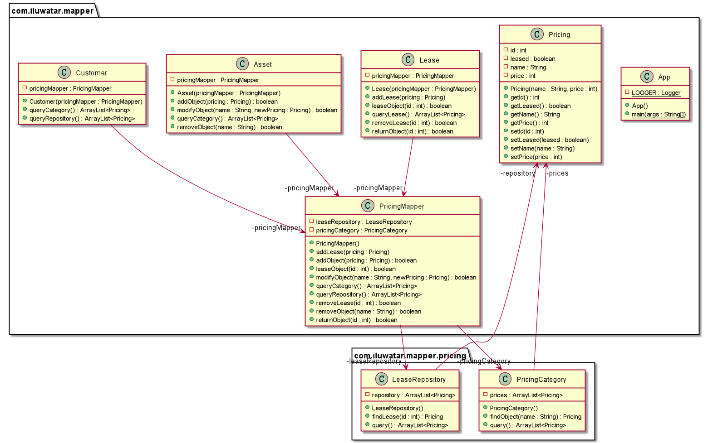

## Intent

Mapper pattern can be used when two or more independent subsystems/services need to communicate with
each other

## Explanation

Real world example

> A customer wants to:
> - find the available assets
> - lease an asset
> - know the leased assets
> - know the pricing information
>
> A Pricing system wants to find the cost associated with a customer 
>
> The PricingMapper establishes interaction between Pricing system and Customer, Asset and Lease.

In plain words

> To allow two(or more) subsystems/services interact without depending on/knowing each other.

**Programmatic Example**

When an Asset needs to be procured and assigned to a Customer, only the PricingMapper is invoked

```java
mapper.assignAsset();
```

Then the PricingMapper adds the Asset to the repository(inventory), sets up the lease and finally
assigns the asset to the customer

```java
public void assignAsset() {
        customerRepository.add(customer);
        assetRepository.add(asset);
        leaseRepository.add(lease);
        }
```

When an Asset needs to be revoked from a Customer, only the PricingMapper is invoked

```java
mapper.revokeAsset();
```

Then PricingMapper revokes the asset from customer, removes the lease and removes the Asset(
optionally) from the inventory

```java
 public void revokeAsset() {
        leaseRepository.remove(lease);
        }
```

When the Pricing system wants to know the Customer cost, only the PricingMapper is invoked

```java
 public double findCustomerCost() {
        return pricingMapper.getPricing();
        }
```

```java
public double getPricing() {
        return getCustomerAssets().stream().mapToDouble(Asset::getPrice).sum();
        }
```

## Class diagram



## Applicability

Use the Mapper pattern when

* the interaction between the subsystems is particularly complicated and somewhat independent to the
  main purpose of both subsystems.

## Credits

* [Patterns of Enterprise Application Architecture: Pattern Enterpr Applica Arch](https://books.google.fi/books?id=vqTfNFDzzdIC&pg=PA473#v=onepage&q&f=false)