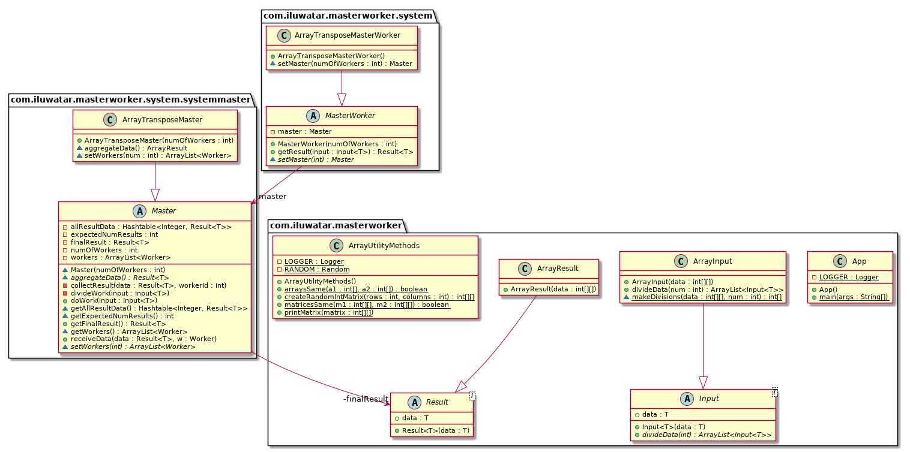

## Also known as

> Master-slave or Map-reduce

## Intent

> Used for centralised parallel processing.

## Class diagram

## Applicability
This pattern can be used when data can be divided into multiple parts, all of which need to go through the same computation to give a result, which need to be aggregated to get the final result.

## Explanation
In this pattern, parallel processing is performed using a system consisting of a master and some number of workers, where a master divides the work among the workers, gets the result back from them and assimilates all the results to give final result. The only communication is between the master and the worker - none of the workers communicate among one another and the user only communicates with the master to get the required job done. The master has to maintain a record of how the divided data has been distributed, how many workers have finished their work and returned a result, and the results themselves to be able to aggregate the data correctly.

## Credits

* [https://docs.gigaspaces.com/sbp/master-worker-pattern.html]
* [http://www.cs.sjsu.edu/~pearce/oom/patterns/behavioral/masterslave.htm]
