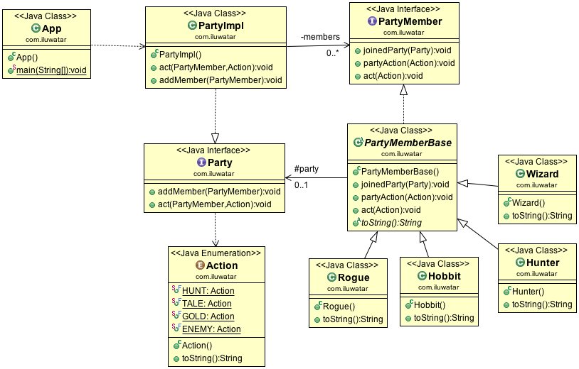

## Also known as

* Controller

## Intent of Mediator Design Pattern

The Mediator design pattern is intended to reduce the complexity of communication between multiple objects or classes in a system. It achieves this by providing a centralized mediator class that handles the interactions between different classes, thus reducing their direct dependencies on each other.

## Detailed Explanation of Mediator Pattern with Real-World Examples

Real-world example

> Imagine an air traffic control system at a busy airport, where the air traffic controller acts as a mediator. In this scenario, numerous airplanes wish to take off, land, or navigate around the airport's airspace. Instead of each pilot communicating directly with every other pilot, which could lead to confusion and potential accidents, all communication goes through the air traffic controller. The controller receives requests, processes them, and gives clear, organized instructions to each pilot. This centralized system reduces the complexity of communications and ensures safety and efficiency in managing the airport's operations. This is analogous to the Mediator design pattern in software, where a central mediator class handles and coordinates the interaction between different objects or systems.

In plain words

> Mediator decouples a set of classes by forcing their communications flow through a mediating object.

Wikipedia says

> In software engineering, the mediator pattern defines an object that encapsulates how a set of  objects interact. This pattern is considered to be a behavioral pattern due to the way it can  alter the program's running behavior. In object-oriented programming, programs often consist of  many classes. Business logic and computation are distributed among these classes. However, as  more classes are added to a program, especially during maintenance and/or refactoring, the  problem of communication between these classes may become more complex. This makes the program  harder to read and maintain. Furthermore, it can become difficult to change the program, since  any change may affect code in several other classes. With the mediator pattern, communication  between objects is encapsulated within a mediator object. Objects no longer communicate directly  with each other, but instead communicate through the mediator. This reduces the dependencies  between communicating objects, thereby reducing coupling.

## Programmatic Example of Mediator Pattern in Java

In this example, the mediator encapsulates how a set of objects interact. Instead of referring to each other directly, they use the mediator interface.

The party members `Rogue`, `Wizard`, `Hobbit`, and `Hunter` all inherit from the `PartyMemberBase`implementing the `PartyMember` interface.

```java
public interface PartyMember {

  void joinedParty(Party party);

  void partyAction(Action action);

  void act(Action action);
}

@Slf4j
public abstract class PartyMemberBase implements PartyMember {

  protected Party party;

  @Override
  public void joinedParty(Party party) {
    LOGGER.info("{} joins the party", this);
    this.party = party;
  }

  @Override
  public void partyAction(Action action) {
    LOGGER.info("{} {}", this, action.getDescription());
  }

  @Override
  public void act(Action action) {
    if (party != null) {
      LOGGER.info("{} {}", this, action);
      party.act(this, action);
    }
  }

  @Override
  public abstract String toString();
}

public class Rogue extends PartyMemberBase {

  @Override
  public String toString() {
    return "Rogue";
  }
}

// Wizard, Hobbit, and Hunter are implemented similarly
```

Our mediator system consists of `Party` interface and its implementation.

```java
public interface Party {

  void addMember(PartyMember member);

  void act(PartyMember actor, Action action);
}

public class PartyImpl implements Party {

  private final List<PartyMember> members;

  public PartyImpl() {
    members = new ArrayList<>();
  }

  @Override
  public void act(PartyMember actor, Action action) {
    for (var member : members) {
      if (!member.equals(actor)) {
        member.partyAction(action);
      }
    }
  }

  @Override
  public void addMember(PartyMember member) {
    members.add(member);
    member.joinedParty(this);
  }
}
```

Here's a demo showing the mediator pattern in action.

```java
public static void main(String[] args) {

    // create party and members
    Party party = new PartyImpl();
    var hobbit = new Hobbit();
    var wizard = new Wizard();
    var rogue = new Rogue();
    var hunter = new Hunter();

    // add party members
    party.addMember(hobbit);
    party.addMember(wizard);
    party.addMember(rogue);
    party.addMember(hunter);

    // perform actions -> the other party members
    // are notified by the party
    hobbit.act(Action.ENEMY);
    wizard.act(Action.TALE);
    rogue.act(Action.GOLD);
    hunter.act(Action.HUNT);
}
```

Here's the console output from running the example.

```
14:05:15.081 [main] INFO com.iluwatar.mediator.PartyMemberBase -- Hobbit joins the party
14:05:15.083 [main] INFO com.iluwatar.mediator.PartyMemberBase -- Wizard joins the party
14:05:15.083 [main] INFO com.iluwatar.mediator.PartyMemberBase -- Rogue joins the party
14:05:15.083 [main] INFO com.iluwatar.mediator.PartyMemberBase -- Hunter joins the party
14:05:15.083 [main] INFO com.iluwatar.mediator.PartyMemberBase -- Hobbit spotted enemies
14:05:15.083 [main] INFO com.iluwatar.mediator.PartyMemberBase -- Wizard runs for cover
14:05:15.083 [main] INFO com.iluwatar.mediator.PartyMemberBase -- Rogue runs for cover
14:05:15.083 [main] INFO com.iluwatar.mediator.PartyMemberBase -- Hunter runs for cover
14:05:15.083 [main] INFO com.iluwatar.mediator.PartyMemberBase -- Wizard tells a tale
14:05:15.083 [main] INFO com.iluwatar.mediator.PartyMemberBase -- Hobbit comes to listen
14:05:15.083 [main] INFO com.iluwatar.mediator.PartyMemberBase -- Rogue comes to listen
14:05:15.083 [main] INFO com.iluwatar.mediator.PartyMemberBase -- Hunter comes to listen
14:05:15.083 [main] INFO com.iluwatar.mediator.PartyMemberBase -- Rogue found gold
14:05:15.083 [main] INFO com.iluwatar.mediator.PartyMemberBase -- Hobbit takes his share of the gold
14:05:15.083 [main] INFO com.iluwatar.mediator.PartyMemberBase -- Wizard takes his share of the gold
14:05:15.083 [main] INFO com.iluwatar.mediator.PartyMemberBase -- Hunter takes his share of the gold
14:05:15.083 [main] INFO com.iluwatar.mediator.PartyMemberBase -- Hunter hunted a rabbit
14:05:15.083 [main] INFO com.iluwatar.mediator.PartyMemberBase -- Hobbit arrives for dinner
14:05:15.083 [main] INFO com.iluwatar.mediator.PartyMemberBase -- Wizard arrives for dinner
14:05:15.083 [main] INFO com.iluwatar.mediator.PartyMemberBase -- Rogue arrives for dinner
```

## Detailed Explanation of Mediator Pattern with Real-World Examples



## When to Use the Mediator Pattern in Java

Use the Mediator pattern when

* A set of objects communicate in well-defined but complex ways. The resulting interdependencies are unstructured and difficult to understand
* Reusing an object is difficult because it refers to and communicates with many other objects
* A behavior that's distributed between several classes should be customizable without a lot of subclassing

## Real-World Applications of Mediator Pattern in Java

* All scheduleXXX() methods of [java.util.Timer](http://docs.oracle.com/javase/8/docs/api/java/util/Timer.html)
* [java.util.concurrent.Executor#execute()](http://docs.oracle.com/javase/8/docs/api/java/util/concurrent/Executor.html#execute-java.lang.Runnable-)
* submit() and invokeXXX() methods of [java.util.concurrent.ExecutorService](http://docs.oracle.com/javase/8/docs/api/java/util/concurrent/ExecutorService.html)
* scheduleXXX() methods of [java.util.concurrent.ScheduledExecutorService](http://docs.oracle.com/javase/8/docs/api/java/util/concurrent/ScheduledExecutorService.html)
* [java.lang.reflect.Method#invoke()](http://docs.oracle.com/javase/8/docs/api/java/lang/reflect/Method.html#invoke-java.lang.Object-java.lang.Object...-)
* Java Message Service (JMS) uses mediators to handle message exchanges between clients and servers.
* JavaBeans property change support class (java.beans.PropertyChangeSupport) acts as a mediator by handling communication between beans regarding property changes.

## Benefits and Trade-offs of Mediator Pattern

Benefits:

* Reduces coupling between components of a program, fostering better organization and easier maintenance.
* Centralizes control. The mediator pattern centralizes the control logic, making it easier to comprehend and manage.

Trade-offs:

* Mediator can become a god object coupled with all classes in the system, gaining too much responsibility and complexity.

## Related Java Design Patterns

* [Observer](https://java-design-patterns.com/patterns/observer/): Often used together, where the mediator pattern can use the observer pattern to notify various objects about state changes. Mediators effectively act as a channel of communication managed by an observer.
* [Facade](https://java-design-patterns.com/patterns/facade/): Mediator simplifies communication between components, similar to how a facade simplifies a subsystem interface, but a mediator’s colleagues can communicate back to the mediator.
* [Command](https://java-design-patterns.com/patterns/command/): Commands can be mediated as they are dispatched to their receivers, encapsulating a request as an object.

## References and Credits

* [Design Patterns: Elements of Reusable Object-Oriented Software](https://amzn.to/3w0pvKI)
* [Head First Design Patterns: Building Extensible and Maintainable Object-Oriented Software](https://amzn.to/49NGldq)
