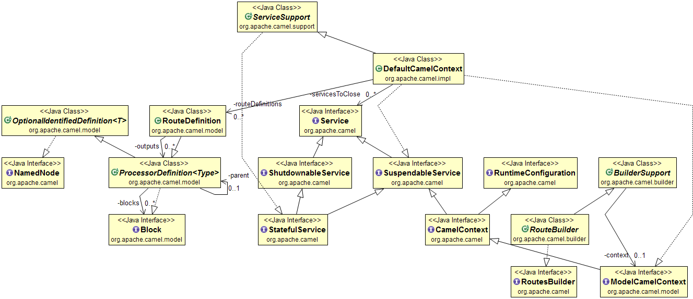

## Intent
When two applications communicate using a messaging system they do it by using logical addresses
of the system, so called Message Channels.

## Applicability
Use the Message Channel pattern when

* two or more applications need to communicate using a messaging system

## Real world examples

* [akka-camel](http://doc.akka.io/docs/akka/snapshot/scala/camel.html)
