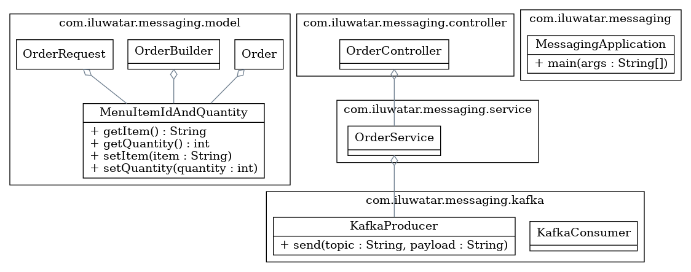

## MESSAGING DESIGN PATTERN


### Also Known As : 
Event Driven / Message Stream Based MicroService

### Intent:
Sample implementation for Kafka Bases messaging service
and events will be published based on transactions 

### Explanation

Use asynchronous messaging for inter-service communication. Services communicating by exchanging messages over messaging channels.

There are several different styles of asynchronous communication:

Request/response - a service sends a request message to a recipient and expects to receive a reply message promptly
Notifications - a sender sends a message a recipient but does not expect a reply. Nor is one sent.
Request/asynchronous response - a service sends a request message to a recipient and expects to receive a reply message eventually
Publish/subscribe - a service publishes a message to zero or more recipients
Publish/asynchronous response - a service publishes a request to one or recipients, some of whom send back a reply

#### This pattern has the following benefits:

Loose runtime coupling since it decouples the message sender from the consumer
* Improved availability since the message broker buffers messages until the consumer is able to process them
* Supports a variety of communication patterns including request/reply, notifications, request/async response, publish/subscribe, publish/async response etc
* This pattern has the following drawbacks:

### Class diagram:


#### High Level Design:


### Applicability:
* Its more appropriate where the system expecting Pub/Sub based communication 
* If immediate notification is required between two microservices, then this pattern will help on the same 

### Tutorials :
1. https://medium.com/design-microservices-architecture-with-patterns/microservices-asynchronous-message-based-communication-6643bee06123
2. https://microservices.io/patterns/communication-style/messaging.html
   
### Known uses:
* Event Driven MicroService - Communication between more than one microservice using messaging channel
* Distributed Transaction Service - Auditing and Notifying system from one to another

### Consequences:
Additional complexity of message broker, which must be highly available
This pattern has the following issues:

- Request/reply-style communication is more complex

### Related patterns :
* The Saga pattern and CQRS pattern use messaging  : https://microservices.io/patterns/data/saga.html , https://microservices.io/patterns/data/cqrs.html
* The Transactional Outbox pattern enables messages to be sent as part of a database transaction : https://microservices.io/patterns/data/transactional-outbox.html

### Credits:
``` Chris Richardson ``` 
Experienced software architect, author of POJOs in Action, the creator of the original CloudFoundry.com 
