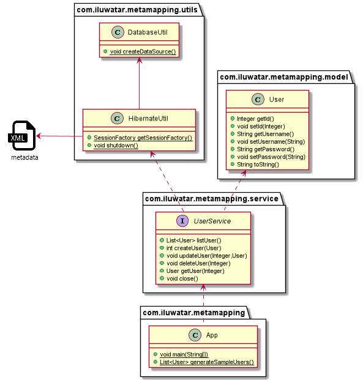

## Intent

Metadata Mapping is designed to manage the mapping between database records and objects in a way that keeps the database schema and object model decoupled and manageable.

## Explanation

Real world example

> Hibernate ORM Tool uses Metadata Mapping Pattern to specify the mapping between classes and tables either using XML or annotations in code. 

In plain words

> Metadata Mapping specifies the mapping between classes and tables so that we could treat a table of any database like a Java class.

Wikipedia says

> Create a "virtual [object database](https://en.wikipedia.org/wiki/Object_database)" that can be used from within the programming language.

**Programmatic Example**

We give an example about visiting the information of `user_account` table in `h2` database. Firstly, we create `user_account` table with `h2`:

```java
@Slf4j
public class DatabaseUtil {
  private static final String DB_URL = "jdbc:h2:mem:metamapping";
  private static final String CREATE_SCHEMA_SQL = "DROP TABLE IF EXISTS `user_account`;"
      + "CREATE TABLE `user_account` (\n"
      + "  `id` int(11) NOT NULL AUTO_INCREMENT,\n"
      + "  `username` varchar(255) NOT NULL,\n"
      + "  `password` varchar(255) NOT NULL,\n"
      + "  PRIMARY KEY (`id`)\n"
      + ");";
    
  /**
   * Create database.
   */
  static {
    LOGGER.info("create h2 database");
    var source = new JdbcDataSource();
    source.setURL(DB_URL);
    try (var statement = source.getConnection().createStatement()) {
      statement.execute(CREATE_SCHEMA_SQL);
    } catch (SQLException e) {
      LOGGER.error("unable to create h2 data source", e);
    }
  }
}
```

Correspondingly, here's the basic `User` entity.

```java
@Setter
@Getter
@ToString
public class User {
  private Integer id;
  private String username;
  private String password;
    
  /**
   * Get a user.
   * @param username user name
   * @param password user password
   */
  public User(String username, String password) {
    this.username = username;
    this.password = password;
  }
}
```

Then we write a `xml` file to show the mapping between the table and the object:

```xml
<?xml version="1.0" encoding="utf-8"?>
<!DOCTYPE hibernate-mapping PUBLIC
    "-//Hibernate/Hibernate Mapping DTD//EN"
    "http://www.hibernate.org/dtd/hibernate-mapping-3.0.dtd">

<hibernate-mapping>
  <class name="com.iluwatar.metamapping.model.User" table="user_account">
    <id name="id" type="java.lang.Integer" column="id">
      <generator class="native"/>
    </id>
    <property name="username" column="username" type="java.lang.String"/>
    <property name="password" column="password" type="java.lang.String"/>
  </class>
</hibernate-mapping>
```

We use `Hibernate` to resolve the mapping and connect to our database, here's its configuration:

```xml
<?xml version="1.0" encoding="utf-8"?>
<!DOCTYPE hibernate-configuration PUBLIC
    "-//Hibernate/Hibernate Configuration DTD 3.0//EN"
    "http://www.hibernate.org/dtd/hibernate-configuration-3.0.dtd">
<hibernate-configuration>
  <session-factory>
    <!-- JDBC Database connection settings -->
    <property name="connection.url">jdbc:h2:mem:metamapping</property>
    <property name="connection.driver_class">org.h2.Driver</property>
    <!-- JDBC connection pool settings ... using built-in test pool -->
    <property name="connection.pool_size">1</property>
    <!-- Select our SQL dialect -->
    <property name="dialect">org.hibernate.dialect.H2Dialect</property>
    <!-- Echo the SQL to stdout -->
    <property name="show_sql">false</property>
    <!-- Drop and re-create the database schema on startup -->
    <property name="hbm2ddl.auto">create-drop</property>
    <mapping resource="com/iluwatar/metamapping/model/User.hbm.xml" />
  </session-factory>
</hibernate-configuration>
```

Then we can get access to the table just like an object with `Hibernate`, here's some CRUDs:

```java
@Slf4j
public class UserService {
  private static final SessionFactory factory = HibernateUtil.getSessionFactory();

  /**
   * List all users.
   * @return list of users
   */
  public List<User> listUser() {
    LOGGER.info("list all users.");
    List<User> users = new ArrayList<>();
    try (var session = factory.openSession()) {
      var tx = session.beginTransaction();
      List<User> userIter = session.createQuery("FROM User").list();
      for (var iterator = userIter.iterator(); iterator.hasNext();) {
        users.add(iterator.next());
      }
      tx.commit();
    } catch (HibernateException e) {
      LOGGER.debug("fail to get users", e);
    }
    return users;
  }
  
  // other CRUDs ->
  // ...
    
  public void close() {
    HibernateUtil.shutdown();
  }
}
```

## Class diagram



## Applicability

Use this pattern when you need to bridge the gap between an object-oriented domain model and a relational database, without hard-coding database queries into the domain logic.

## Known Uses

* Object-Relational Mapping (ORM) frameworks like Hibernate, JPA, EclipseLink and MyBatis.
* Mapping database rows to domain objects in enterprise applications.

## Consequences

Benefits:

* Decouples object model and database schema, allowing independent evolution.
* Reduces boilerplate code associated with data access.
* Centralizes mapping logic, making changes more manageable.

Trade-offs:

* Adds complexity due to an additional layer of abstraction.
* Can impact performance if not properly optimized.

## Related Patterns

* [Data Mapper](https://java-design-patterns.com/patterns/data-mapper/): Metadata Mapping is often used within the broader Data Mapper pattern to facilitate the mapping process.
* Active Record: Differently from Active Record, Metadata Mapping separates the data access logic from the domain entities.
* [Repository](https://java-design-patterns.com/patterns/repository/): Works well with the Repository pattern by abstracting data access further, allowing more complex domain logic to be cleanly separated from data mapping.

## Credits

* [J2EE Design Patterns](https://amzn.to/4dpzgmx)
* [Java Persistence with Hibernate](https://amzn.to/44tP1ox)
* [Patterns of Enterprise Application Architecture](https://amzn.to/3WfKBPR)
* [Pro JPA 2: Mastering the Java Persistence API](https://amzn.to/4b7UoMC)
