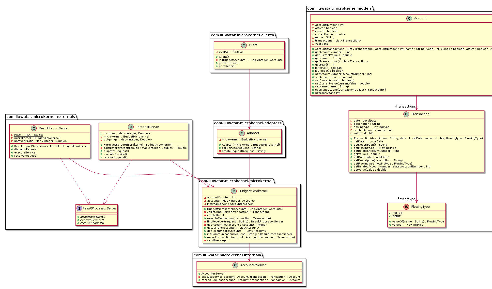

## Also known as
Plug-in

## Intent
The pattern may be applied in the context of complex software systems serving
as a platform for
other software applications. Such complex systems usually should be extensible
and adaptable to emerging technologies, capable of coping with a range of standards and technologies.
They also need to possess high performance and scalability qualities; as a result, low memory
consumption and low processing demands are required. Taken together, the above requirements are difficult to achieve.

## Explanation
The Microkernel architectural pattern applies to software systems
that must be able to adapt to changing system requirements. It
separates a minimal functional core from extended functionality and
customer-specific parts. The microkernel also serves as a socket for
plugging in these extensions and coordinating their collaboration

The Microkernel pattern defines five kinds of participating
components:
- Internal servers
- External servers
- Adapters
- Clients
- Microkernel

Real world example

>We have small enterprise which has an accounting system. Every income and outgoing
economical event are recorded in transactions. These transactions related to accounts
and they are stored there. The core system - microkernel - stores these accounts and does the basic calculations for them.
The accounting is a special part of the core, so this is outsourced in an
internal server. There are two types of external server. The first make us a forecast
about the feature year income and outgoing, and the other counts the actual year profit
with tax. These external servers use the core functionality with the internal server and
they make extended behavior of the cores, which the client can easily use by the adapter.

## Class diagram

## Known Use
- Chorus is a commercially-available Microkernel system.
- The **MKDE** (Microkenel Datenbank Enginge)system introduces an architecture for database engines that follows the
  Microkernel pattern.
- **Windows NT** was developed by Microsoft as an operating system for high-performance servers.
- The operating system **Amoeba** consists of two basic
elements: the microkernel itself and a collection of servers
(subsystems) that are used to implement the majority of Amoeba's
functionality.
- The **Mach** operating system was developed at CarnegieMellon-University, and its first version was released in 1986.
- **Symbian OS** for mobile phones, has Microkernel as core architectural pattern.
- Microsoft’s next generation experimental operating system in research code name **‘Singularity’** has adopting concept of Microkernel. 

## Consequences
The Microkernel pattern offers some important **benefits**:
- Portability
- Flexibility and Extensibility
- Separation of policy and mechanism
- Scakability
- Reliability
- Transparency

The Microkernel architectural framework also has **liabilities**:
- Performance
- Complexity of design and implementation

## Credits
* [Pattern-Oriented Software Architecture](https://www.amazon.com/Pattern-Oriented-Software-Architecture-System-Patterns-ebook/dp/B0014EME7I)
