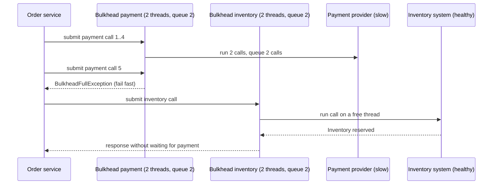
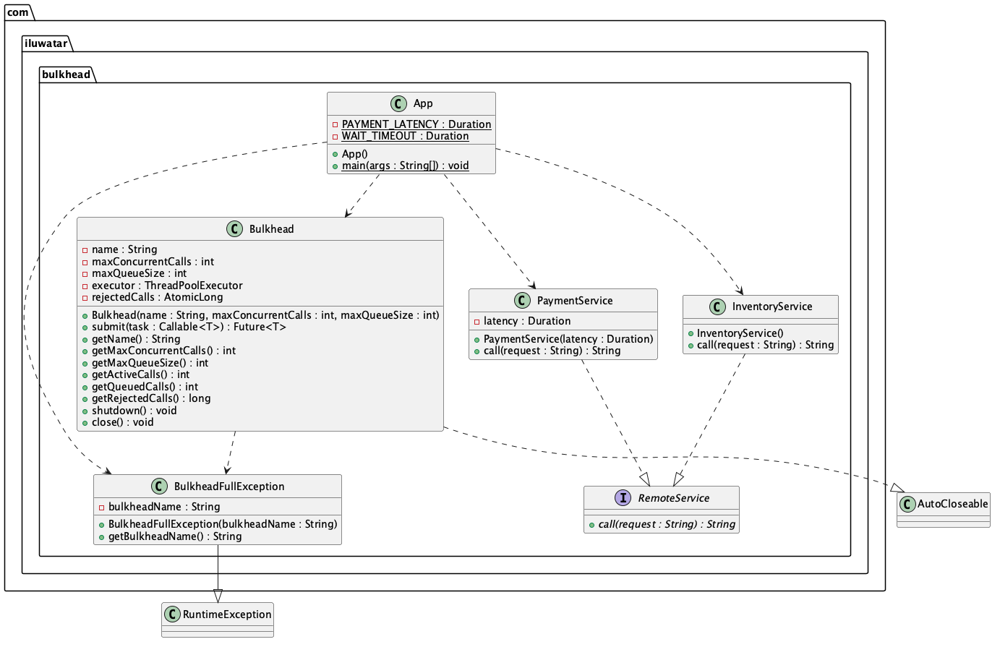

## Also known as

* Compartmentalization
* Resource isolation

## Intent of Bulkhead Design Pattern

Partition the resources of a service, typically its threads and connections, into isolated compartments so that a failure or an overload in one downstream dependency cannot consume the resources needed by the others. The compartment that is full rejects new calls immediately instead of letting them pile up.

## Detailed Explanation of Bulkhead Pattern with Real-World Examples

Real-world example

> The hull of a ship is divided into watertight compartments called bulkheads. If the hull is breached, only the flooded compartment fills with water and the ship stays afloat. In an order service, the calls to a payment provider and the calls to an inventory system are placed in separate compartments. When the payment provider becomes slow and its compartment fills up, the extra payment requests are turned away at once, while inventory lookups keep flowing through their own compartment as if nothing happened.

In plain words

> Give every downstream dependency its own bounded pool of threads, so one misbehaving dependency can only exhaust its own pool.

Microservices.io says

> Bulkhead is a pattern that isolates the resources used by a service so that a failure in one part of the system does not cascade to other parts.

Sequence diagram





## Programmatic Example of Bulkhead Pattern in Java

Our order service depends on two remote systems. Both implement the same `RemoteService` contract.

```java
@FunctionalInterface
public interface RemoteService {
  String call(String request);
}
```

The payment provider has become slow: every call takes the configured latency. The inventory system is healthy and answers immediately.

```java
@Slf4j
public class PaymentService implements RemoteService {

  private final Duration latency;

  public PaymentService(Duration latency) {
    this.latency = latency;
  }

  @Override
  public String call(String request) {
    LOGGER.info("Payment provider received '{}', it will take {} ms", request, latency.toMillis());
    try {
      Thread.sleep(latency);
    } catch (InterruptedException e) {
      Thread.currentThread().interrupt();
      throw new IllegalStateException("Payment for '" + request + "' was interrupted", e);
    }
    return "Payment approved for " + request;
  }
}

@Slf4j
public class InventoryService implements RemoteService {

  @Override
  public String call(String request) {
    LOGGER.info("Inventory system received '{}'", request);
    return "Inventory reserved for " + request;
  }
}
```

The `Bulkhead` is the compartment. It owns a `ThreadPoolExecutor` with a fixed number of worker threads and a bounded queue. The `AbortPolicy` makes the executor throw when both are full, and the bulkhead translates that into a `BulkheadFullException` so the caller fails fast. It also keeps a counter of rejected calls for monitoring, and on shutdown it cancels the futures of the calls that were still queued so their callers are released instead of waiting forever.

```java
@Slf4j
public class Bulkhead implements AutoCloseable {

  @Getter private final String name;
  @Getter private final int maxConcurrentCalls;
  @Getter private final int maxQueueSize;
  private final ThreadPoolExecutor executor;
  private final AtomicLong rejectedCalls = new AtomicLong();

  public Bulkhead(String name, int maxConcurrentCalls, int maxQueueSize) {
    // argument validation omitted
    this.name = name;
    this.maxConcurrentCalls = maxConcurrentCalls;
    this.maxQueueSize = maxQueueSize;
    BlockingQueue<Runnable> queue =
        maxQueueSize == 0 ? new SynchronousQueue<>() : new ArrayBlockingQueue<>(maxQueueSize);
    var threadCounter = new AtomicInteger();
    this.executor =
        new ThreadPoolExecutor(
            maxConcurrentCalls,
            maxConcurrentCalls,
            0L,
            TimeUnit.MILLISECONDS,
            queue,
            runnable ->
                new Thread(runnable, "bulkhead-" + name + "-" + threadCounter.incrementAndGet()),
            new ThreadPoolExecutor.AbortPolicy());
  }

  public <T> Future<T> submit(Callable<T> task) {
    if (executor.isShutdown()) {
      throw new IllegalStateException("Bulkhead '" + name + "' is shut down");
    }
    try {
      return executor.submit(task);
    } catch (RejectedExecutionException e) {
      if (executor.isShutdown()) {
        throw new IllegalStateException("Bulkhead '" + name + "' is shut down");
      }
      rejectedCalls.incrementAndGet();
      LOGGER.warn(
          "Bulkhead '{}' is full ({} active, {} queued), rejecting call",
          name,
          executor.getActiveCount(),
          executor.getQueue().size());
      throw new BulkheadFullException(name);
    }
  }

  public int getActiveCalls() {
    return executor.getActiveCount();
  }

  public int getQueuedCalls() {
    return executor.getQueue().size();
  }

  public long getRejectedCalls() {
    return rejectedCalls.get();
  }

  public void shutdown() {
    for (var pending : executor.shutdownNow()) {
      if (pending instanceof Future<?> future) {
        future.cancel(false);
      }
    }
  }

  @Override
  public void close() {
    shutdown();
  }
}
```

`BulkheadFullException` carries the name of the compartment that turned the call away.

```java
public class BulkheadFullException extends RuntimeException {

  private final String bulkheadName;

  public BulkheadFullException(String bulkheadName) {
    super("Bulkhead '" + bulkheadName + "' is full, call rejected");
    this.bulkheadName = bulkheadName;
  }

  public String getBulkheadName() {
    return bulkheadName;
  }
}
```

The application runs two scenarios. In the first one every downstream call goes through one shared pool of two threads with a queue of two. Four slow payment calls fill the pool, and the next inventory call is rejected although the inventory system is healthy. In the second scenario each dependency gets its own bulkhead. The payment compartment still saturates and rejects the excess calls immediately, but the inventory compartment keeps answering because payment calls can no longer take its threads.

```java
public static void main(String[] args) {
  var payment = new PaymentService(PAYMENT_LATENCY);
  var inventory = new InventoryService();

  LOGGER.info("--- Scenario 1: one shared thread pool for every downstream call ---");
  try (var sharedPool = new Bulkhead("shared-pool", 2, 2)) {
    var paymentFutures = flood(sharedPool, payment, "order", 4);
    callInventory(sharedPool, inventory, "order-5");
    awaitAll(paymentFutures);
  }

  LOGGER.info("--- Scenario 2: a dedicated bulkhead for each downstream dependency ---");
  try (var paymentBulkhead = new Bulkhead("payment", 2, 2);
      var inventoryBulkhead = new Bulkhead("inventory", 2, 2)) {
    var paymentFutures = flood(paymentBulkhead, payment, "order", 10);
    for (var i = 1; i <= 3; i++) {
      callInventory(inventoryBulkhead, inventory, "order-" + i);
    }
    awaitAll(paymentFutures);
    LOGGER.info(
        "Bulkhead '{}' rejected {} of 10 calls, bulkhead '{}' rejected {} of 3 calls",
        paymentBulkhead.getName(),
        paymentBulkhead.getRejectedCalls(),
        inventoryBulkhead.getName(),
        inventoryBulkhead.getRejectedCalls());
  }
}
```

`flood` submits a burst of calls and logs the ones that are rejected, `callInventory` submits one inventory call and reports whether it was served or rejected, and `awaitAll` waits for the accepted payment calls.

```java
private static List<Future<String>> flood(
    Bulkhead bulkhead, RemoteService service, String requestPrefix, int calls) {
  var accepted = new ArrayList<Future<String>>();
  for (var i = 1; i <= calls; i++) {
    var request = requestPrefix + "-" + i;
    try {
      accepted.add(bulkhead.submit(() -> service.call(request)));
    } catch (BulkheadFullException e) {
      LOGGER.info("Request '{}' rejected immediately: {}", request, e.getMessage());
    }
  }
  return accepted;
}
```

Running the application produces output similar to the following.

```
--- Scenario 1: one shared thread pool for every downstream call ---
Payment provider received 'order-1', it will take 300 ms
Payment provider received 'order-2', it will take 300 ms
Bulkhead 'shared-pool' is full (2 active, 2 queued), rejecting call
Inventory check for 'order-5' rejected although the inventory system is healthy: Bulkhead 'shared-pool' is full, call rejected
Payment response: Payment approved for order-1
...
--- Scenario 2: a dedicated bulkhead for each downstream dependency ---
Payment provider received 'order-1', it will take 300 ms
Payment provider received 'order-2', it will take 300 ms
Bulkhead 'payment' is full (2 active, 2 queued), rejecting call
Request 'order-5' rejected immediately: Bulkhead 'payment' is full, call rejected
...
Inventory system received 'order-1'
Inventory response: Inventory reserved for order-1
Inventory system received 'order-2'
Inventory response: Inventory reserved for order-2
Inventory system received 'order-3'
Inventory response: Inventory reserved for order-3
Payment response: Payment approved for order-1
...
Bulkhead 'payment' rejected 6 of 10 calls, bulkhead 'inventory' rejected 0 of 3 calls
```

## When to Use the Bulkhead Pattern in Java

* A service calls several downstream dependencies and a slowdown in one of them must not degrade the others.
* Requests have different importance and the critical ones need guaranteed capacity.
* Threads, connections, or memory are shared and an overloaded consumer could starve the rest of the application.
* You prefer rejecting excess load quickly over queueing it indefinitely and timing out later.

## Real-World Applications of Bulkhead Pattern in Java

* [Resilience4j Bulkhead](https://resilience4j.readme.io/docs/bulkhead) offers a semaphore based and a thread pool based bulkhead.
* [Netflix Hystrix](https://github.com/Netflix/Hystrix/wiki/How-it-Works#isolation) isolated every command in its own thread pool.
* Separate connection pools per database or per tenant in JDBC and HTTP client configurations.
* Kubernetes resource limits and separate node pools that keep noisy workloads apart.

## Benefits and Trade-offs of Bulkhead Pattern

Benefits:

* Contains failures: an overloaded dependency can only exhaust its own compartment.
* Fails fast: callers learn immediately that a compartment is full and can degrade gracefully.
* Predictable capacity: every dependency has a known, bounded share of the resources.
* Easy to observe: active, queued, and rejected calls per compartment are natural metrics.

Trade-offs:

* Resources sit idle in one compartment while another is saturated, so overall utilisation can drop.
* Every compartment needs sizing and tuning, which adds configuration and operational overhead.
* Thread pool bulkheads add a thread hop and a small latency cost for every call.
* Rejected calls still need a strategy, such as a fallback or a retry, to give the user a sensible result.

## Related Java Design Patterns

* [Circuit Breaker](../circuit-breaker): stops calling a dependency that keeps failing, while a bulkhead limits how much of the caller a dependency can occupy.
* [Fallback](../fallback): supplies a degraded response when a bulkhead rejects a call.
* [Retry](../retry): retries a call that was rejected once the compartment has free capacity again.
* [Throttling](../throttling) and [Rate Limiting](../rate-limiting-pattern): limit how many calls a client may make over time, whereas a bulkhead limits how many calls may run at once.
* [Health Check](../health-check): reports the state of dependencies that bulkheads protect.

## References and Credits

* [Release It!: Design and Deploy Production-Ready Software](https://amzn.to/3Uul4kF)
* [Microservices Patterns: With examples in Java](https://amzn.to/3UyWD5O)
* [Bulkhead pattern (microservices.io)](https://microservices.io/patterns/reliability/bulkhead.html)
* [Bulkhead pattern (Azure Architecture Center)](https://learn.microsoft.com/en-us/azure/architecture/patterns/bulkhead)
* [Resilience4j Bulkhead](https://resilience4j.readme.io/docs/bulkhead)
