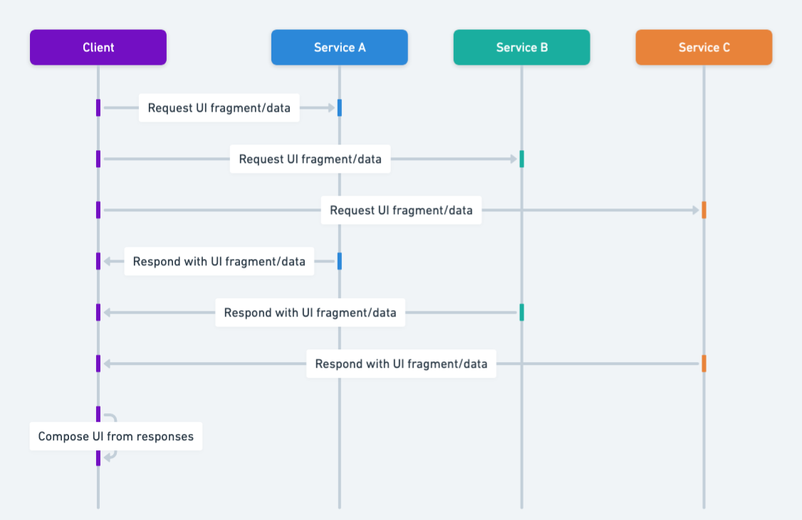

## Intent of Client-Side UI Composition Design Pattern

Compose user interface from independently deployable microservices on the client side for greater flexibility and decoupling.

## Also Known As

* UI Aggregator
* Frontend-Driven Composition

## Detailed Explanation of Client-Side UI Composition Pattern with Real-World Examples

Real-world Example

> In a SaaS dashboard, a client-side composition pattern enables various independent modules like “Billing,” “Reports,” and “Account Settings” to be developed and deployed by separate teams. These modules are composed into a unified interface for the user, with each module independently fetching data from its respective microservice.

In Plain Words

> The Client-Side UI Composition pattern breaks down the user interface into smaller, independent parts that can be developed, maintained, and scaled separately by different teams.

Wikipedia says

> UI composition refers to the practice of building a user interface from modular components, each responsible for fetching its own data and rendering its own content. This approach enables faster development cycles, easier maintenance, and better scalability in large systems.

Sequence diagram



## Programmatic Example of Client-Side UI Composition in Java

This example composes an e-commerce frontend by integrating three independent modules. Each module is served by a microservice and fetched on the client side through an API Gateway.

### `ApiGateway` Implementation

```java
public class ApiGateway {

    private final Map<String, FrontendComponent> routes = new HashMap<>();

    public void registerRoute(String path, FrontendComponent component) {
        routes.put(path, component);
    }

    public String handleRequest(String path, Map<String, String> params) {
        if (routes.containsKey(path)) {
            return routes.get(path).fetchData(params);
        } else {
            return "404 Not Found";
        }
    }
}

```

### `FrontendComponent` Interface

```java
public interface FrontendComponent {
    String fetchData(Map<String, String> params);
}
```

### Example Components

```java
public class ProductComponent implements FrontendComponent {
    @Override
    public String fetchData(Map<String, String> params) {
        return "Displaying Products: " + params.getOrDefault("category", "all");
    }
}

public class CartComponent implements FrontendComponent {
    @Override
    public String fetchData(Map<String, String> params) {
        return "Displaying Cart for User: " + params.getOrDefault("userId", "unknown");
    }
}
```

This approach dynamically assembles UI components based on the route in the client-side request. Each component fetches its data asynchronously and renders it within the main interface.

## When to Use the Client-Side UI Composition Pattern

* When each microservice must present its own UI components
* When frequent independent deployments of UI features are required
* When teams own end-to-end functionality, including front-end modules
* When Java-based backends provide separate APIs for direct UI consumption

## Client-Side UI Composition Pattern Tutorials

- [Micro Frontends in Action (O'Reilly)](https://www.oreilly.com/library/view/micro-frontends-in/9781617296873/)
- [Micro Frontends with React (ThoughtWorks)](https://www.thoughtworks.com/insights/articles/building-micro-frontends-using-react)
- [API Gateway in Microservices (Spring Cloud)](https://spring.io/guides/gs/gateway/)

## Real-World Applications of Client-Side UI Composition Pattern in Java

* Large-scale e-commerce portals with microservices powering modular pages
* SaaS platforms requiring rapid iteration of front-end features
* Java-based microservice architectures using frameworks like Spring Boot for modular UI components

## Benefits and Trade-offs of Client-Side UI Composition Pattern

Benefits:

* Facilitates independent deployment cycles for UI features
* Reduces overall coupling and fosters autonomy among teams
* Enables polyglot front-end development

Trade-offs:

* Increases client complexity for rendering and data aggregation
* Can cause performance challenges with multiple service calls
* Demands consistent UX guidelines across diverse microservices

## Related Design Patterns

* Backend for Frontend (BFF): Provides custom endpoints for specific UIs
* Micro Frontends: Splits the front-end into smaller, individually deployable fragments
* [Microservices API Gateway Pattern](https://java-design-patterns.com/patterns/microservices-api-gateway/): API Gateway serves as a routing mechanism for client-side UI requests.

## References and Credits

* [Building Microservices](https://amzn.to/3UACtrU)
* [Building Microservices with Micro Frontends (Martin Fowler)](https://martinfowler.com/articles/micro-frontends.html)
* [Client-Side UI Composition (Microservices.io)](https://microservices.io/patterns/client-side-ui-composition.html)
* [Cloud Native Java: Designing Resilient Systems with Spring Boot, Spring Cloud, and Cloud Foundry](https://amzn.to/44vDTat)
* [Micro Frontends Architecture (Microfrontends.org)](https://micro-frontends.org/)
* [Microservices Patterns: With examples in Java](https://amzn.to/3UyWD5O)
