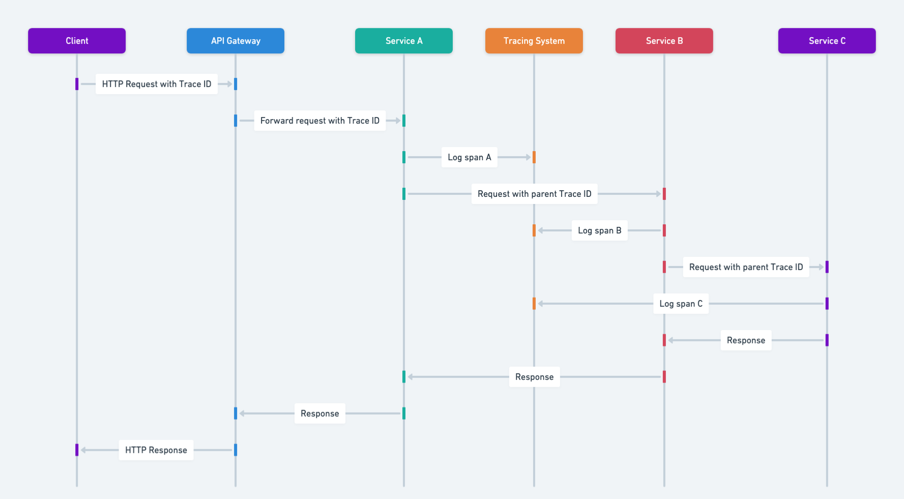

## Intent of Microservices Distributed Tracing Design Pattern

Provide a mechanism to trace and correlate requests as they traverse multiple microservices in a distributed system, enabling end-to-end visibility and easier troubleshooting.

## Also known as

* Distributed Request Tracing
* End-to-End Microservice Tracing

## Detailed Explanation of Microservices Distributed Tracing Pattern with Real-World Examples

Real-world example

> Imagine an online food delivery platform where one microservice handles user orders, another manages restaurant menus, and yet another coordinates courier assignments. When a user places an order, the request travels through all three services in sequence. By implementing distributed tracing, each service attaches a trace identifier to its logs. This allows the operations team to follow the journey of a single order across the entire pipeline, identify any delays along the way, and quickly pinpoint which service is causing the bottleneck or experiencing an error.

In plain words

> Distributed tracing allows you to follow a request's journey through all the services it interacts with, providing insights into system performance and aiding in debugging.

Wikipedia says

> Tracing in software engineering refers to the process of capturing and recording information about the execution of a software program. This information is typically used by programmers for debugging purposes, and additionally, depending on the type and detail of information contained in a trace log, by experienced system administrators or technical-support personnel and by software monitoring tools to diagnose common problems with software.

Sequence diagram



## Programmatic Example of Microservices Distributed Tracing in Java

This implementation shows how an e-commerce platform's `OrderService` interacts with both `PaymentService` and `ProductService`. When a customer places an order, the `OrderService` calls the `PaymentService` to process the payment and the `ProductService` to check the product inventory. By adding distributed trace instrumentation (usually via libraries like Spring Cloud Sleuth or OpenTelemetry), each service attaches trace context to outgoing requests and logs. These logs can then be viewed in the Zipkin interface (or other tracing tools, such as Jaeger) to observe the entire flow of the request and quickly identify any performance bottlenecks or failures across multiple services.

Here's the `Order microservice` implementation.

```java
@Slf4j
@RestController
public class OrderController {

    private final OrderService orderService;

    public OrderController(final OrderService orderService) {
        this.orderService = orderService;
    }
    
    @PostMapping("/order")
    public ResponseEntity<String> processOrder(@RequestBody(required = false) String request) {
        LOGGER.info("Received order request: {}", request);
        var result = orderService.processOrder();
        LOGGER.info("Order processed result: {}", result);
        return ResponseEntity.ok(result);
    }
}
```
```java
@Slf4j
@Service
public class OrderService {

    private final RestTemplateBuilder restTemplateBuilder;

    public OrderService(final RestTemplateBuilder restTemplateBuilder) {
        this.restTemplateBuilder = restTemplateBuilder;
    }

    public String processOrder() {
        if (validateProduct() && processPayment()) {
            return "Order processed successfully";
        }
        return "Order processing failed";
    }
    
    Boolean validateProduct() {
        try {
            ResponseEntity<Boolean> productValidationResult = restTemplateBuilder
                    .build()
                    .postForEntity("http://localhost:30302/product/validate", "validating product",
                            Boolean.class);
            LOGGER.info("Product validation result: {}", productValidationResult.getBody());
            return productValidationResult.getBody();
        } catch (ResourceAccessException | HttpClientErrorException e) {
            LOGGER.error("Error communicating with product service: {}", e.getMessage());
            return false;
        }
    }

    Boolean processPayment() {
        try {
            ResponseEntity<Boolean> paymentProcessResult = restTemplateBuilder
                    .build()
                    .postForEntity("http://localhost:30301/payment/process", "processing payment",
                            Boolean.class);
            LOGGER.info("Payment processing result: {}", paymentProcessResult.getBody());
            return paymentProcessResult.getBody();
        } catch (ResourceAccessException | HttpClientErrorException e) {
            LOGGER.error("Error communicating with payment service: {}", e.getMessage());
            return false;
        }
    }
}
```

Here's the `Payment microservice` implementation.

```java

@Slf4j
@RestController
public class PaymentController {

    @PostMapping("/payment/process")
    public ResponseEntity<Boolean> payment(@RequestBody(required = false) String request) {
        LOGGER.info("Received payment request: {}", request);
        boolean result = true;
        LOGGER.info("Payment result: {}", result);
        return ResponseEntity.ok(result);
    }
}
```

Here's the `Product microservice` implementation.

```java
/**
 * Controller for handling product validation requests.
 */
@Slf4j
@RestController
public class ProductController {

    /**
     * Validates the product based on the request.
     *
     * @param request the request body containing product information (can be null)
     * @return ResponseEntity containing the validation result (true)
     */
    @PostMapping("/product/validate")
    public ResponseEntity<Boolean> validateProduct(@RequestBody(required = false) String request) {
        LOGGER.info("Received product validation request: {}", request);
        boolean result = true;
        LOGGER.info("Product validation result: {}", result);
        return ResponseEntity.ok(result);
    }
}
```

In this example, each microservice would typically be configured with tracing libraries (like Sleuth or OpenTelemetry). The trace context is propagated via HTTP headers, enabling the logs and metrics for each service call to be grouped together and visualized in Zipkin or another compatible tool. This ensures complete end-to-end visibility into each request’s journey.

## When to Use the Microservices Distributed Tracing Pattern in Java

* When multiple services form a single user request path and debugging failures requires visibility across service boundaries.
* When monitoring or diagnosing performance bottlenecks is critical in a multi-service environment.
* When correlation of logs and metrics from independent services is needed to understand overall system health.

## Microservices Distributed Tracing Pattern Java Tutorials

* [Spring Boot - Tracing (Spring)](https://docs.spring.io/spring-boot/reference/actuator/tracing.html)
* [Reactive Observability (Spring Academy)](https://spring.academy/guides/microservices-observability-reactive-spring-boot-3)
* [Spring Cloud – Tracing Services with Zipkin (Baeldung)](https://dzone.com/articles/getting-started-with-spring-cloud-gateway)

## Real-World Applications of Microservices Distributed Tracing Pattern in Java

* OpenTelemetry for tracing instrumentation in Java services.
* Spring Cloud Sleuth for automatic tracing in Spring Boot microservices.
* Jaeger and Zipkin for collecting and visualizing distributed traces in Java-based systems.

## Benefits and Trade-offs of Microservices Distributed Tracing Pattern

Benefits:

* Centralized insight into request paths across services, reducing time to diagnose issues.
* Improved observability enables proactive identification of system bottlenecks.
* Aids in debugging and troubleshooting complex systems.

Trade-offs:

* Adds overhead to each request due to tracing data.
* Requires additional infrastructure (e.g., Zipkin, Jaeger) for collecting and visualizing traces.
* Can become complex to manage in large-scale systems.

## Related Java Design Patterns

* [API Gateway Microservice](https://java-design-patterns.com/patterns/microservices-api-gateway/): Acts as an entry point to microservices and can propagate trace information to downstream services.
* [Circuit Breaker](https://java-design-patterns.com/patterns/circuit-breaker/): Distributed tracing can be used alongside the Circuit Breaker pattern to monitor and handle failures gracefully, preventing cascading failures in microservices.
* [Log Aggregation Microservice](https://java-design-patterns.com/patterns/microservices-log-aggregation/): Distributed tracing works well in conjunction with log aggregation to provide comprehensive observability and troubleshooting capabilities.
* [Saga](https://java-design-patterns.com/patterns/saga/): Orchestrates distributed transactions, which benefit from trace identifiers to correlate steps across services.

## References and Credits

* [Building Microservices](https://amzn.to/3UACtrU)
* [Distributed tracing (microservices.io)](https://microservices.io/patterns/observability/distributed-tracing.html)
* [Microservices Patterns: With examples in Java](https://amzn.to/3UyWD5O)
* [OpenTelemetry Documentation](https://opentelemetry.io/docs/)
* [Release It! Design and Deploy Production-Ready Software](https://amzn.to/3Uul4kF)
