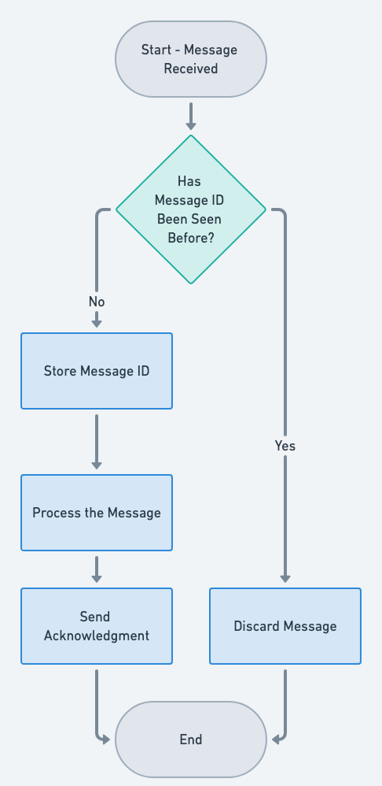

## Also known as

* Idempotent Subscriber
* Repeatable Message Consumer
* Safe Consumer

## Intent of Idempotent Consumer Pattern

Ensure that consuming the same message multiple times does not cause unintended side effects in a microservices-based architecture.

## Detailed Explanation of Idempotent Consumer Pattern with Real-World Examples

Real-world example

> In a payment processing system, ensuring that payment messages are idempotent prevents duplicate transactions. For example, if a user’s payment message is accidentally processed twice, the system should recognize the second message as a duplicate and prevent it from executing a second time. By storing unique identifiers for each processed message, such as a transaction ID, the system can skip any duplicate messages. This ensures that a user is not charged twice for the same transaction, maintaining system integrity and customer satisfaction.

In plain words

> The Idempotent Consumer pattern prevents duplicate messages from causing unintended side effects by ensuring that processing the same message multiple times results in the same outcome. This makes message processing safe in distributed systems where duplicates may occur.


Wikipedia says

> In computing, idempotence is the property of certain operations in mathematics and computer science whereby they can be applied multiple times without changing the result beyond the initial application.

Flowchart



## Programmatic example of Idempotent Consumer Pattern

In this Java example, we have an idempotent service that creates and updates orders. The `create` method is idempotent, meaning multiple calls with the same order ID return the same result without duplicates. For state changes (like starting or completing an order), the service checks whether the transition is valid and throws an exception if it’s not allowed. The `RequestStateMachine` ensures that order statuses move forward in a valid sequence (e.g., PENDING → STARTED → COMPLETED).

### RequestService - Managing Idempotent Order Operations

The `RequestService` class provides methods to create and transition an order. The `create` method returns an existing order if it already exists, making it idempotent.

```java
public class RequestService {
    // Idempotent: ensures that the same request is returned if it already exists
    public Request create(UUID uuid) {
        Optional<Request> optReq = requestRepository.findById(uuid);
        if (!optReq.isEmpty()) {
            return optReq.get();  // Return existing request
        }
        return requestRepository.save(new Request(uuid));  // Save and return new request
    }

    public Request start(UUID uuid) {
        Optional<Request> optReq = requestRepository.findById(uuid);
        if (optReq.isEmpty()) {
            throw new RequestNotFoundException(uuid);
        }
        return requestRepository.save(requestStateMachine.next(optReq.get(), Request.Status.STARTED));
    }

    public Request complete(UUID uuid) {
        Optional<Request> optReq = requestRepository.findById(uuid);
        if (optReq.isEmpty()) {
            throw new RequestNotFoundException(uuid);
        }
        return requestRepository.save(requestStateMachine.next(optReq.get(), Request.Status.COMPLETED));
    }
}
```

### RequestStateMachine - Managing Order Transitions

The `RequestStateMachine` enforces valid state changes. If a requested transition is not allowed based on the current status, an exception is thrown.

```java
public class RequestStateMachine {

  public Request next(Request req, Request.Status nextStatus) {
    String transitionStr = String.format("Transition: %s -> %s", req.getStatus(), nextStatus);
    switch (nextStatus) {
      case PENDING -> throw new InvalidNextStateException(transitionStr);
      case STARTED -> {
        if (Request.Status.PENDING.equals(req.getStatus())) {
          return new Request(req.getUuid(), Request.Status.STARTED);  // Valid transition
        }
        throw new InvalidNextStateException(transitionStr);  // Invalid transition
      }
      case COMPLETED -> {
        if (Request.Status.STARTED.equals(req.getStatus())) {
          return new Request(req.getUuid(), Request.Status.COMPLETED);  // Valid transition
        }
        throw new InvalidNextStateException(transitionStr);  // Invalid transition
      }
      default -> throw new InvalidNextStateException(transitionStr);  // Invalid status
    }
  }
}
```

### Main Application - Running the Idempotent Consumer Example

Here, we demonstrate how `RequestService` can be called multiple times without creating duplicate orders. We also show how invalid transitions (like trying to start an order twice) result in exceptions, while valid transitions proceed normally.

```java
Request req = requestService.create(UUID.randomUUID());
// Try creating the same Request again with the same UUID (idempotent operation)
requestService.create(req.getUuid());
// Again, try creating the same Request (idempotent operation, no new Request should be created)
requestService.create(req.getUuid());
LOGGER.info("Nb of requests : {}", requestRepository.count()); // 1, processRequest is idempotent
// Attempt to start the Request (the first valid transition)
req = requestService.start(req.getUuid());
// Try to start the Request again, which should throw an exception since it's already started
try {
  req = requestService.start(req.getUuid());
} catch (InvalidNextStateException ex) {
  // Log an error message when trying to start a request twice
  LOGGER.error("Cannot start request twice!");
}
// Complete the Request (valid transition from STARTED to COMPLETED)
req = requestService.complete(req.getUuid());
// Log the final status of the Request to confirm it's been completed
LOGGER.info("Request: {}", req);
```

Program output:

```
19:01:54.382  INFO [main] com.iluwatar.idempotentconsumer.App      : Nb of requests : 1
19:01:54.395 ERROR [main] com.iluwatar.idempotentconsumer.App      : Cannot start request twice!
19:01:54.399  INFO [main] com.iluwatar.idempotentconsumer.App      : Request: Request(uuid=2d5521ef-6b6b-4003-9ade-81e381fe9a63, status=COMPLETED)
```

## When to Use the Idempotent Consumer Pattern

* When messages can arrive more than once due to network glitches or retries
* When microservices must guarantee consistent state changes regardless of duplicates
* When fault-tolerant event-driven communication is critical to system reliability
* When horizontal scaling requires stateless consumer operations

## Real-World Applications of Idempotent Consumer Pattern

* Payment processing systems that receive duplicate charge events
* E-commerce order services that handle duplicate purchase requests
* Notification services that retry failed message deliveries
* Distributed transaction systems where duplicated events are common

## Benefits and Trade-offs of the Idempotent Consumer Pattern

Benefits

* Prevents duplicate side effects
* Increases reliability under repeated or delayed messages
* Simplifies error handling and retry logic

Trade-offs

* Requires careful design to track processed messages
* Can add overhead for maintaining idempotency tokens or state
* May require additional storage or database transactions

## Related Patterns in Java

* Outbox Pattern: Uses a dedicated table or storage to reliably publish events and handle deduplication at the source.

## References and Credits

* [Building Microservices](https://amzn.to/3UACtrU)
* [Enterprise Integration Patterns: Designing, Building, and Deploying Messaging Solutions](https://amzn.to/4dznP2Y)
* [Microservices Patterns: With examples in Java](https://amzn.to/3UyWD5O)
