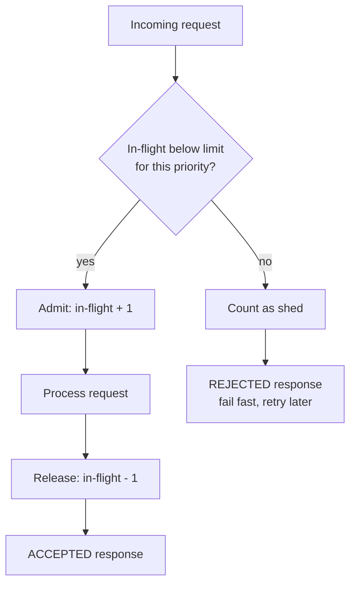
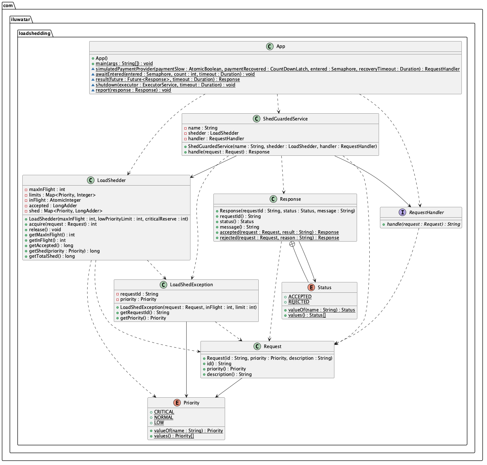

## Also known as

* Overload protection
* Admission control
* Graceful degradation under load

## Intent of Load Shedding Design Pattern

Keep a service responsive when it receives more work than it can handle by measuring its own load and rejecting excess requests immediately, before they consume threads, memory or connections. The requests that are accepted are served with normal latency, the rest fail fast so callers can retry or degrade gracefully.

## Detailed Explanation of Load Shedding Pattern with Real-World Examples

Real-world example

> A power grid that is asked for more electricity than it can generate does not try to serve everybody a little worse. It disconnects selected neighbourhoods in a controlled way, keeps hospitals and traffic lights powered, and reconnects the rest when generation catches up. Without this deliberate "load shedding" the frequency would drop and the whole grid would collapse.

In plain words

> When a service is at capacity, say no to new requests right away instead of letting them queue up and slow everything down. Drop the least important work first.

Google's Site Reliability Engineering book says

> A server that is overloaded should degrade gracefully... it is better to reject some requests quickly than to accept all of them and serve every request slowly or not at all.

Flowchart





## Programmatic Example of Load Shedding Pattern in Java

Our example is an order service that can process five requests at the same time. When a slow payment provider makes orders pile up inside the service, new requests are shed according to their priority: best-effort work is dropped first, regular traffic is dropped when the service is almost full, and one slot is always kept free for critical requests such as checkout.

Every request carries a `Priority`. It is the only piece of information the shedder needs.

```java
public enum Priority {
  CRITICAL,
  NORMAL,
  LOW
}

public record Request(String id, Priority priority, String description) {}
```

The `LoadShedder` is the admission controller. It knows the hard capacity of the service and a limit per priority: low priority requests are shed early, normal requests may not touch the reserve kept for critical ones, and critical requests may use the whole capacity. The admission check is lock-free: the in-flight count is updated with an atomic accumulator whose function refuses to increment past the limit, so concurrent callers can never push the in-flight count above the capacity. A request that cannot be admitted gets a `LoadShedException` immediately instead of a place in a queue.

```java
public class LoadShedder {

  private final int maxInFlight;
  private final Map<Priority, Integer> limits = new EnumMap<>(Priority.class);
  private final AtomicInteger inFlight = new AtomicInteger();
  private final LongAdder accepted = new LongAdder();
  private final Map<Priority, LongAdder> shed = new EnumMap<>(Priority.class);

  public LoadShedder(int maxInFlight, int lowPriorityLimit, int criticalReserve) {
    // validation omitted
    this.maxInFlight = maxInFlight;
    limits.put(Priority.CRITICAL, maxInFlight);
    limits.put(Priority.NORMAL, maxInFlight - criticalReserve);
    limits.put(Priority.LOW, lowPriorityLimit);
    for (var priority : Priority.values()) {
      shed.put(priority, new LongAdder());
    }
  }

  public int acquire(Request request) {
    var priority = request.priority();
    var limit = limits.get(priority);
    // The accumulator is a pure function, so it is safe for the atomic to re-apply it under
    // contention: the count is only incremented while it is below the limit for this priority.
    var previous =
        inFlight.getAndAccumulate(
            1, (current, increment) -> current >= limit ? current : current + increment);
    if (previous >= limit) {
      // Fail fast: the caller gets an immediate rejection instead of waiting in a queue.
      shed.get(priority).increment();
      throw new LoadShedException(request, previous, limit);
    }
    accepted.increment();
    return previous + 1;
  }

  public void release() {
    // Clamped at zero so that an unmatched release cannot hand out capacity the service lacks.
    inFlight.updateAndGet(current -> Math.max(0, current - 1));
  }
}
```

`ShedGuardedService` puts the shedder in front of the real business logic, which is a plain `RequestHandler` function. Shed requests are answered with a `REJECTED` response right away and never reach the handler. Admitted requests always release their slot when they finish, even when the handler throws.

```java
@Slf4j
public class ShedGuardedService {

  private final String name;
  private final LoadShedder shedder;
  private final RequestHandler handler;

  public Response handle(Request request) {
    int inFlight;
    try {
      // The count is taken from the admission itself: reading it back afterwards could report a
      // value that belongs to a concurrent request.
      inFlight = shedder.acquire(request);
    } catch (LoadShedException e) {
      LOGGER.warn("[{}] shed {} ({}): {}", name, request.id(), request.priority(), e.getMessage());
      return Response.rejected(request, e.getMessage());
    }
    LOGGER.info("[{}] admitted {} ({}), {}/{} in flight", name, request.id(), request.priority(),
        inFlight, shedder.getMaxInFlight());
    try {
      return Response.accepted(request, handler.handle(request));
    } finally {
      shedder.release();
    }
  }
}
```

The `App` drives three phases. Under light load every request is admitted. Then the payment provider becomes slow, four orders get stuck inside the service and three probes are sent: the low priority one is shed because the service is past the low priority limit, the normal one is shed because only the critical reserve is left, and the critical checkout is admitted into that reserve. When the provider recovers the stuck orders complete and new requests are admitted again.

```java
var shedder = new LoadShedder(CAPACITY, LOW_PRIORITY_LIMIT, CRITICAL_RESERVE);
var orderService = new ShedGuardedService("order-service", shedder, paymentProvider);

// Phase 2: four orders are stuck behind a slow payment provider
report(orderService.handle(new Request("p1", Priority.LOW, "prefetch recommendations")));
report(orderService.handle(new Request("p2", Priority.NORMAL, "view cart")));
var checkout = executor.submit(
    () -> orderService.handle(new Request("p3", Priority.CRITICAL, "checkout payment")));
```

Running the program produces output similar to this:

```
Order service capacity: 5 in flight, low priority shed at 3, 1 slot reserved for critical requests
--- Phase 1: light load, every request is admitted ---
[order-service] admitted r1 (LOW), 1/5 in flight
r1 -> ACCEPTED: processed prefetch recommendations
[order-service] admitted r2 (NORMAL), 1/5 in flight
r2 -> ACCEPTED: processed view cart
--- Phase 2: payment provider slows down, orders pile up ---
[order-service] admitted order-1 (NORMAL), 1/5 in flight
[order-service] admitted order-2 (NORMAL), 2/5 in flight
[order-service] admitted order-3 (NORMAL), 3/5 in flight
[order-service] admitted order-4 (NORMAL), 4/5 in flight
4 of 5 slots busy, probing with every priority
[order-service] shed p1 (LOW): Request p1 shed: 4 requests in flight, limit for LOW priority is 3
p1 -> REJECTED: Request p1 shed: 4 requests in flight, limit for LOW priority is 3
[order-service] shed p2 (NORMAL): Request p2 shed: 4 requests in flight, limit for NORMAL priority is 4
p2 -> REJECTED: Request p2 shed: 4 requests in flight, limit for NORMAL priority is 4
[order-service] admitted p3 (CRITICAL), 5/5 in flight
--- Phase 3: payment provider recovers, load drops ---
order-1 -> ACCEPTED: processed place order
order-2 -> ACCEPTED: processed place order
order-3 -> ACCEPTED: processed place order
order-4 -> ACCEPTED: processed place order
p3 -> ACCEPTED: processed checkout payment
[order-service] admitted r3 (LOW), 1/5 in flight
r3 -> ACCEPTED: processed prefetch recommendations
Summary: accepted=8, shed 2 requests in total: low=1, normal=1, critical=0
```

## When to Use the Load Shedding Pattern in Java

* A service has a known capacity (threads, connections, CPU) and traffic can exceed it, for example during marketing campaigns, retry storms or when a downstream dependency slows down.
* Latency matters more than throughput: it is better to answer some callers quickly with an error than to answer everybody late.
* Requests differ in importance and you want to protect critical flows (checkout, health checks, control plane traffic) at the expense of best-effort work.
* Callers are able to retry with backoff or to degrade gracefully when they receive a rejection.

## Real-World Applications of Load Shedding Pattern in Java

* Google's frontends shed load based on per-request criticality and measured CPU utilisation, as described in the Site Reliability Engineering book.
* Netflix's [concurrency-limits](https://github.com/Netflix/concurrency-limits) library rejects requests once the measured concurrency limit of a Java service is reached.
* Envoy and Istio provide admission control filters that reject requests when success rate or concurrency thresholds are exceeded.
* Resilience4j's `Bulkhead` and Hystrix's semaphore isolation reject calls when the configured number of concurrent calls is in flight.
* Netty and Tomcat reject connections when their accept queues are full rather than growing without bound.

## Benefits and Trade-offs of Load Shedding Pattern

Benefits:

* Keeps latency predictable for the requests that are admitted instead of degrading every request.
* Prevents an overloaded service from exhausting memory, threads or connection pools and crashing.
* Stops overload from cascading: callers get an immediate answer and can fail over, degrade or back off.
* Priority-aware shedding protects the business-critical flows first.

Trade-offs:

* Some requests are deliberately rejected, so callers must be prepared to handle a rejection.
* Choosing capacity limits and priority thresholds requires measurement; limits that are too low waste capacity and limits that are too high do not protect the service.
* A static in-flight limit does not follow changes in hardware or in the cost of individual requests. Adaptive variants measure latency or CPU instead.
* Rejected callers that retry immediately can turn shedding into a retry storm, so shedding is usually combined with exponential backoff on the client side.

## Related Java Design Patterns

* [Rate Limiting](../rate-limiting-pattern): limits how many requests a client may send in a time window; load shedding instead reacts to the actual load of the server, whoever the client is.
* [Throttling](../throttling): slows callers down to a configured rate; load shedding rejects excess work outright once capacity is reached.
* [Backpressure](../backpressure): asks producers to slow down; load shedding is the last line of defence when producers cannot or do not slow down.
* [Queue-Based Load Leveling](../queue-based-load-leveling): buffers bursts in a queue; load shedding bounds that queue and drops what does not fit so that latency stays low.
* [Circuit Breaker](../circuit-breaker): protects a caller from a failing dependency; load shedding protects a service from its callers.
* [Fallback](../fallback): a natural companion, callers can answer a shed request with a cached or simplified response.

## References and Credits

* [Load Shedding pattern (microservices.io)](https://microservices.io/patterns/reliability/load-shedding.html)
* [Site Reliability Engineering, chapter Handling Overload (Google)](https://sre.google/sre-book/handling-overload/)
* [Release It! Design and Deploy Production-Ready Software (Michael T. Nygard)](https://www.amazon.com/gp/product/1680502395)
* [Using load shedding to avoid overload (Amazon Builders' Library)](https://aws.amazon.com/builders-library/using-load-shedding-to-avoid-overload/)
* [Netflix concurrency-limits](https://github.com/Netflix/concurrency-limits)
