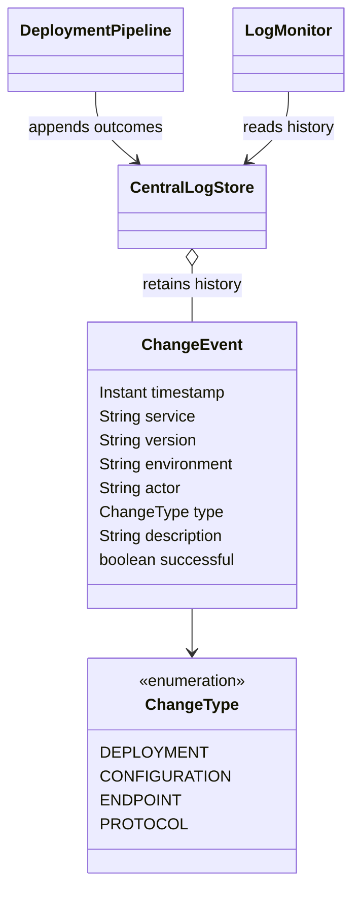

## Intent of Microservices Log Deployments and Changes Design Pattern

Record deployments and operational changes with their service, version, environment, initiator,
timestamp, and outcome. Use this history to correlate changes with unexpected application behavior.

## Detailed Explanation of Microservices Log Deployments and Changes Pattern with Real-World Examples

Real-world example

> An online shop releases a new orders service and changes the payments timeout. Payments then
> start failing. A shared timeline helps operators identify which changes preceded the failures,
> even though different teams performed the operations.

In plain words

> Keep a shared record of what changed, when, who changed it, and whether it succeeded.

[Microservices.io](https://microservices.io/patterns/observability/log-deployments-and-changes.html)
describes recording deployments and environment changes to correlate them with application issues.

This example follows the producer-to-central-store structure of
[Microservices Log Aggregation](../microservices-log-aggregation/README.md). Its events describe
operational changes rather than general application messages. Each `DeploymentPipeline` wraps a
service operation and appends its outcome to the shared `CentralLogStore`. `LogMonitor` presents
the history and selects alerts using a supplied rule.

## Class diagram



## Programmatic Example of Microservices Log Deployments and Changes Pattern in Java

Create a shared store and inject a clock. Tests use a fixed clock for deterministic UTC timestamps.

```java
var store = new CentralLogStore();
var pipeline = new DeploymentPipeline(store, Clock.systemUTC());
var monitor = new LogMonitor(store);
pipeline.execute(
    "orders", "2.0", "production", "release-engineer", ChangeType.DEPLOYMENT,
    "Deploy orders release", () -> LOGGER.info("Deploying orders 2.0"));
```

The operation represents deployment tooling or a configuration update. `execute` invokes it once
and records an immutable `ChangeEvent` in a `finally` block. A successful return records success;
an exception records failure and propagates to the caller. The timestamp is the completion time.
Configuration, endpoint, and communication protocol updates use the corresponding `ChangeType`.
Callers do not need a separate logging step.

Display the timeline and alert on failed production operations:

```java
LOGGER.info("Deployment and change timeline:\n{}", monitor.timeline());
monitor.alerts(event -> !event.successful() && "production".equals(event.environment()))
    .forEach(event -> LOGGER.warn("ALERT: {} {} failed", event.service(), event.type()));
```

`App` simulates changes for orders and payments. Its protocol update deliberately fails; the demo
catches that failure to display the complete history. Output includes these lines (times and actor vary):

```text
2026-01-01T12:00:00Z | orders | 2.0 | production | release-engineer | DEPLOYMENT | SUCCESS | Deploy orders release
2026-01-01T12:00:00Z | payments | 1.1 | production | release-engineer | PROTOCOL | FAILURE | Switch inter-service protocol to gRPC
ALERT: payments PROTOCOL failed
```

### Running and verifying the example

From the repository root, with Java 21:

```shell
./mvnw -pl microservices-log-deployments-and-changes -am test
./mvnw -pl microservices-log-deployments-and-changes spotless:check
./mvnw -pl microservices-log-deployments-and-changes -am package -DskipTests
java -jar microservices-log-deployments-and-changes/target/microservices-log-deployments-and-changes-1.26.0-SNAPSHOT.jar
```

On Windows, use `./mvnw.cmd` instead of `./mvnw`. Tests cover all event types, complete metadata,
exception propagation, and immutable snapshots. `LogMonitorTest` also integrates two producers
with the shared store and verifies the rendered timeline and selective alerts.

### CI/CD integration

The repository's `.github/workflows/log-deployments-and-changes.yml` defines the manually triggered
**Log deployments and changes example** workflow. It follows the existing Java 21/Maven setup,
builds this module, and runs the demonstration. `App` reads `GITHUB_ACTOR` for the initiator. The
workflow saves the console timeline and alerts as a downloadable artifact. Once the workflow is
on the default branch, run it from the repository's Actions tab.

This is a simulated pipeline; it does not deploy the repository's other examples. For a real service,
wrap its deployment or change command with `DeploymentPipeline.execute`, supplying the actual
version, environment, and initiator. The operation must throw on failure, including when an external
command returns a nonzero exit code. Share the event destination across services. Production callers
should let failures fail the pipeline; only the demo catches its deliberately simulated failure.

The store is single-threaded and in-memory, and visualization is a console timeline. It does not
retain history between processes, detect out-of-band changes, or send external notifications.
Production use needs durable shared collection, delivery handling, and monitoring that overlays
change timestamps on service metrics. Abrupt process termination can prevent a completion event
from being written. Descriptions should not contain credentials or raw configuration secrets.

## When to Use the Microservices Log Deployments and Changes Pattern in Java

* Multiple services or teams deploy independently.
* Operators need to correlate incidents with releases and environment changes.
* Configuration, endpoint, or protocol changes affect behavior without a new release.

## Real-World Applications of Microservices Log Deployments and Changes Pattern in Java

* Deployment tools can publish release markers alongside application metrics, as described by
  [Microservices.io](https://microservices.io/patterns/observability/log-deployments-and-changes.html).
* Service delivery pipelines can record releases and configuration updates in one operational history.

## Benefits and Trade-offs of Microservices Log Deployments and Changes Pattern

Benefits:

* Makes recent changes visible across service and team boundaries.
* Automates recording at the operation boundary, including failed attempts.
* Supports filtering by environment, service, type, or outcome.

Trade-offs:

* Every deployment and change path must participate for complete history.
* Durable collection and reliable delivery add operational work.
* Temporal correlation aids investigation but does not prove causation.

## Related Java Design Patterns

* [Microservices Log Aggregation](../microservices-log-aggregation/README.md): centralizes application logs.
* [Event Sourcing](../event-sourcing/README.md): reconstructs state from events; this example records operational outcomes.
* [Observer](../observer/README.md): can notify subscribers when change events arrive.

## References and Credits

* [Pattern: Log deployments and changes](https://microservices.io/patterns/observability/log-deployments-and-changes.html)
* [Issue #2696](https://github.com/iluwatar/java-design-patterns/issues/2696)
