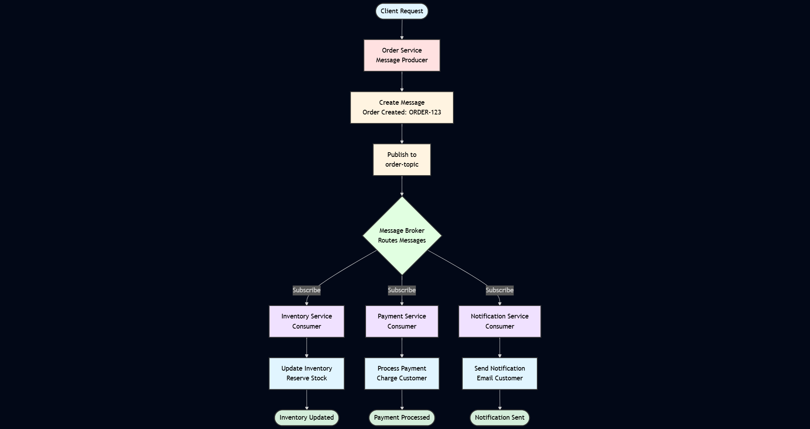
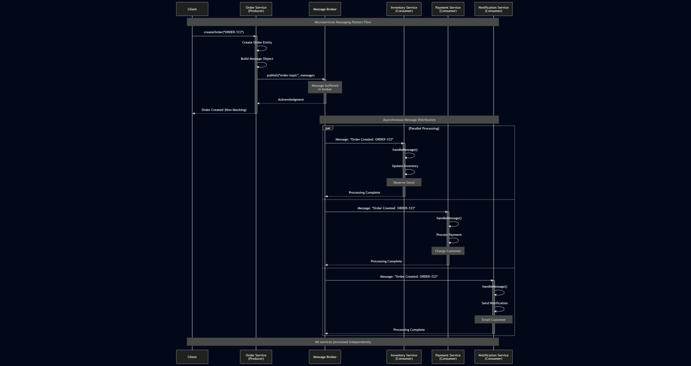

## Also known as

* Asynchronous Messaging
* Event-Driven Communication
* Message-Oriented Middleware (MOM)

## Intent of Microservices Messaging Design Pattern

The Microservices Messaging pattern enables asynchronous communication between microservices through message passing, allowing for better decoupling, scalability, and fault tolerance. Services communicate by exchanging messages over messaging channels managed by a message broker.

## Detailed Explanation of Microservices Messaging Pattern with Real-World Examples

Real-world example

> Imagine an e-commerce platform where a customer places an order. The Order Service publishes an "Order Created" message to a message broker. Multiple services listen to this message: the Inventory Service updates stock levels, the Payment Service processes payment, and the Notification Service sends confirmation emails. Each service operates independently, processing messages at its own pace without blocking others. If the Payment Service is temporarily down, the message broker holds the message until it recovers, ensuring no data is lost.

In plain words

> The Microservices Messaging pattern allows services to communicate asynchronously through a message broker, enabling them to work independently without waiting for each other.

Wikipedia says

> Message-oriented middleware is software or hardware infrastructure supporting sending and receiving messages between distributed systems. MOM allows application modules to be distributed over heterogeneous platforms and reduces the complexity of developing applications that span multiple operating systems and network protocols.

Flowchart




## Programmatic Example of Microservices Messaging Pattern in Java


The Microservices Messaging pattern demonstrates how services communicate through a message broker without direct coupling. In this example, we show an order processing system where services exchange messages asynchronously.

The `Message` class represents the data exchanged between services.

```java
public class Message {
  private final String id;
  private final String content;
  private final LocalDateTime timestamp;

  public Message(String content) {
    this.id = UUID.randomUUID().toString();
    this.content = content;
    this.timestamp = LocalDateTime.now();
  }

  // Getters
}
```

The `MessageBroker` acts as the intermediary that routes messages between producers and consumers.

```java
public class MessageBroker {
  private final Map subscribers = new ConcurrentHashMap<>();

  public void subscribe(String topic, Consumer handler) {
    subscribers.computeIfAbsent(topic, k -> new ArrayList<>()).add(handler);
  }

  public void publish(String topic, Message message) {
    List<Consumer> handlers = subscribers.get(topic);
    if (handlers != null) {
      handlers.forEach(handler -> handler.accept(message));
    }
  }
}
```

The `OrderService` is a message producer that publishes order messages.

```java
public class OrderService {
  private static final Logger LOGGER = LoggerFactory.getLogger(OrderService.class);
  private final MessageBroker broker;

  public OrderService(MessageBroker broker) {
    this.broker = broker;
  }

  public void createOrder(String orderId) {
    Message message = new Message("Order Created: " + orderId);
    broker.publish("order-topic", message);
    LOGGER.info("Published order message: {}", orderId);
  }
}
```

The `InventoryService` is a message consumer that processes inventory updates.

```java
public class InventoryService {
  private static final Logger LOGGER = LoggerFactory.getLogger(InventoryService.class);

  public void handleMessage(Message message) {
    LOGGER.info("Inventory Service received: {}", message.getContent());
    LOGGER.info("Updating inventory...");
  }
}
```

The `PaymentService` handles payment processing messages.

```java
public class PaymentService {
  private static final Logger LOGGER = LoggerFactory.getLogger(PaymentService.class);

  public void handleMessage(Message message) {
    LOGGER.info("Payment Service received: {}", message.getContent());
    LOGGER.info("Processing payment...");
  }
}
```

The `main` application demonstrates the messaging pattern in action.

```java
public class App {
  private static final Logger LOGGER = LoggerFactory.getLogger(App.class);

  public static void main(String[] args) throws InterruptedException {
    final MessageBroker broker = new MessageBroker();

    final InventoryService inventoryService = new InventoryService();
    final PaymentService paymentService = new PaymentService();

    broker.subscribe("order-topic", inventoryService::handleMessage);
    broker.subscribe("order-topic", paymentService::handleMessage);

    final OrderService orderService = new OrderService(broker);

    orderService.createOrder("ORDER-123");

    Thread.sleep(1000);
  }
}
```

Console output:

```
Published order message: ORDER-123
Inventory Service received: Order Created: ORDER-123
Updating inventory...
Payment Service received: Order Created: ORDER-123
Processing payment...
```

Sequence Diagram




## When to Use the Microservices Messaging Pattern in Java

* When services need to communicate without blocking each other.
* In systems requiring loose coupling between components.
* For event-driven architectures where multiple services react to events.
* When you need to handle traffic spikes by buffering messages.
* In distributed systems where services may be temporarily unavailable.

## Real-World Applications of Microservices Messaging Pattern in Java

* Java applications using Apache Kafka, RabbitMQ, or ActiveMQ for service communication.
* E-commerce platforms for order processing and inventory management.
* Financial services for transaction processing and notifications.
* IoT systems for sensor data processing and event handling.

## Benefits and Trade-offs of Microservices Messaging Pattern

* Services are loosely coupled and can be developed and deployed independently.
* Message buffering improves system resilience when services are temporarily unavailable.
* Supports multiple communication patterns like publish/subscribe and request/reply.
* Enhances scalability by allowing parallel message processing.
* Natural support for event-driven architectures.

Trade-offs:

* Introduces additional complexity with the message broker infrastructure.
* Requires high availability setup for the message broker.
* Eventual consistency instead of immediate consistency.
* Debugging asynchronous flows is more complex than synchronous calls.
* Need to handle message duplication and ensure idempotent consumers.

## Related Java Design Patterns

* [Saga Pattern](https://java-design-patterns.com/patterns/saga/): Uses messaging to coordinate distributed transactions.
* [CQRS Pattern](https://java-design-patterns.com/patterns/cqrs/): Often uses messaging to separate read and write operations.
* [Event Sourcing](https://java-design-patterns.com/patterns/event-sourcing/): Stores state changes as messages.
* [API Gateway](https://java-design-patterns.com/patterns/microservices-api-gateway/): Complements messaging for synchronous requests.

## References and Credits

* [Enterprise Integration Patterns: Designing, Building, and Deploying Messaging Solutions](https://amzn.to/3vLKqET)
* [Microservices Patterns: With examples in Java](https://amzn.to/3UyWD5O)
* [Building Event-Driven Microservices: Leveraging Organizational Data at Scale](https://amzn.to/3PihS9R)
* [Pattern: Messaging (microservices.io)](https://microservices.io/patterns/communication-style/messaging.html)
* [Apache Kafka Documentation](https://kafka.apache.org/documentation/)