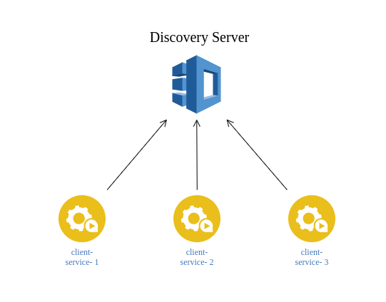

## Intent

Eureka server is a component of Netflix's Eureka service discovery system that allows microservices to register themselves and discover other services in a distributed environment.

## Explanation

When an Eureka client wants to register with a Eureka server, it first sends a registration request containing its application metadata, such as its name, IP address, and port number, to the Eureka server's registration endpoint. The Eureka server then stores this information in its registry, associating it with the client's application name.

The Eureka client periodically sends heartbeats to the Eureka server to indicate its availability and refresh its registration. If the server doesn't receive a heartbeat within a certain timeframe, it assumes the client is no longer available and removes it from the registry. Additionally, the Eureka client can also send a deregistration request to the Eureka server when it wants to unregister itself from the registry, such as during shutdown or when it becomes unavailable.

Here's the example of eureka server.

Entry point
```java
@EnableEurekaServer
@SpringBootApplication
public class DiscoveryServerApplication
{
	public static void main(String[] args)
	{
		SpringApplication.run(DiscoveryServerApplication.class, args);
	}
}
```

Configuration
```yaml
server:
  port: 8761

eureka:
  client:
    register-with-eureka: false
    fetch-registry: false
```

Here's the example of eureka client.

Entry point
```java
@EnableDiscoveryClient
@SpringBootApplication
public class ClientServiceApplication
{
	public static void main(String[] args)
	{
		SpringApplication.run(ClientServiceApplication.class, args);
	}
}
```

Configuration
```yaml
server:
  port:
    8080
spring:
  application:
    name: CLIENT-SERVICE
eureka:
  client:
    service-url:
      defaultZone : http://localhost:8761/eureka/
```


## Diagram


## Applicability

Use the Discovery pattern when

* You're using a complex distributed systems and microservices architectures, where services need to discover and communicate with each other in a flexible and scalable manner.

## Tutorials

* [Service Discovery: Eureka Server](https://cloud.spring.io/spring-cloud-netflix/multi/multi_spring-cloud-eureka-server.html)