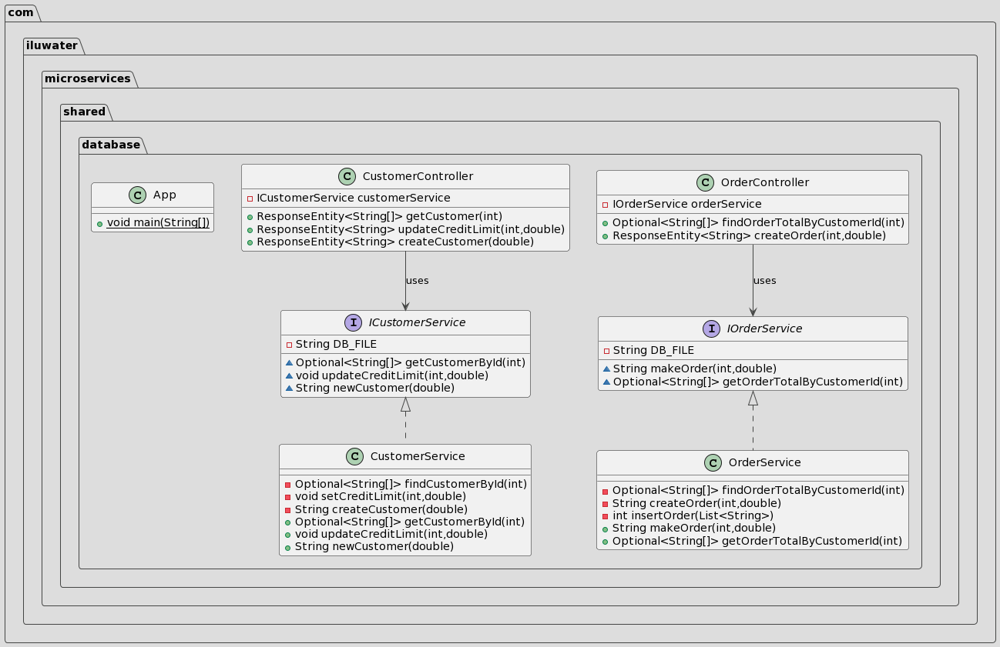

---  
title: Microservices Architecture - Shared Database  
category: Architectural  
language: en  
tag:
- Cloud distributed
- Decoupling
- Microservices
---  

## Intent

The data and its relevant operations inside the services are interdependent, and the Shared Database could notify the cross-service updates in microservices.

## Explanation

Real world example

> Our e-commerce has two services,  the `Order Service` stores information about orders and the `Customer Service` stores information about customers.
> When new order is created, the `Order Service` should check whether is customer has passed their credit limit.
> A shared database could let the `OrderService` and `CustomerService` freely access each other’s tables. For example, the `OrderService` can use the following ACID transaction ensure that a new order will not violate the customer’s credit limit.
>

In plain words

> Shared database allow many services to access and modify the same database so that to ensure their data persistence.

microservices.io says

> Use a (single) database that is shared by multiple services. Each service freely accesses data owned by other services using local ACID transactions.

**Programmatic Example**

Let's start from the layout of the shared database. Here's our `localdb.txt`.

```txt
CUSTOMERS  
ID, CREDIT_LIMIT  
234, 60000.0  
235, 1000.0  
  
ORDERS  
ID, CUSTOMER_ID, STATUS, TOTAL  
4567, 234, ACCEPTED, 54044.30
```  

Next we can introduce our `CustomerController` microservice. It contains find method `getCustomer`, update method `updateCreditLimit`   and  create method `createCustomer`  for calling customer microservice.

```java  
@RestController  
@RequestMapping("/api/customers")  
public class CustomerController {  
  
    @Autowired  
    private ICustomerService customerService; 
    
    /**  
	 * Endpoint to retrieve a specific customer's details by their ID. * * @param customerId The ID of the customer to retrieve.  
	 * @return A ResponseEntity containing the customer's details or an error message.  
	 */
	@GetMapping("/get/{customerId}")  
	public ResponseEntity<String[]> getCustomer(@PathVariable int customerId) {
		// ......
	}

	/**  
	 * Endpoint to update the credit limit of a specific customer. * * @param customerId The ID of the customer to update.  
	 * @param newCreditLimit The new credit limit value.  
	 * @return A ResponseEntity indicating the success or failure of the operation.  
	 */
	@PutMapping("/creditLimit/{customerId}")  
	public ResponseEntity<String> updateCreditLimit(@PathVariable int customerId, @RequestParam double newCreditLimit) {
		// ......
	}

	/**  
	 * Endpoint to create a new customer with a specified credit limit. * * @param creditLimit The credit limit for the new customer.  
	 * @return A ResponseEntity containing the ID of the newly created customer or an error message.  
	 */
	@PostMapping("/create/{creditLimit}")  
	public ResponseEntity<String> createCustomer(@PathVariable double creditLimit) {
		// ......
	}
}
```  

Then we can introduce our `OrderCustomerController` microservice. It contains find method `findOrderTotalByCustomerId` and  create method `createOrder`  for calling order microservice.

```java  
@RestController  
@RequestMapping("/api/orders")  
public class OrderController {  
  
    @Autowired  
    private IOrderService orderService;
    
    /**  
	 * Endpoint to retrieve the total orders of a specific customer. * * @param customerId The ID of the customer whose orders are to be fetched.  
	 * @return An Optional containing a list of orders in String array format or an error message if not found.  
	 */@GetMapping("/getTotal/{customerId}")  
	public Optional<String[]> findOrderTotalByCustomerId(@PathVariable int customerId) {
		// ......
	}

	/**  
	 * Endpoint to create an order for a specific customer. * * @param customerId The ID of the customer making the order.  
	 * @param amount The amount of the order.  
	 * @return A ResponseEntity containing a success message if the order was created or an error message if not.  
	 */@PostMapping("/create/{customerId}")  
	public ResponseEntity<String> createOrder(@PathVariable int customerId, @RequestParam double amount) {
		// ......
	}
}
```  

Now calling the relevant REST API to modify or return the customer or order information :

- Get customer info

```bash  
curl http://localhost:8080/api/customers/get/234
```  

- Update customer credit

```bash  
curl -X PUT http://localhost:8080/api/customers/creditLimit/234 -d "newCreditLimit=70000"
```  

- Create new customer

```bash  
curl -X POST http://localhost:8080/api/customers/create/2000
```  

- Get all orders of the customer

```bash  
curl http://localhost:8080/api/orders/getTotal/234 
```  

- Create new order for customer

```bash  
curl -X POST http://localhost:8080/api/orders/create/234 -d "amount=5000"
```  
## Class diagram



## Applicability

Use the Shared Database pattern if you believe the interdependency between the services is sufficiently high, and they need to notify the frequent data updates.
## Credits

* [Microservices Patterns: With examples in Java](https://www.amazon.com/gp/product/1617294543/ref=as_li_qf_asin_il_tl?ie=UTF8&tag=javadesignpat-20&creative=9325&linkCode=as2&creativeASIN=1617294543&linkId=8b4e570267bc5fb8b8189917b461dc60)
* [Shared database (microservices.io)](https://microservices.io/patterns/data/shared-database.html)
