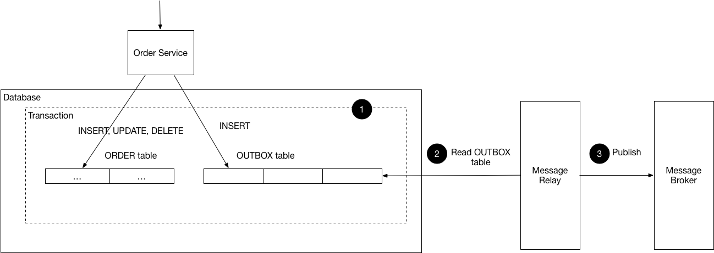

## Also known as

* Outbox Pattern
* Reliable Messaging Pattern

## Intent of Microservices Transactional Outbox Design Pattern

To ensure that messages are reliably sent from a microservice as part of a single, atomic database transaction, preventing data loss and inconsistencies in distributed systems.

## Detailed Explanation of Microservices Transactional Outbox Pattern with Real-World Examples

Real-world example
> Imagine an e-commerce platform's "Order Service." When a new order is placed, the service must save the order to its database and also notify a separate "Notification Service" to send a confirmation email. If the Order Service first saves the order and then tries to publish a message, the message broker could be down, resulting in an order being created without a notification. Conversely, if it sends the message first and then the database commit fails, a notification is sent for an order that doesn't exist. The Transactional Outbox pattern solves this by saving the new order and the "email notification" event into an `outbox` table within the same database transaction. A separate process then reads from this `outbox` table and reliably sends the event to the Notification Service, guaranteeing that a notification is sent if, and only if, the order was successfully created.

In plain words
> Atomically save your business data and the messages about those changes in your local database before sending them to other services.

Chris Richardson's "microservices.io" says
> The Transactional Outbox pattern ensures that a message is sent if and only if the database transaction that creates the event commits. The service that sends the message has an "outbox" table in its database. When it sends a message, it inserts the message into the outbox table as part of the same transaction that updates its business entities. A separate message relay process reads the outbox table and publishes the messages to a message broker.

Flowchart



## Programmatic Example of Microservices Transactional Outbox Pattern in Java

This example demonstrates the Transactional Outbox pattern for a `CustomerService`. When a new customer is created, the business data is saved, and a corresponding event is stored in an `outbox` table within the same transaction. A background poller then reads these events and sends them to a message broker.

The `OutboxEvent` entity represents a record in our `outbox` table.

```java
@Entity
@Table(name = "OUTBOX")
public class OutboxEvent {

    @Id
    @GeneratedValue
    private Integer id;

    private String eventType;
    private String payload; // Typically a JSON string
    private boolean processed;
    private LocalDateTime createdAt;

    // Constructors, Getters, and Setters
}
```

The `CustomerService` handles the business logic. It saves a new `Customer` and an `OutboxEvent` in a single, atomic database transaction.

```java
public class CustomerService {

  private final EntityManager entityManager;
  private final OutboxRepository outboxRepository;

  public void createCustomer(String username) throws Exception {
    entityManager.getTransaction().begin();
    try {
      // 1. Save the business entity
      var customer = new Customer(username);
      entityManager.persist(customer);

      // 2. Create and save the outbox event in the same transaction
      String payload = new ObjectMapper().writeValueAsString(customer);
      var event = new OutboxEvent("CUSTOMER_CREATED", payload);
      outboxRepository.save(event);

      // 3. Commit the single transaction
      entityManager.getTransaction().commit();
    } catch (Exception e) {
      entityManager.getTransaction().rollback();
      throw e;
    }
  }
}
```

The `EventPoller` acts as the separate process that reads from the outbox and publishes messages.

```java
public class EventPoller {

  private final EntityManager entityManager;
  private final OutboxRepository outboxRepository;
  private final MessageBroker messageBroker;

  public void start() {
    // Polls the database at a fixed rate
  }

  private void processOutboxEvents() {
    entityManager.getTransaction().begin();
    try {
      List<OutboxEvent> events = outboxRepository.findUnprocessedEvents();
      for (var event : events) {
        messageBroker.sendMessage(event);
        outboxRepository.markAsProcessed(event);
      }
      entityManager.getTransaction().commit();
    } catch (Exception e) {
      entityManager.getTransaction().rollback();
    }
  }
}
```

The main application starts the services and simulates customer creation.

```java
public class App {

    public static void main(String[] args) throws Exception {
        var entityManagerFactory = Persistence.createEntityManagerFactory("transactional-outbox-pu");
        var entityManager = entityManagerFactory.createEntityManager();

        var customerService = new CustomerService(entityManager);
        var messageBroker = new MessageBroker();
        var eventPoller = new EventPoller(entityManager, messageBroker);

        // Start the background poller
        eventPoller.start();

        // Simulate application logic
        customerService.createCustomer("john.doe");

        // Shutdown
        eventPoller.stop();
    }
}
```
## When to Use the Microservices Transactional Outbox Pattern in Java

* When you need to guarantee that an event or message is published after a database transaction successfully commits.
* In distributed systems where you need to reliably communicate state changes between services.
* When using asynchronous communication patterns to improve resilience and decoupling but cannot afford to lose messages.
* To avoid dual-write problems where a service needs to write to its own database and send a message as a single atomic operation.

## Real-World Applications of Microservices Transactional Outbox Pattern in Java

* E-commerce platforms for reliably handling order creation, payment confirmation, and shipping notification events. 
* Financial systems for ensuring that transaction notifications and audit logs are created and sent reliably. 
* Booking and reservation systems where a confirmed booking must trigger reliable notifications to other systems (e.g., inventory, customer communication)

## Benefits and Trade-offs of Microservices Transactional Outbox Pattern

Benefits:

* `Reliability`: Guarantees at-least-once delivery of messages, as the event is persisted within the same transaction as the business data. 
* `Data Consistency`: Prevents inconsistencies between a service's internal state and the messages it sends to other services. 
* `Decoupling`: The service's business logic is completely decoupled from the complexities of message publishing, retries, and failure handling.

Trade-offs:

* `Increased Complexity`: Requires an additional `outbox` database table and a separate message relay/polling process. 
* `Latency`: Messages are not sent in real-time. There is a delay between the transaction commit and the message being published by the poller. 
* `Potential` for Duplicate Messages: Because it ensures at-least-once delivery, consumers of the messages must be designed to be idempotent to handle potential duplicates.

## Related Java Design Patterns

* `Saga Pattern`: The Transactional Outbox pattern is a common and reliable way to implement the steps in a Saga, ensuring that commands or events are published reliably between saga participants. 
* `Publish/Subscribe`: The outbox poller typically publishes messages to a topic on a message broker, which are then consumed by one or more subscribers. 
* `Event Sourcing`: While different, both patterns involve persisting state changes as a sequence of events. The outbox pattern can be used to reliably publish events generated in an Event Sourcing system.

## References and Credits

* [Pattern: Transactional Outbox (microservices.io)](https://microservices.io/patterns/data/transactional-outbox.html)
* [Outbox Pattern for Microservices Architectures](https://medium.com/design-microservices-architecture-with-patterns/outbox-pattern-for-microservices-architectures-1b8648dfaa27)
* [Outbox Pattern in Microservices](https://www.baeldung.com/cs/outbox-pattern-microservices)