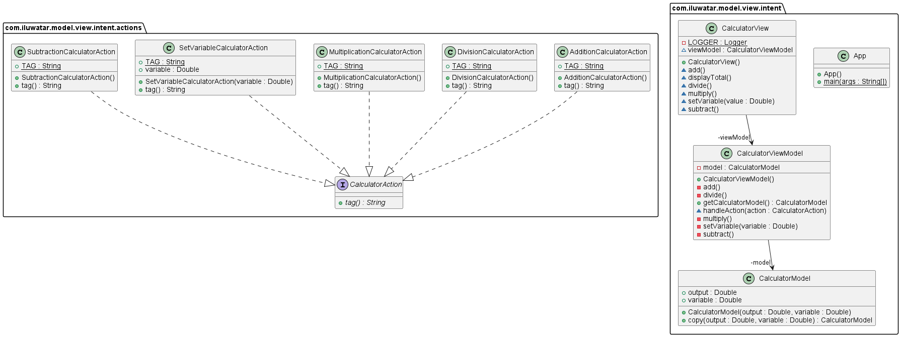

## Also known as

* MVI

## Intent

To create a unidirectional and cyclical data flow between the Model, View, and Intent components, enhancing predictability and maintainability in user interface logic.

## Explanation

Real-world example

> Consider a real-world analogy of the Model-View-Intent (MVI) pattern using the scenario of ordering at a fast-food restaurant.
>
> In this analogy:
> - **Model:** It's like the kitchen of the restaurant, where the current state of your order is managed. As you choose items, the kitchen updates the order status and ingredients used.
> - **View:** This represents the menu and the digital display board where you see your current order summary. It reflects the current state of your order, showing what items you've added or removed.
> - **Intent:** Think of this as your decision-making process when you interact with the menu. Each choice you make (like adding a burger or removing a drink) sends a specific intention to the system (kitchen).
>
> When you decide to add an item to your order (Intent), the kitchen (Model) processes this request, updates the state of your order, and then the display (View) updates to show the latest status of your order. This cycle continues until you finalize your order, demonstrating the unidirectional and cyclical flow characteristic of MVI. This ensures that every change in the order is predictably and accurately reflected in the customer's view, similar to how UI components update in response to state changes in software using MVI.

In plain words

> The Model-View-Intent (MVI) pattern is a reactive architectural approach where user actions (Intent) modify the application state (Model), and the updated state is then reflected back in the user interface (View) in a unidirectional and cyclical data flow.

**Programmatic Example**

The Model-View-Intent (MVI) pattern is a modern approach to structuring your application's logic. It's a variation of the Model-View-Presenter (MVP) and Model-View-ViewModel (MVVM) patterns, but with a more streamlined flow of data and events.

In MVI, the View sends user events to the Intent. The Intent translates these events into a state change in the Model. The Model then pushes this new state to the View, which updates itself accordingly. This creates a unidirectional data flow, which can make your code easier to understand and debug.

First, we have the `App` class, which serves as the entry point for the application. It creates the View and ViewModel, and then simulates a series of user interactions with the calculator.

```java
public final class App {
  private static final double RANDOM_VARIABLE = 10.0;

  public static void main(final String[] args) {
    var view = new CalculatorView(new CalculatorViewModel());
    var variable1 = RANDOM_VARIABLE;

    view.setVariable(variable1);
    view.add();
    view.displayTotal();

    variable1 = 2.0;
    view.setVariable(variable1);
    view.subtract();
    view.divide();
    view.multiply();
    view.displayTotal();
  }

  private App() {
  }
}
```

The `CalculatorView` class represents the View in MVI. It receives user events (in this case, simulated by the `App` class), and sends them to the ViewModel. It also updates its display when it receives a new state from the ViewModel.

```java
public class CalculatorView {
  private CalculatorViewModel viewModel;

  public CalculatorView(CalculatorViewModel viewModel) {
    this.viewModel = viewModel;
  }

  public void setVariable(double variable) {
    viewModel.process(new SetVariableEvent(variable));
  }

  public void add() {
    viewModel.process(new AddEvent());
  }

  public void subtract() {
    viewModel.process(new SubtractEvent());
  }

  public void divide() {
    viewModel.process(new DivideEvent());
  }

  public void multiply() {
    viewModel.process(new MultiplyEvent());
  }

  public void displayTotal() {
    System.out.println("Total: " + viewModel.getState().getTotal());
  }
}
```

The `CalculatorViewModel` class represents the ViewModel in MVI. It receives events from the View, updates the Model's state accordingly, and then pushes the new state to the View.

```java
public class CalculatorViewModel {
  private CalculatorModel model;

  public CalculatorViewModel() {
    this.model = new CalculatorModel();
  }

  public void process(UserEvent event) {
    event.apply(model);
  }

  public CalculatorModel getState() {
    return model;
  }
}
```

The `CalculatorModel` class represents the Model in MVI. It holds the current state of the calculator, and provides methods for updating that state.

```java
public class CalculatorModel {
  private double total;
  private double variable;

  public void setVariable(double variable) {
    this.variable = variable;
  }

  public void add() {
    total += variable;
  }

  public void subtract() {
    total -= variable;
  }

  public void divide() {
    total /= variable;
  }

  public void multiply() {
    total *= variable;
  }

  public double getTotal() {
    return total;
  }
}
```

Finally, the `UserEvent` interface and its implementations represent the different types of user events that can occur. Each event knows how to apply itself to the Model.

```java
public interface UserEvent {
  void apply(CalculatorModel model);
}

public class SetVariableEvent implements UserEvent {
  private double variable;

  public SetVariableEvent(double variable) {
    this.variable = variable;
  }

  @Override
  public void apply(CalculatorModel model) {
    model.setVariable(variable);
  }
}

// Similar classes would be created for AddEvent, SubtractEvent, DivideEvent, and MultiplyEvent
```

This example demonstrates the key aspects of the MVI pattern: unidirectional data flow, clear separation of concerns, and the use of events to drive changes in the Model's state.

## Class diagram



## Applicability

* Useful in applications with complex user interfaces that require a clear separation of concerns and predictable state management.
* Often applied in reactive programming environments to ensure a smooth data flow and state consistency.

## Tutorials

* [Model View Intent: a new Android Architecture Pattern](https://apiumacademy.com/blog/model-view-intent-pattern/)
* [MVI Architecture for Android Tutorial](https://www.kodeco.com/817602-mvi-architecture-for-android-tutorial-getting-started)

## Known uses

* Widely adopted in reactive and event-driven Java applications, particularly those using frameworks like RxJava or Project Reactor.
* Used in Android development, especially with libraries that support reactive programming such as RxJava and LiveData.

## Consequences

Benefits:

* Enhances the predictability of the UI by establishing a clear and cyclical data flow.
* Improves testability due to well-defined separation between components.
* Supports better state management by centralizing the state within the Model.

Trade-offs:

* Increases complexity for simple UIs due to the structured and cyclical flow.
* Requires familiarity with reactive programming paradigms.
* Can lead to boilerplate code if not managed properly.

## Related patterns

[Model-View-ViewModel (MVVM)](https://java-design-patterns.com/patterns/model-view-viewmodel/): Shares a similar goal of separating the view from the model but differs as MVI introduces a cyclical data flow.
[Model-View-Controller (MVC)](https://java-design-patterns.com/patterns/model-view-controller/): MVI can be seen as an evolution of MVC, focusing more on reactive programming and unidirectional data flow.
[Observer](https://java-design-patterns.com/patterns/observer/): Essential in MVI to observe changes in the Model and update the View accordingly.

## Credits

* [Functional and Reactive Domain Modeling](https://amzn.to/4adghJ8)
* [Reactive Programming with RxJava: Creating Asynchronous, Event-Based Applications](https://amzn.to/4dxwawC)
