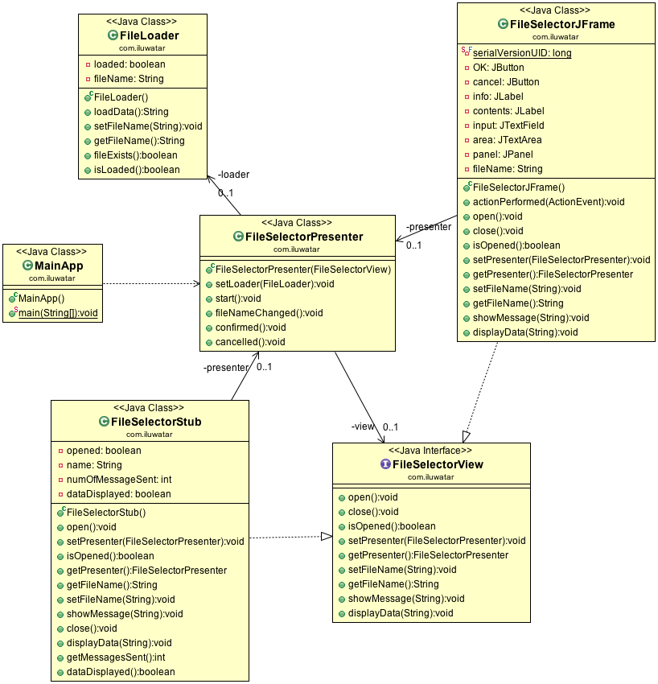

## Intent
Apply a "Separation of Concerns" principle in a way that allows
developers to build and test user interfaces.

## Class diagram

## Applicability
Use the Model-View-Presenter in any of the following
situations

* When you want to improve the "Separation of Concerns" principle in presentation logic
* When a user interface development and testing is necessary.

## Real world examples

* [MVP4J](https://github.com/amineoualialami/mvp4j)
