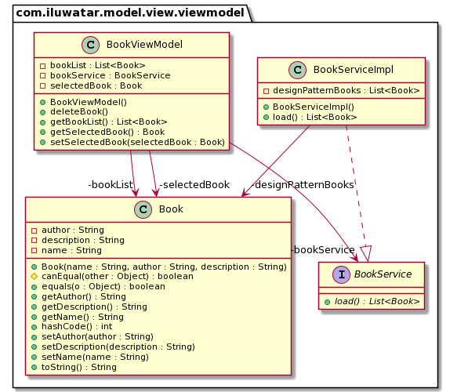

## Also known as

Model–View–Binder

## Intent

To apply "[Separation of Concerns](https://java-design-patterns.com/principles/#separation-of-concerns)" to separate the logic from the UI components and allow developers to work on UI without affecting the logic and vice versa.

## Explanation

Wikipedia says

> Model–view–viewmodel (MVVM) is a software architectural pattern that facilitates the separation of the development of the graphical user interface (the view) – be it via a markup language or GUI code – from the development of the business logic or back-end logic (the model) so that the view is not dependent on any specific model platform. 

**Programmatic Example**

Zkoss implementation:

> ViewModel will hold the business logic and expose the data from model to View

```java
public class BookViewModel {
  @WireVariable
  private List<Book> bookList;
  private Book selectedBook;
  private BookService bookService = new BookServiceImpl();
  
  public Book getSelectedBook() {
    return selectedBook;
  }

  @NotifyChange("selectedBook")
  public void setSelectedBook(Book selectedBook) {
    this.selectedBook = selectedBook;
  }

  public List<Book> getBookList() {
    return bookService.load();
  }
  
  /** Deleting a book.
   */
  @Command
  @NotifyChange({"selectedBook","bookList"})
  public void deleteBook() {
    if (selectedBook != null) {
      getBookList().remove(selectedBook);
      selectedBook = null;
    }
}
```

> View will have no logic, only UI elements

```xml
<zk>
<window title="List of Books" border="normal" width="600px" apply="org.zkoss.bind.BindComposer" viewModel="@id('vm') @init('com.iluwatar.model.view.viewmodel.BookViewModel')">
    <vbox hflex="true">
        <listbox model="@bind(vm.bookList)" selectedItem="@bind(vm.selectedBook)" height="400px" mold="paging">
            <listhead>
                <listheader label="Book Name"/>
                <listheader label="Author"/>               
            </listhead>
            <template name="model" var="book">
                <listitem >
                    <listcell label="@bind(book.name)"/>
                    <listcell label="@bind(book.author)"/>
                </listitem>
            </template>
        </listbox>
    </vbox>
    <toolbar>
        <button label="Delete" onClick="@command('deleteBook')" disabled="@load(empty vm.selectedBook)" />
    </toolbar>
    <hbox style="margin-top:20px" visible="@bind(not empty vm.selectedBook)">
		<vbox>
			<hlayout>
				Book Name : <label value="@bind(vm.selectedBook.name)" style="font-weight:bold"/>
			</hlayout>
			<hlayout>
				Book Author : <label value="@bind(vm.selectedBook.author)" style="font-weight:bold"/>
			</hlayout>
			<hlayout>
				Book Description : <label value="@bind(vm.selectedBook.description)" style="font-weight:bold"/>
			</hlayout>
		</vbox>
	</hbox>
</window>
</zk>
```

To deploy the example, go to model-view-viewmodel folder and run:

* `mvn clean install`
* `mvn jetty:run -Djetty.http.port=9911`
* Open browser to address: http://localhost:9911/model-view-viewmodel/

## Class diagram



## Applicability

* When looking for clean architecture, with better reusability, testability and maintainability.

## Tutorials

* [Zkoss Demo](https://www.zkoss.org/zkdemo/getting_started/mvvm)
* [Learn MVVM](https://www.learnmvvm.com/)
* [Android Developer CodeLabs](https://codelabs.developers.google.com/codelabs/android-databinding)

## Typical Use Case

* Android apps
* .NET framework applications
* JavaScript applications

## Real world examples

* ZK Framework [zkoss.org](https://www.zkoss.org/)
* KnockoutJS [knockoutjs.com](https://knockoutjs.com/)

## Consequences

* John Gossman has criticized the MVVM pattern and its application in specific uses, stating that MVVM can be "overkill" when creating simple user interfaces. For larger applications, he believes that generalizing the viewmodel upfront can be difficult, and that large-scale data binding can lead to lower performance - Ref: [MVVM-Wiki](https://en.wikipedia.org/wiki/Model%E2%80%93view%E2%80%93viewmodel)

* Can be hard to design ViewModel for larger applications.
* For complex databinding, debugging can be difficult.

## Credits

* [ZK MVVM](https://www.zkoss.org/wiki/ZK%20Developer's%20Reference/MVVM)
* [GeeksforGeeks  MVVM Intro](https://www.geeksforgeeks.org/introduction-to-model-view-view-model-mvvm/)
* [ZK MVVM Book](http://books.zkoss.org/zk-mvvm-book/9.5/)
* [Microsoft MVVM](https://docs.microsoft.com/en-us/archive/msdn-magazine/2009/february/patterns-wpf-apps-with-the-model-view-viewmodel-design-pattern)
