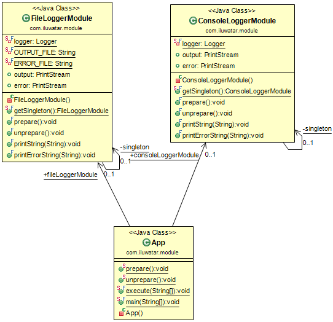

## Intent
Module pattern is used to implement the concept of software modules, defined by modular programming, in a programming language with incomplete direct support for the concept.

## Applicability
The Module pattern can be considered a creational pattern and a structural pattern. It manages the creation and organization of other elements, and groups them as the structural pattern does.

An object that applies this pattern can provide the equivalent of a namespace, providing the initialization and finalization process of a static class or a class with static members with cleaner, more concise syntax and semantics.

## Credits

* [Module](https://en.wikipedia.org/wiki/Module_pattern)
