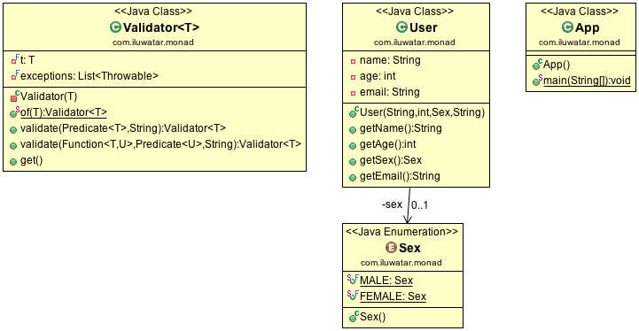

## Intent

Monad pattern based on monad from linear algebra represents the way of chaining operations
together step by step. Binding functions can be described as passing one's output to another's input
basing on the 'same type' contract. Formally, monad consists of a type constructor M and two
operations:
bind - that takes monadic object and a function from plain object to monadic value and returns monadic value
return - that takes plain type object and returns this object wrapped in a monadic value.

## Class diagram

## Applicability

Use the Monad in any of the following situations

* When you want to chain operations easily
* When you want to apply each function regardless of the result of any of them

## Credits

* [Design Pattern Reloaded by Remi Forax](https://youtu.be/-k2X7guaArU)
* [Brian Beckman: Don't fear the Monad](https://channel9.msdn.com/Shows/Going+Deep/Brian-Beckman-Dont-fear-the-Monads)
* [Monad on Wikipedia](https://en.wikipedia.org/wiki/Monad_(functional_programming))
