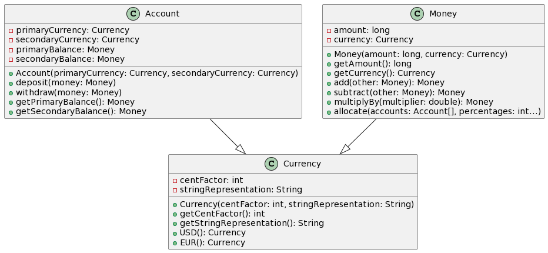

## Intent

The Money Design Pattern, initially defined by Martin Fowler and detailed in "Patterns of Enterprise Application Architecture,"
is a pattern designed to represent value-unit pairs effectively. It's commonly referred to as the "Money Pattern" because it was originally
introduced in the context of financial applications. This pattern aims to handle various aspects of working with money, including currency
conversions, mathematical operations, and more.
## Class diagram

## Known uses

While the Money Design Pattern itself isn't a widely recognized pattern in the traditional sense, the concept of encapsulating money and currency is
used in various financial and measurement applications. Libraries and frameworks often provide tools for managing money and units.

## Consequences

Pros:
- Encapsulation: It encapsulates value and currency, making it easier to work with money-related operations.
- Currency conversion: The pattern can handle automatic currency conversions, simplifying complex financial tasks.
- Reusability: Once implemented, the Money class can be reused in different parts of an application.

Cons:
- Complexity: Implementing the Money Design Pattern, especially with advanced features like automatic currency conversion, can be complex.
- Performance: Depending on the implementation, there may be performance overhead, especially in currency conversion.

## Related patterns

- Factory Pattern: Often used to create instances of Money objects, especially in the context of different currencies.
- Strategy Pattern: Used to define and switch between different currency conversion strategies.

## Applicability

The Money Design Pattern is applicable in various scenarios where you need to manage value-unit pairs. Here are some common use cases:

- Financial applications: Handling multiple currencies, currency conversions, and monetary operations.
- Measurement units: Representing and converting between different measurement units (e.g., temperature in Celsius and Fahrenheit).
- Distance calculations: Storing distances between points in different units (e.g., metric and imperial).
- Quantity-based applications: Managing quantities in various units (e.g., liters, gallons, kilograms, pounds).

## Credits

* [Patkos Csaba: com.iluwatar.Money Pattern: The Right Way to Represent Value-Unit Pairs](https://code.tutsplus.com/money-pattern-the-right-way-to-represent-value-unit-pairs--net-35509t)
