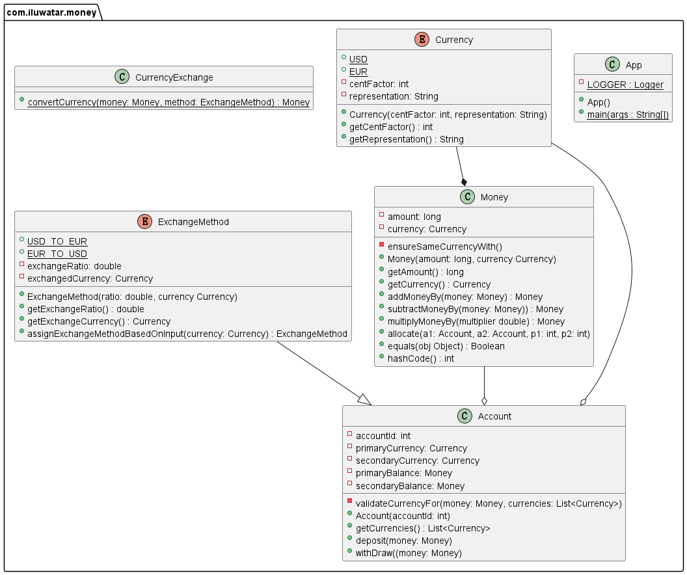

## Intent

Providing a great way to represent value-unit pairs and encapsulates the specifics of the money concept,
to alleviate the burden of computations from Account with underlying calculation handled by Money.

## Explanation

Real-world example

> Imagine now we have an account with two balances. The primary balance is USD, the primary currency of the account.
> The secondary balance is EUR, the secondary currency of the account. Besides, we have earned one extra USD, and we can
> deposit it into the USD balance through the deposit method in Account class. Also, if we are about to take some money
> out, we can use withdraw method in Account. Moreover, if one balance is insufficient, exchange will take place
> automatically between different balances.


**Programmatic Example**

In this example, we see how an account just take over the `deposit` for us.

We have a class `Money` which implements `add`, `subtract`, `multiply` and `allocate`.

```java
public class Money {

  private long amount;
  private final Currency currency;


  public Money(long amount, Currency currency) {
    this.amount = amount;
    this.currency = currency;
  }

  public Money addMoneyBy(Money moneyToAdd) {
    this.ensureSameCurrencyWith(moneyToAdd);
    return new Money(this.amount + moneyToAdd.getAmount(), this.currency);
  }

  public long getAmount() {
    return amount;
  }

  public Currency getCurrency() {
    return currency;
  }

  private void ensureSameCurrencyWith(Money other) {
    if (this.currency != other.getCurrency()) {
      throw new CurrencyMismatchException("Both Moneys must be of same currency");
    }
  }

  @Override
  public boolean equals(Object obj) {
    if (obj == null || getClass() != obj.getClass()) {
      return false;
    }
    var comparedMoney = (Money) obj;
    return this.amount == comparedMoney.getAmount() && this.currency == comparedMoney.getCurrency();
  }

  @Override
  public int hashCode() {
    return Objects.hash(amount, currency);
  }
}
```

Also, there will be an enumeration of Currency where we support (`USD`, `EUR` and `CNY`).

```java
public enum Currency {
  USD(100, "USD"),
  EUR(100, "USD"),
  CNY(100, "CNY");
  
  private final int centFactor;

  private final String representation;

  Currency(final int centFactor, final String representation) {
    this.centFactor = centFactor;
    this.representation = representation;
  }

  public int getCentFactor() {
    return this.centFactor;
  }
  
  public String getStringRepresentation() {
    return this.representation;
  }
}
```

Then finally, we reach the class `Account`.

```java
public class Account { //NOPMD - suppressed DataClass - adapt to the design philosophy of this class
  private final int accountId;
  
  private Currency primaryCurrency;
  
  private Currency secondaryCurrency;
  
  private Money primaryBalance;
  
  private Money secondaryBalance;
  
  public Account(final int accountId) {
    this.accountId = accountId;
  }

  public void setPrimaryCurrency(final Currency primaryCurrency) {
    this.primaryCurrency = primaryCurrency;
  }

  public void setSecondaryCurrency(final Currency secondaryCurrency) {
    this.secondaryCurrency = secondaryCurrency;
  }

  public Money getPrimaryBalance() {
    return primaryBalance;
  }

  public Money getSecondaryBalance() {
    return secondaryBalance;
  }
  
  public List<Currency> getCurrencies() {
    return new ArrayList<>(Arrays.asList(this.primaryCurrency, this.secondaryCurrency));
  }
  
  public void deposit(final Money moneyToDeposit) throws CurrencyMismatchException {
    if (this.primaryCurrency == moneyToDeposit.getCurrency()) {
      if (this.primaryBalance == null) {
        this.primaryBalance = new Money(0, this.primaryCurrency);
      }
      this.primaryBalance = this.primaryBalance.addMoneyBy(moneyToDeposit);
    } else if (this.secondaryCurrency == null
        || this.secondaryCurrency == moneyToDeposit.getCurrency()) {
      if (this.secondaryBalance == null) {
        this.secondaryBalance = new Money(0, this.secondaryCurrency);
      }
      this.secondaryBalance = this.secondaryBalance.addMoneyBy(moneyToDeposit);
    } else {
      throw new CurrencyMismatchException(
          "Currency of money to deposit does not exist in account.");
    }
  }
}
```

Now on the client code we can easily deposit money into our account using the `deposit` method.

```
LOGGER.info("Here you are, the money pattern.");
final var account = new Account(123);
LOGGER.info("An account with ID " + 123 + " is created.");
account.setPrimaryCurrency(Currency.USD);
account.setSecondaryCurrency(Currency.EUR);
account.deposit(new Money(100, Currency.USD));
account.deposit(new Money(200, Currency.EUR));
LOGGER.info("Now the account has balance, USD: " + account.getPrimaryBalance().getAmount()
+ ", EUR: " + account.getSecondaryBalance().getAmount());
```

Program output:

```
Here you are, the money pattern.
An account with ID 123 is created.
Now the account has balance, USD: 100, EUR: 200
```

## Class Diagram



## Applicability

Use the factory pattern when:

* you are about to create a value-unit pair.
* You have a mapping application, and you want to represent distances between points.

## Credits

* [Money Pattern](https://code.tutsplus.com/tutorials/money-pattern-the-right-way-to-represent-value-unit-pairs--net-35509)