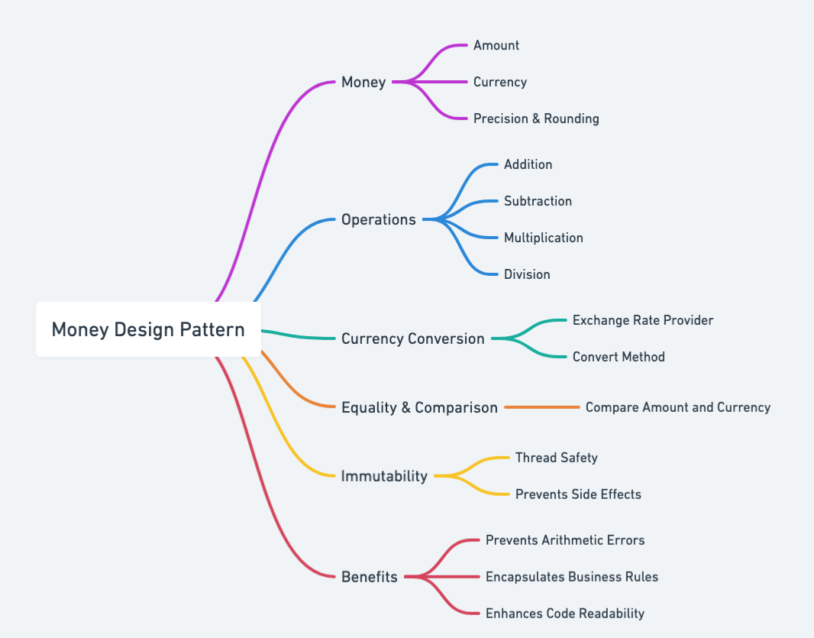
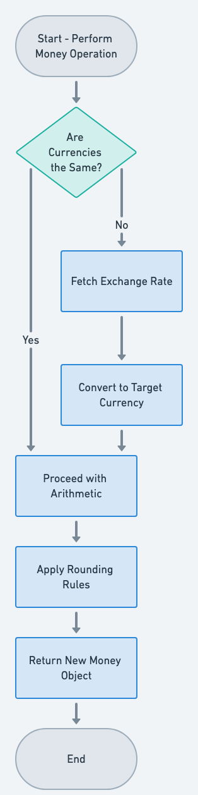

## Also known as

* Monetary Value Object

## Intent of Money Design Pattern

Encapsulate monetary values and their associated currency in a domain-specific object.

## Detailed Explanation of Money Pattern with Real-World Examples

Real-world example

> Imagine an online gift card system, where each gift card holds a specific balance in a particular currency. Instead of just using a floating-point value for the balance, the system uses a Money object to precisely track the amount and currency. Whenever someone uses the gift card, it updates the balance with accurate calculations that avoid floating-point rounding errors, ensuring the domain logic stays consistent and accurate.

In plain words

> The Money pattern encapsulates both an amount and its currency, ensuring financial operations are precise, consistent, and maintainable.

Wikipedia says

> The Money design pattern encapsulates a monetary value and its currency, allowing for safe arithmetic operations and conversions while preserving accuracy and consistency in financial calculations.

Mind map



Flowchart



## Programmatic Example of Money Pattern in Java

In this example, we're creating a `Money` class to demonstrate how monetary values can be encapsulated along with their currency. This approach helps avoid floating-point inaccuracies, ensures arithmetic operations are handled consistently, and provides a clear domain-centric way of working with money.

```java
@AllArgsConstructor
@Getter
public class Money {
    private double amount;
    private String currency;

    public Money(double amnt, String curr) {
        this.amount = amnt;
        this.currency = curr;
    }

    private double roundToTwoDecimals(double value) {
        return Math.round(value * 100.0) / 100.0;
    }

    public void addMoney(Money moneyToBeAdded) throws CannotAddTwoCurrienciesException {
        if (!moneyToBeAdded.getCurrency().equals(this.currency)) {
            throw new CannotAddTwoCurrienciesException("You are trying to add two different currencies");
        }
        this.amount = roundToTwoDecimals(this.amount + moneyToBeAdded.getAmount());
    }

    public void subtractMoney(Money moneyToBeSubtracted) throws CannotSubtractException {
        if (!moneyToBeSubtracted.getCurrency().equals(this.currency)) {
            throw new CannotSubtractException("You are trying to subtract two different currencies");
        } else if (moneyToBeSubtracted.getAmount() > this.amount) {
            throw new CannotSubtractException("The amount you are trying to subtract is larger than the amount you have");
        }
        this.amount = roundToTwoDecimals(this.amount - moneyToBeSubtracted.getAmount());
    }

    public void multiply(int factor) {
        if (factor < 0) {
            throw new IllegalArgumentException("Factor must be non-negative");
        }
        this.amount = roundToTwoDecimals(this.amount * factor);
    }

    public void exchangeCurrency(String currencyToChangeTo, double exchangeRate) {
        if (exchangeRate < 0) {
            throw new IllegalArgumentException("Exchange rate must be non-negative");
        }
        this.amount = roundToTwoDecimals(this.amount * exchangeRate);
        this.currency = currencyToChangeTo;
    }
}
```

By encapsulating all money-related logic in a single class, we reduce the risk of mixing different currencies, improve clarity of the codebase, and facilitate future modifications such as adding new currencies or refining rounding rules. This pattern ultimately strengthens the domain model by treating money as a distinct concept rather than just another numeric value.

## When to Use the Money Pattern

* When financial calculations or money manipulations are part of the business logic
* When precise handling of currency amounts is required to avoid floating-point inaccuracies
* When domain-driven design principles and strong typing are desired

## Real-World Applications of Monad Pattern in Java

* JSR 354 (Java Money and Currency) library in Java
* Custom domain models in e-commerce and accounting systems

## Benefits and Trade-offs of Money Pattern

Benefits

* Provides a single, type-safe representation of monetary amounts and currency
* Encourages encapsulation of related operations such as addition, subtraction, and formatting
* Avoids floating-point errors by using integers or specialized decimal libraries

Trade-offs

* Requires additional classes and infrastructure to handle currency conversions and formatting
* Might introduce performance overhead when performing large numbers of money operations

## Related Design Patterns

* [Value Object](https://java-design-patterns.com/patterns/value-object/): Money is typically a prime example of a domain-driven design value object.

## References and Credits

* [Domain-Driven Design: Tackling Complexity in the Heart of Software](https://amzn.to/3wlDrze)
* [Implementing Domain-Driven Design](https://amzn.to/4dmBjrB)
* [Patterns of Enterprise Application Architecture](https://amzn.to/3WfKBPR)
