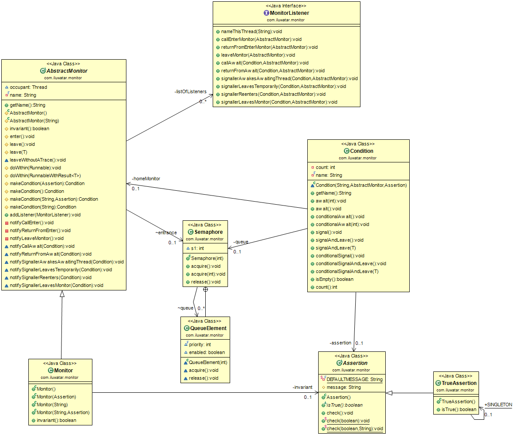

## Intent
In 1974, Tony Hoare proposed the concept of monitors for designing and reasoning about objects that are shared between multiple threads. The key property of these "Hoare-style" monitors is that threads can wait until some specific assertion about the monitor's state is true and be guaranteed that it is still true after the thread has been awakened. The purpose of the Monitor Object is to provide an implementation of Hoare-style monitors for thread communication in a Java-based monitor package that automates assertion checking during execution. This approach reduces redundant coding and automates assertions checking during execution.

## Applicability
Use the Monitor Object Pattern for thread signaling (over Java's wait() and notify() approach) in the following situations:

* When you need Defensive programming in multithreaded code - The monitor package provides support for defensive programming through the invariant() method and the assertion objects associated with each condition object. Java's notify() and wait() provide no assertion checking
* When you need objects to wait on multiple wait queues - The monitor package provides condition objects, each providing its own wait queue. Threads waiting for different assertions to become true wait on different queues. Using wait(), there is only one wait queue per object.
* When you need seamless passing of occupancy - In the monitor package, control is passed seamlessly from the signaling thread to an awaiting thread. You can be sure that, after returning from an await(), the assertion the thread has waited for is true. In contrast, the notify() and notifyAll() methods simply move a waiting thread back to the entry queue for the monitor.

## Credits

* [Theodore S. Norvell - Monitor Object](https://www.javaworld.com/article/2077769/core-java/better-monitors-for-java.html)
* [Monitor (syncronization)](https://en.wikipedia.org/wiki/Monitor_(synchronization))
