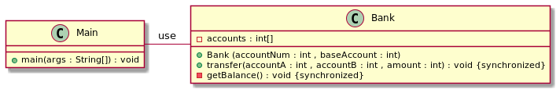

## Also known as

Monitor object pattern

## Intent

The primary intent is to provide a structured and controlled way for multiple threads or processes to safely access and 
manipulate shared resources, such as variables, data structures, or critical sections of code, without causing conflicts 
or race conditions.

## Explanation

In plain words

> Monitor pattern is used to enforce single-threaded access to data. Only one thread at a time is allowed to execute code within the monitor object.

Wikipedia says

> In concurrent programming (also known as parallel programming), a monitor is a synchronization construct that allows threads to have both mutual exclusion and the ability to wait (block) for a certain condition to become false. Monitors also have a mechanism for signaling other threads that their condition has been met.

**Programmatic Examples**

Consider there is a bank that transfers money from an account to another account with transfer method . it is `synchronized` mean just one thread can access to this method because if many threads access to it and transfer money from an account to another account in same time balance changed !   
 
```
class Bank {

     private int[] accounts;
     Logger logger;
 
     public Bank(int accountNum, int baseAmount, Logger logger) {
         this.logger = logger;
         accounts = new int[accountNum];
         Arrays.fill(accounts, baseAmount);
     }
 
     public synchronized void transfer(int accountA, int accountB, int amount) {
         if (accounts[accountA] >= amount) {
             accounts[accountB] += amount;
             accounts[accountA] -= amount;
             logger.info("Transferred from account :" + accountA + " to account :" + accountB + " , amount :" + amount + " . balance :" + getBalance());
         }
     }
```

getBalance always return total amount and the total amount should be same after each transfers 

```
     private synchronized int getBalance() {
         int balance = 0;
         for (int account : accounts) {
             balance += account;
         }
         return balance;
     }
 }
```

## Class diagram


## Applicability

The Monitor design pattern should be used in situations where you have shared resources that need to be accessed and 
manipulated by multiple threads or processes concurrently. This pattern is particularly useful in scenarios where 
synchronization is necessary to prevent race conditions, data corruption, and inconsistent states. Here are some 
situations where you should consider using the Monitor pattern:

1. **Shared Data**: When your application involves shared data structures, variables, or resources that need to be accessed and updated by multiple threads. Monitors ensure that only one thread can access the shared resource at a time, preventing conflicts and ensuring data consistency.

2. **Critical Sections**: When you have critical sections of code that need to be executed by only one thread at a time. Critical sections are portions of code where shared resources are manipulated, and concurrent access could lead to problems. Monitors help ensure that only one thread can execute the critical section at any given time.

3. **Thread Safety**: When you need to ensure thread safety without relying solely on low-level synchronization mechanisms like locks and semaphores. Monitors provide a higher-level abstraction that encapsulates synchronization and resource management.

4. **Waiting and Signaling**: When you have scenarios where threads need to wait for certain conditions to be met before proceeding. Monitors often include mechanisms for threads to wait for specific conditions and for other threads to notify them when the conditions are satisfied.

5. **Deadlock Prevention**: When you want to prevent deadlocks by providing a structured way to acquire and release locks on shared resources. Monitors help avoid common deadlock scenarios by ensuring that resource access is well-managed.

6. **Concurrent Data Structures**: When you're implementing concurrent data structures, such as queues, stacks, or hash tables, where multiple threads need to manipulate the structure while maintaining its integrity.

7. **Resource Sharing**: When multiple threads need to share limited resources, like connections to a database or access to a network socket. Monitors can help manage the allocation and release of these resources in a controlled manner.

8. **Improved Maintainability**: When you want to encapsulate synchronization logic and shared resource management within a single object, improving code organization and making it easier to reason about concurrency-related code.

However, it's important to note that the Monitor pattern might not be the best fit for all concurrency scenarios. In 
some cases, other synchronization mechanisms like locks, semaphores, or concurrent data structures might be more 
suitable. Additionally, modern programming languages and frameworks often provide higher-level concurrency constructs 
that abstract away the complexities of low-level synchronization.

Before applying the Monitor pattern, it's recommended to thoroughly analyze your application's concurrency requirements 
and choose the synchronization approach that best suits your needs, taking into consideration factors like performance, 
complexity, and available language features.

## Related patterns

* Active object
* Double-checked locking
