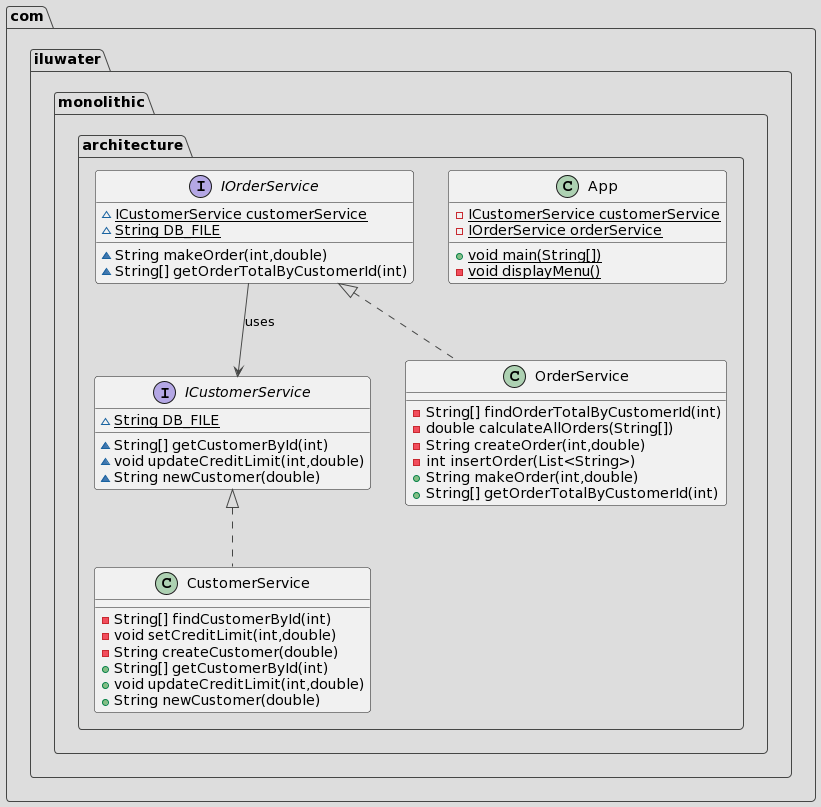

---

title: Monolithic Architecture 
category: Architectural  
language: en  
tag:
- monolithic

---

## Intent

In a monolithic architecture, services are interconnected and share data within the same system boundary. This approach centralizes the e-commerce operations, ensuring data integrity and simplifying cross-service updates.

## Explanation

Real world example

> Consider our e-commerce application which encompasses two primary functionalities: managing orders and customer information. Specifically, the `Order module` is responsible for storing and processing order details while the `Customer module` keeps track of customer data.  
> When a customer places a new order, it becomes crucial for the `Order module` to communicate with the `Customer module`. This is to check if the order being placed doesn't exceed the customer's credit limit.  
> Instead of relying on distributed data storage or external calls, our monolithic architecture enables the `Order Service` and `Customer module` to seamlessly interact with each other's data directly, ensuring the order's adherence to the customer's credit limit.

In plain words

> Monolithic architecture bundles different modules together under one system, allowing them to easily access and modify shared data, ensuring data consistency.

Wikipedia says

> In software engineering, a monolithic application describes a software application that is designed as a single service.

**Programmatic Example**

Let's start from the layout of the shared database. Here's our `localdb.txt`.

```txt
CUSTOMERS  
ID, CREDIT_LIMIT  
234, 60000.0  
235, 1000.0  
  
ORDERS  
ID, CUSTOMER_ID, STATUS, TOTAL  
4567, 234, ACCEPTED, 54044.30
```  

Next we can introduce our `CustomerModule`. It contains `getCustomer`, `updateCreditLimit`   and `createCustomer`  for calling customer module.

```java  
/**
 * Module interface defining the operations related to customers.
 */
public interface CustomerModuleInterface {

    /** Path to the database file where customer data is stored. */
    String DB_FILE = "monolithic-architecture/etc/localdb.txt";

    /**
     * Retrieves the customer details for the given customer ID.
     *
     * @param customerId The ID of the customer whose details are to be fetched.
     * @return An array containing the customer details.
     * @throws Exception If any error occurs while fetching the data.
     */
    String[] getCustomerById(int customerId) throws Exception;

    /**
     * Updates the credit limit for the customer with the specified ID.
     *
     * @param customerId The ID of the customer whose credit limit needs to be updated.
     * @param newCreditLimit The new credit limit value to be set for the customer.
     * @throws Exception If any error occurs while updating the credit limit.
     */
    void updateCreditLimit(int customerId, double newCreditLimit) throws Exception;

    /**
     * Creates a new customer with the specified initial credit limit.
     *
     * @param creditLimit The initial credit limit for the new customer.
     * @return The ID of the newly created customer.
     * @throws Exception If any error occurs while creating a new customer.
     */
    String newCustomer(double creditLimit) throws Exception;
}

```  

Then we can introduce our `OrderModule`. It contains find method `getOrderTotalByCustomerId` and  create method `makeOrder`  for calling order module.

```java  
/**
 * Module interface defining the operations related to orders.
 */
public interface OrderModuleInterface {

    ICustomeModule customerModule = new CustomerModule();
    String DB_FILE = "monolithic-architecture/etc/localdb.txt";

    /**
     * Create a new order for a given customer with a specified total.
     *
     * @param customerId The ID of the customer making the order.
     * @param total The total amount for the order.
     * @return The ID of the newly created order.
     * @throws Exception If there's an error during order creation.
     */
    String makeOrder(int customerId, double total) throws Exception;

    /**
     * Fetches the total of all orders made by a specific customer.
     *
     * @param customerId The ID of the customer whose order totals are to be fetched.
     * @return An Optional containing the order totals in String array format.
     * @throws Exception If there's an error during data retrieval.
     */
    String[] getOrderTotalByCustomerId(int customerId) throws Exception;
}
```  

Now running the `App` for interactive functionalities calling :

```bash
Choose an option:
1. Get Customer by ID
2. Update Customer Credit Limit
3. Create New Customer
4. Make an Order
5. Get Order Total by Customer ID
Q. Quit
Your choice: 1
Enter Customer ID: 234
Customer Info: 234, 60000.0

Choose an option:
1. Get Customer by ID
2. Update Customer Credit Limit
3. Create New Customer
4. Make an Order
5. Get Order Total by Customer ID
Q. Quit
Your choice: 2
Enter Customer ID: 234
Enter New Credit Limit: 60000.0
Credit Limit Updated Successfully!

Choose an option:
1. Get Customer by ID
2. Update Customer Credit Limit
3. Create New Customer
4. Make an Order
5. Get Order Total by Customer ID
Q. Quit
Your choice: 
```


## Class diagram



## Applicability

Use the Monolithic Architecture pattern when you want to ensure data consistency and require high application performance.

## Credits

* [Wikipedia - monolithic architecture](https://en.wikipedia.org/wiki/Monolithic_application)
* [Monolithic architecture (microservices.io)](https://microservices.io/patterns/monolithic.html)
