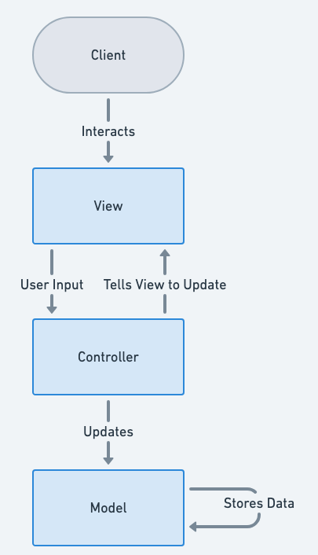

## Monolithic-Ecommerce App
* A Monolithic Ecommerce example to showcase Monolithic Architecture

## The Intent of Monolithic Design pattern
> the Monolithic Design Pattern structures an application as a single, cohesive unit where all components—such as business logic, user interface, and data access are tightly integrated and operate as part of a single executable.

## Detailed Explanation of the Monolithic Architecture
Real-world Example
> A traditional E-commerce website is the most straightforward example for a monolithic application as it is comprised of a catalogue of products, orders to be made, shopping carts, and payment processes that are all inseperable of each other.

In Plain words
>The monolithic design pattern structures an application as a single unified unit, where all components are tightly coupled and run within a single process.

GeeksforGeeks states
> Monolithic architecture, a traditional approach in system design, which contains all application components into a single codebase. This unified structure simplifies development and deployment processes, offering ease of management and tight integration. However, because of its rigidity, it is difficult to scale and maintain, which makes it difficult to adjust to changing needs.

Why use MVC for a Monolithic Application ?
>The Model-View-Controller (MVC) pattern is not inherently tied to microservices or distributed systems. It's a software design pattern that organizes the codebase by separating concerns into three distinct layers:
>* Model
>* View
>* Controller
>
> this also helps maintain the principles of a Monolithic Architecture which are:
> 
> Simple to
>* Develop
>* Test
>* Deploy
>* Scale
>

Architecture diagram



## We can clearly see that this is a Monolithic application through the main class
This is a simplified version of the main application that shows the main interaction point with the CLI and how a user is registered
```java
@SpringBootApplication
public class EcommerceApp implements CommandLineRunner {

  private static final Logger log = LogManager.getLogger(EcommerceApp.class);
  private final UserCon userService;
  private final ProductCon productService;
  private final OrderCon orderService;
  public EcommerceApp(UserCon userService, ProductCon productService, OrderCon orderService) {
    this.userService = userService;
    this.productService = productService;
    this.orderService = orderService;
  }
  public static void main(String... args) {
    SpringApplication.run(EcommerceApp.class, args);
  }
  @Override
  public void run(String... args) {
    Scanner scanner = new Scanner(System.in, StandardCharsets.UTF_8);

    log.info("Welcome to the Monolithic E-commerce CLI!");
    while (true) {
      log.info("\nChoose an option:");
      log.info("1. Register User");
      log.info("2. Add Product");
      log.info("3. Place Order");
      log.info("4. Exit");
      log.info("Enter your choice: ");

      int userInput = scanner.nextInt();
      scanner.nextLine();

      switch (userInput) {
        case 1 -> registerUser(scanner);
        case 2 -> addProduct(scanner);
        case 3 -> placeOrder(scanner);
        case 4 -> {
          log.info("Exiting the application. Goodbye!");
          return;
        }
        default -> log.info("Invalid choice! Please try again.");
      }
    }
  }
  protected void registerUser(Scanner scanner) {
    log.info("Enter user details:");
    log.info("Name: ");
    String name = scanner.nextLine();
    log.info("Email: ");
    String email = scanner.nextLine();
    log.info("Password: ");
    String password = scanner.nextLine();

    User user = new User(null, name, email, password);
    userService.registerUser(user);
    log.info("User registered successfully!");
  }

}
```
### We can clearly reach the conclusion that all of these classes reside under the same module and are essential for each other's functionality, this is supported by the presence of all relevant classes as parts of the main application class.

## When should you resort to a Monolithic Architecture ?
>* An enterprise Starting off with a relatively small team
>* Simplicity is the most important factor of the project
>* Maintaining less entry points to the system is cruical
>* Prototyping ideas
>
## Pros & Cons of using Monolithic Architecture
>### Pros:
>* Simple Development: Easy to develop and deploy.
>* Unified Codebase: All code in one place, simplifying debugging.
>* Better Performance: No inter-service communication overhead.
>* Lower Costs: Minimal infrastructure and tooling requirements.
>* Ease of Testing: Single application makes end-to-end testing straightforward.
>   * This is also assisted by the MVC structure employed in this example.
>### Cons:
>* Scalability Issues: Cannot scale individual components.
>* Tight Coupling: Changes in one area may impact the whole system.
>* Deployment Risks: A single failure can crash the entire application.
>* Complex Maintenance: Harder to manage as the codebase grows.
>* Limited Flexibility: Difficult to adopt new technologies for specific parts.

## Real-World Applications of Monolithic architecture Pattern in Java
>* E-Commerce Platforms
>* Content Management Systems (CMS)
>* Banking and Financial Systems
>* Enterprise Resource Planning (ERP) Systems
>* Retail Point of Sale (POS) Systems

## References
>* [GeeksforGeeks](https://www.geeksforgeeks.org/monolithic-architecture-system-design/)
>* [Wikipedia](https://en.wikipedia.org/wiki/Monolithic_application)
>* [vFunction](https://vfunction.com/blog/what-is-monolithic-application/#:~:text=A%20traditional%20e%2Dcommerce%20platform,inseparable%20components%20of%20the%20system.) Blog post
>* [Microservices.io](https://microservices.io/patterns/monolithic.html)
>* [IBM](https://www.ibm.com/think/topics/monolithic-architecture)
>#### References used to create the code
>* [Mockito](https://site.mockito.org/) -Testing
>* [Junit](https://junit.org/junit5/docs/current/user-guide/) -Testing 
>* [Springboot](https://docs.spring.io/spring-boot/index.html) -Web Application Initiation (implemented but not utilized in this example)
>* [Sprint Data Jpa](https://docs.spring.io/spring-data/jpa/reference/index.html) -Database connection
>* [Lombok](https://projectlombok.org/) -Simplifying Classes
>* [Log4j](https://logging.apache.org/log4j/2.x/index.html) -Capturing Logs
>* [H2 Databse](https://www.h2database.com/html/tutorial.html) -Efficient, Simple, Dynamic Databse