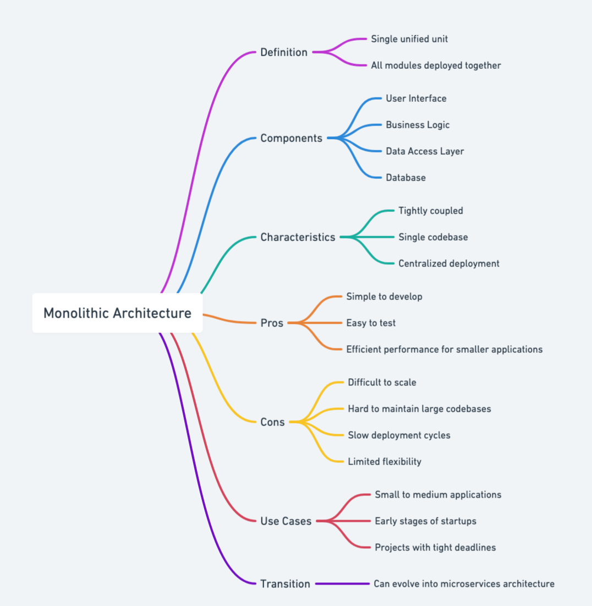
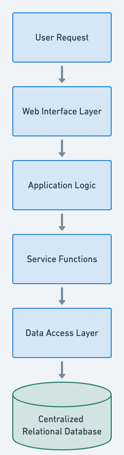

## Also known as

* Single-tier architecture
* Monolith

## The Intent of Monolithic Design pattern

Encapsulate all the functionality of an application within a single, cohesive codebase.

## Detailed Explanation of the Monolithic Architecture

Real-world example

> An analogous real-world example of the Monolithic Architecture pattern is a department store. Just like a monolithic Java application, a department store hosts all product categories, sales, storage, and customer services within a single, large building. It simplifies shopping by consolidating everything under one roof, making operations straightforward and easy to manage. However, expanding or rearranging specific departments becomes increasingly challenging over time, similar to how scaling individual functionalities within a monolithic system can become complex and cumbersome.

In plain words

> The monolithic design pattern structures an application as a single unified unit, where all components are tightly coupled and run within a single process.

Wikipedia says

> In software engineering, a monolithic application is a single unified software application that is self-contained and independent of other applications, but typically lacks flexibility. There are advantages and disadvantages of building applications in a monolithic style of software architecture, depending on requirements. Monolith applications are relatively simple and have a low cost but their shortcomings are lack of elasticity, fault tolerance and scalability.

Mind map



Flowchart



## Programmatic Example of Monolithic Architecture in Java

This is a simplified version of the main application, demonstrating how a monolithic architecture can be implemented. Here, all the essential services—such as user management (`UserCon`), product management (`ProductCon`), and order processing (`OrderCon`) — are tightly integrated within a single executable Java application. The CLI provides a straightforward user interaction point where operations like user registration, adding products, and placing orders are handled.

```java
@SpringBootApplication
public class EcommerceApp implements CommandLineRunner {

  private static final Logger log = LogManager.getLogger(EcommerceApp.class);
  private final UserCon userService;
  private final ProductCon productService;
  private final OrderCon orderService;
  public EcommerceApp(UserCon userService, ProductCon productService, OrderCon orderService) {
    this.userService = userService;
    this.productService = productService;
    this.orderService = orderService;
  }
  public static void main(String... args) {
    SpringApplication.run(EcommerceApp.class, args);
  }
  @Override
  public void run(String... args) {
    Scanner scanner = new Scanner(System.in, StandardCharsets.UTF_8);

    log.info("Welcome to the Monolithic E-commerce CLI!");
    while (true) {
      log.info("\nChoose an option:");
      log.info("1. Register User");
      log.info("2. Add Product");
      log.info("3. Place Order");
      log.info("4. Exit");
      log.info("Enter your choice: ");

      int userInput = scanner.nextInt();
      scanner.nextLine();

      switch (userInput) {
        case 1 -> registerUser(scanner);
        case 2 -> addProduct(scanner);
        case 3 -> placeOrder(scanner);
        case 4 -> {
          log.info("Exiting the application. Goodbye!");
          return;
        }
        default -> log.info("Invalid choice! Please try again.");
      }
    }
  }
  protected void registerUser(Scanner scanner) {
    log.info("Enter user details:");
    log.info("Name: ");
    String name = scanner.nextLine();
    log.info("Email: ");
    String email = scanner.nextLine();
    log.info("Password: ");
    String password = scanner.nextLine();

    User user = new User(null, name, email, password);
    userService.registerUser(user);
    log.info("User registered successfully!");
  }

}
```

In this example, the core business functionalities are closely interconnected, sharing common resources and residing within the same codebase. This approach simplifies initial application development, testing, and deployment, as each component can easily access the others directly without the overhead of inter-service communication. However, as the application grows, scaling individual components independently becomes more challenging, highlighting the key trade-off inherent in the monolithic architecture.

## When to Use the Monolithic Architecture in Java

* Suitable for small to medium-sized applications where simplicity, cohesive development, and ease of deployment outweigh scalability and flexibility requirements.
* Applicable in contexts where initial rapid development and ease of testing are prioritized.

## Real-World Applications of Monolithic Architecture in Java

* Early-stage Java web applications developed using frameworks like Spring MVC, Java EE (Servlets/JSP), or frameworks like Play.
* Traditional Java enterprise applications packaged and deployed as WAR or EAR files on application servers such as Apache Tomcat, Jetty, or WildFly.
* Standalone Java applications and desktop applications packaged as single executable JAR files.

## Benefits and Trade-offs of Monolithic Architecture

Benefits:

* Simpler to develop, test, and deploy as the application is a single unit.
* Easier debugging and performance monitoring due to the single unified runtime.
* Typically faster initial development and straightforward management of dependencies.

Trade-offs:

* Poor scalability and potential performance bottlenecks as the application grows.
* Limited modularity, leading to increased complexity and harder maintainability over time.
* Slow deployments and updates due to a single large codebase.
* Difficult to scale individual functionalities independently.

## Related Patterns

* Microservices Architecture: Breaks down a monolithic application into independently deployable services, directly addressing the scalability and maintainability limitations of monoliths.
* [Layered Architecture](https://java-design-patterns.com/patterns/layered-architecture/): Often used internally within monoliths to provide clear separation between presentation, business logic, and persistence layers.

## References

* [Building Microservices](https://amzn.to/3UACtrU)
* [Fundamentals of Software Architecture: An Engineering Approach](https://amzn.to/4cx4A2N)
* [Monolithic Architecture - System Design (GeeksforGeeks)](https://www.geeksforgeeks.org/monolithic-architecture-system-design/)
* [Monolithic Application (Wikipedia)](https://en.wikipedia.org/wiki/Monolithic_application)
* [Pattern: Monolithic Architecture (Microservices.io)](https://microservices.io/patterns/monolithic.html)
* [Patterns of Enterprise Application Architecture](https://amzn.to/3WfKBPR)
* [What Is Monolithic Architecture? (IBM)](https://www.ibm.com/think/topics/monolithic-architecture)
