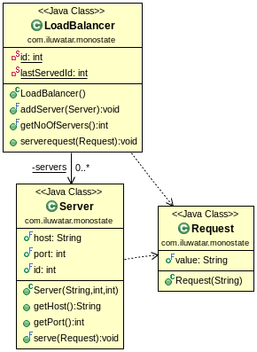

## Also known as
Borg

## Intent
Monostate is an alternative approach to achieving a singleton-like behavior in object-oriented design. It enforces a unique behavior where all instances of a class share the same state. Unlike the Singleton pattern, which restricts a class to a single instance, Monostate allows for multiple instances but ensures they all have a shared state.

## Explanation

Real-word example

> In a cloud-based document editing service, multiple users can collaborate on the same document simultaneously. To ensure consistency across different user sessions, the system maintains a shared state that includes the document’s content, the cursor position of each user, and any comments made on the document. Instead of coupling each user’s session directly to each other, the system utilizes the Monostate pattern to share the state among all active sessions. Each user interacts with their own instance of a DocumentSession class, unaware that they are all sharing the same underlying state. This approach decouples the individual sessions from each other, while ensuring real-time consistency and collaboration across all users working on the document.


In plain words

> Monostate allows multiple instances of a class to share the same state by channeling their state management through a common shared structure. This ensures consistent state across all instances while maintaining the facade of independent objects.


**Programmatic Examples**

Suppose you are developing an online multi-person collaborative drawing application that allows multiple users to draw simultaneously on the same canvas. In order to synchronize the views of all users, you need to ensure that all users see the same canvas state, including the current background color and brush size. Therefore, you decide to use Monostate mode to synchronize these settings across all user interfaces.

```
public class CanvasSettings {
    private static String backgroundColor = "White";
    private static int brushSize = 5;

    public void setBackgroundColor(String color) {
        backgroundColor = color;
    }

    public String getBackgroundColor() {
        return backgroundColor;
    }

    public void setBrushSize(int size) {
        if (size > 0) {
            brushSize = size;
        }
    }

    public int getBrushSize() {
        return brushSize;
    }
}
```
* CanvasSettings class manages settings for drawing applications, such as background color and brush size.
* It uses static fields to store state, ensuring that all instances of the CanvasSettings class share the same state.
* setBackgroundColor, getBackgroundColor, setBrushSize, and getBrushSize methods are used to modify and retrieve settings.

```
public class MonostateExample {
    public static void main(String[] args) {
        CanvasSettings user1Settings = new CanvasSettings();
        CanvasSettings user2Settings = new CanvasSettings();

        // Initially, both instances share the same state
        System.out.println("User 1 Background Color: " + user1Settings.getBackgroundColor());  // output: White
        System.out.println("User 2 Brush Size: " + user2Settings.getBrushSize());  // output: 5

        // User 1 changes the background color
        user1Settings.setBackgroundColor("Blue");

        /// The change is reflected in the settings of User 2
        System.out.println("User 2 Background Color (after change): " + user2Settings.getBackgroundColor());  // output: Blue

       // User 2 changes the brush size
        user2Settings.setBrushSize(10);

        // The change is reflected in the settings of User 1
        System.out.println("User 1 Brush Size (after change): " + user1Settings.getBrushSize());  // output: 10
    }
}
```
In this MonostateExample class, we demonstrate how to create instances for two users and show that changes to settings in one instance are reflected in the other instance.

## Class diagram


## Applicability
Use the Monostate pattern when

1. **Shared State Across Instances:** All instances of a class must share the same state. Changes in one instance should be reflected across all instances.

2. **Transparent Usage:** Unlike Singleton, which can be less transparent in its usage, Monostate allows for a more transparent way of sharing state across instances. Clients interact with instances of the Monostate class as if they were regular instances, unaware of the shared state.

3. **Subclass Flexibility:** Monostate provides an advantage over Singleton when it comes to extending behavior through subclasses. Subclasses of a Monostate class can introduce additional behavior or modify existing behavior while still sharing the same state as instances of the base class. This allows for dynamic and diverse behaviors across different parts of an application, all while maintaining a shared state.

4. **Avoiding Global Variables:** The pattern is applicable when you want to avoid global variables but still need a shared state across multiple instances.

5. **Integration with Existing Systems:** Monostate can be more easily integrated into existing systems that expect to work with instances rather than a single global instance. This can lead to a smoother transition when refactoring code to use shared state.

6. **Consistent Configuration or State Management:** In scenarios where you need consistent configuration management or state management across different parts of an application, Monostate provides a pattern to ensure all parts of the system are in sync.

## Typical Use Case

* The logging class
* Managing a connection to a database
* File manager

