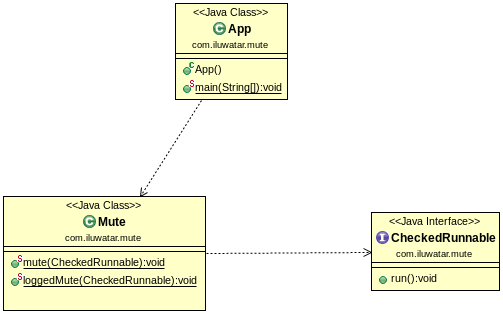

## Also known as

* Exception Suppression
* Quiet Exception

## Intent

The Mute Idiom is designed to simplify error handling by muting exceptions that are deemed non-critical or expected in specific contexts, especially within multithreaded or complex control flow environments.

## Explanation

Real-world example

> An analogous real-world example of the Mute Idiom design pattern is found in car door locking mechanisms.
>
> Imagine a car equipped with an automatic locking system that attempts to lock all doors when the car reaches a certain speed. In this system, if one of the doors is already locked, the system doesn't need to alert the driver or perform any special handling; it simply skips locking that door and continues with the others. The locking system "mutes" the handling of already locked doors, focusing only on those that need to be locked. This approach simplifies the logic and avoids unnecessary checks, similar to how the Mute Idiom in software development suppresses handling trivial exceptions.

In plain words

> The Mute Idiom design pattern suppresses the handling of trivial or non-critical exceptions to simplify code.

**Programmatic Example**

The Mute Idiom is a design pattern that is used to simplify error handling by muting exceptions that are deemed non-critical or expected in specific contexts. This pattern is particularly useful in multithreaded or complex control flow environments.

We have a `Resource` interface that has a `close` method which throws an `IOException`.

```java
public interface Resource extends AutoCloseable {
  @Override
  void close() throws IOException;
}
```

We also have an `App` class that uses this `Resource`. In the `App` class, we have a `useOfLoggedMute` method that demonstrates the use of the Mute Idiom. Here, we acquire a `Resource`, utilize it, and then attempt to close it. The closing of the resource is done in a `finally` block to ensure that it is executed regardless of whether an exception is thrown or not.

```java
public class App {
  // ...

  private static void useOfLoggedMute() {
    Optional<Resource> resource = Optional.empty();
    try {
      resource = Optional.of(acquireResource());
      utilizeResource(resource.get());
    } finally {
      resource.ifPresent(App::closeResource);
    }
  }

  // ...
}
```

The `closeResource` method is where the Mute Idiom is applied. We use the `Mute.loggedMute` method to suppress any `IOException` that might be thrown when closing the resource. This is done because the failure to close a resource is considered a non-critical issue that does not affect the overall logic or outcome of the program.

```java
public class App {
  // ...

  private static void closeResource(Resource resource) {
    Mute.loggedMute(resource::close);
  }

  // ...
}
```

In this way, the Mute Idiom allows us to simplify error handling by reducing boilerplate code for expected exceptions, enhancing code readability and maintainability, and allowing uninterrupted execution for non-critical exceptions.

## Class diagram



## Applicability

* Useful in scenarios where certain exceptions are predictable and do not affect the overall logic or outcome.
* Commonly used in logging, cleanup operations, or when working with APIs that signal non-critical issues via exceptions.

## Tutorials

* [The Mute Design Pattern (JOOQ)](http://blog.jooq.org/2016/02/18/the-mute-design-pattern/)

## Known Uses

* Muting exceptions in background tasks or threads where interruption is expected.
* Handling known issues in third-party libraries where exceptions can be safely ignored.

## Consequences

Benefits:

* Simplifies error handling by reducing boilerplate code for expected exceptions.
* Enhances code readability and maintainability.
* Allows uninterrupted execution for non-critical exceptions.

Trade-offs:

* Can lead to missed critical issues if overused or misapplied.
* Makes debugging harder if exceptions are muted indiscriminately.

## Related Patterns

* [Null Object](https://java-design-patterns.com/patterns/null-object/): Both aim to simplify error handling; Null Object avoids null checks while Mute Idiom avoids exception handling complexities.
* [Decorator](https://java-design-patterns.com/patterns/decorator/): Can be used to wrap functionality with additional error handling or muting behaviors.

## Credits

* [Effective Java](https://amzn.to/4cGk2Jz)
* [Java Concurrency in Practice](https://amzn.to/4aRMruW)
