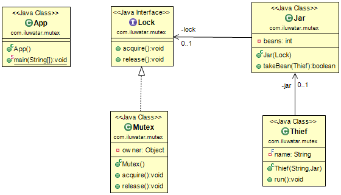

## Also known as

* Mutual Exclusion Lock
* Binary Semaphore

## Intent
Create a lock which only allows a single thread to access a resource at any one instant.

## Class diagram

## Applicability
Use a Mutex when

* You need to prevent two threads accessing a critical section at the same time
* Concurrent access to a resource could lead to a race condition 

## Credits

* [Lock (computer science)] (http://en.wikipedia.org/wiki/Lock_(computer_science))
* [Semaphores] (http://tutorials.jenkov.com/java-concurrency/semaphores.html)
