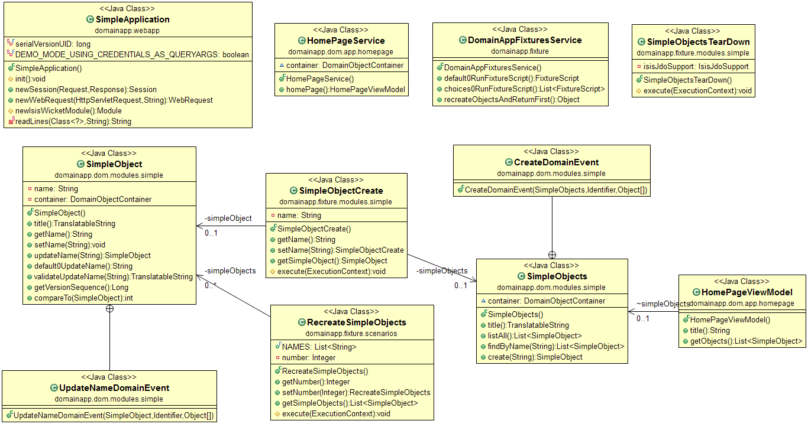

## Intent
The Naked Objects architectural pattern is well suited for rapid
prototyping. Using the pattern, you only need to write the domain objects,
everything else is autogenerated by the framework.

## Applicability
Use the Naked Objects pattern when

* you are prototyping and need fast development cycle
* an autogenerated user interface is good enough
* you want to automatically publish the domain as REST services

## Real world examples

* [Apache Isis](https://isis.apache.org/)

## Credits

* [Richard Pawson - Naked Objects](http://downloads.nakedobjects.net/resources/Pawson%20thesis.pdf)
