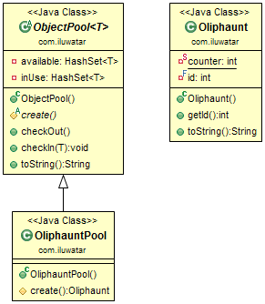

## Intent
When objects are expensive to create and they are needed only for
short periods of time it is advantageous to utilize the Object Pool pattern.
The Object Pool provides a cache for instantiated objects tracking which ones
are in use and which are available.

## Class diagram

## Applicability
Use the Object Pool pattern when

* The objects are expensive to create (allocation cost)
* You need a large number of short-lived objects (memory fragmentation)
