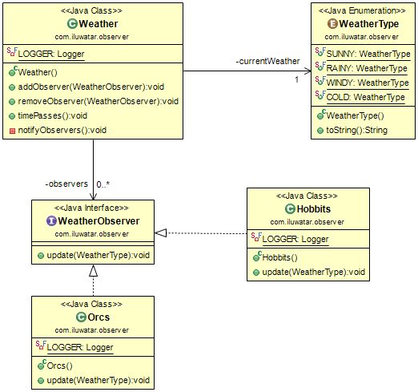

## Also known as
Dependents, Publish-Subscribe

## Intent
Define a one-to-many dependency between objects so that when one
object changes state, all its dependents are notified and updated
automatically.

## Class diagram

## Applicability
Use the Observer pattern in any of the following situations

* When an abstraction has two aspects, one dependent on the other. Encapsulating these aspects in separate objects lets you vary and reuse them independently
* When a change to one object requires changing others, and you don't know how many objects need to be changed
* When an object should be able to notify other objects without making assumptions about who these objects are. In other words, you don't want these objects tightly coupled

## Typical Use Case

* Changing in one object leads to a change in other objects

## Real world examples

* [java.util.Observer](http://docs.oracle.com/javase/8/docs/api/java/util/Observer.html)
* [java.util.EventListener](http://docs.oracle.com/javase/8/docs/api/java/util/EventListener.html)
* [javax.servlet.http.HttpSessionBindingListener](http://docs.oracle.com/javaee/7/api/javax/servlet/http/HttpSessionBindingListener.html)
* [RxJava](https://github.com/ReactiveX/RxJava)

## Credits

* [Design Patterns: Elements of Reusable Object-Oriented Software](http://www.amazon.com/Design-Patterns-Elements-Reusable-Object-Oriented/dp/0201633612)
* [Java Generics and Collections](http://www.amazon.com/Java-Generics-Collections-Maurice-Naftalin/dp/0596527756/)
