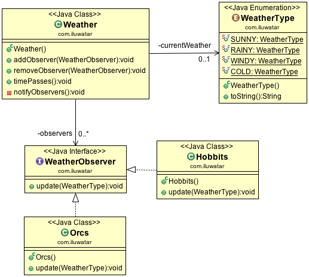

**Intent:** Define a one-to-many dependency between objects so that when one
object changes state, all its dependents are notified and updated
automatically.

**Applicability:** Use the Observer pattern in any of the following situations

* when an abstraction has two aspects, one dependent on the other. Encapsulating these aspects in separate objects lets you vary and reuse them independently
* when a change to one object requires changing others, and you don't know how many objects need to be changed
* when an object should be able to notify other objects without making assumptions about who these objects are. In other words, you don't want these objects tightly coupled

**Typical Use Case:**

* changing in one object leads to a change in other objects

**Real world examples:**

* [java.util.Observer](http://docs.oracle.com/javase/8/docs/api/java/util/Observer.html)
