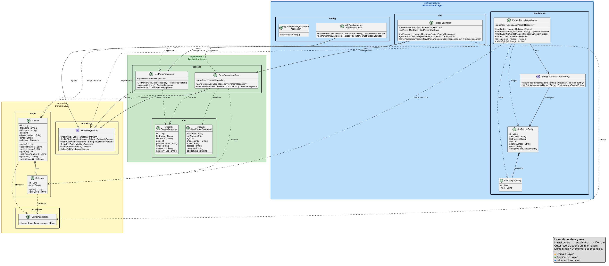

## Intent of Microservices API Gateway Design Pattern

In this project, the implementation demonstrates **Onion Architecture** with clear dependency direction: infrastructure and application depend on domain, but domain is independent.

The central intent is to keep business rules in `domain`, orchestrate use cases in `application`, and isolate delivery/persistence/API details in `infrastructure`.

Current implementation highlights:

* `domain`: `Person`, `Category`, `PersonRepository`, `DomainException`
* `application`: `SavePersonUseCase`, `GetPersonUseCase`, DTO records
* `infrastructure`: Spring Boot REST controller, JPA entities, repository adapter, bean wiring

## Also known as

* Ports and Adapters Architecture
* Hexagonal-style layering (conceptually related)
* Dependency-rule-first architecture

## Detailed Explanation of Onion Architecture Pattern with Real-World Examples

Real-world example

> Imagine a people-management service where business validation must stay consistent no matter how data is stored or exposed. In this codebase, `Person` and `Category` enforce invariants (e.g., age >= 18, required email/category), use cases coordinate behavior, and infrastructure adapts HTTP + JPA concerns. This allows the persistence or web layer to evolve without changing core domain rules.

In plain words

> The project keeps business logic in the center and treats frameworks as replaceable details around it.

Wikipedia says

> Onion Architecture is a software architecture pattern that emphasizes separation of concerns and dependency inversion by organizing code in concentric layers, with the domain model at the center.

Sequence diagram



Request flow in this implementation:

1. Client calls REST endpoint in `PersonController` (`/api/persons`, `/api/persons/{id}`)
2. Controller delegates to `SavePersonUseCase` or `GetPersonUseCase`
3. Use case interacts with `PersonRepository` abstraction from `domain`
4. `PersonRepositoryAdapter` maps domain <-> JPA and delegates to `SpringDataPersonRepository`
5. Response DTO (`PersonResponse`) is returned to the client

## Programmatic Example of Onion Architecture in Java

This repository exposes a simple person API backed by use cases and domain models.

Controller (infrastructure layer):

```java
@RestController
@RequestMapping("/api")
public class PersonController {

    @GetMapping("/persons/{id}")
    public ResponseEntity<PersonResponse> getPerson(@PathVariable Long id) {
        var person = getPersonUseCase.execute(id);
        return ResponseEntity.ok(person);
    }

    @GetMapping("/persons")
    public ResponseEntity<List<PersonResponse>> getAllPersons() {
        var persons = getPersonUseCase.executeAll();
        return ResponseEntity.ok(persons);
    }

    @PostMapping("/persons")
    public ResponseEntity<PersonResponse> savePerson(@RequestBody SavePersonCommand command) {
        try {
            var savedPerson = savePersonUseCase.execute(command);
            return ResponseEntity.status(HttpStatus.OK).body(savedPerson);
        } catch (DomainException e) {
            return ResponseEntity.status(HttpStatus.BAD_REQUEST).build();
        }
    }
}
```

Use case (application layer):

```java
public class SavePersonUseCase {

    private final PersonRepository repository;

    public PersonResponse execute(SavePersonCommand command) {
        var category = new Category(command.categoryId(), command.categoryType());
        var person = new Person(
                null,
                command.firstName(),
                command.lastName(),
                command.age(),
                command.phoneNumber(),
                command.email(),
                category);

        var savedPerson = repository.save(person);
        return new PersonResponse(
                savedPerson.getId(),
                savedPerson.getFirstName(),
                savedPerson.getLastName(),
                savedPerson.getAge(),
                savedPerson.getPhoneNumber(),
                savedPerson.getEmail(),
                savedPerson.getCategory().getId(),
                savedPerson.getCategory().getType()
        );
    }
}
```

Domain validation (domain layer):

```java
public class Person {
    public Person(Long id, String firstName, String lastName, int age,
                  String phoneNumber, String email, Category category) {
        validateNames(firstName, lastName);
        validateAge(age);
        validatePhone(phoneNumber);
        validateEmail(email);
        validateCategory(category);
        // assign fields...
    }
}
```

Repository adapter (infrastructure -> domain port):

```java
@Repository
public class PersonRepositoryAdapter implements PersonRepository {

    private final SpringDataPersonRepository repository;

    @Override
    public Optional<Person> findById(Long id) {
        return repository.findById(id).map(this::mapToDomain);
    }

    @Override
    public Person save(Person person) {
        JpaPersonEntity savedEntity = repository.save(mapToEntity(person));
        return mapToDomain(savedEntity);
    }
}
```

- **Maven 3.6.0** or higher

### Build Steps

1. **Navigate to the onion-architecture module directory:**
   ```bash
   cd java-design-patterns/onion-architecture
   ```

2. **Build all modules:**
   ```bash
   mvn clean package
   ```
   This will compile the `domain`, `application`, and `infrastructure` modules and package them into a Spring Boot executable JAR.

3. **Run the Spring Boot application:**
   ```bash
   mvn -pl infrastructure spring-boot:run
   ```
   Alternatively, after building, run the JAR directly:
   ```bash
   java -jar infrastructure/target/infrastructure-1.26.0-SNAPSHOT.jar
   ```

### Accessing the API

The application exposes REST endpoints at `http://localhost:8080/api`:
There is a Postman collection available in the `etc/postman` folder for testing the API.

- **Get all persons:**
  ```bash
  GET http://localhost:8080/api/persons
  ```

- **Get person by ID:**
  ```bash
  GET http://localhost:8080/api/persons/{id}
  ```

- **Create a new person:**
  ```bash
  POST http://localhost:8080/api/persons
  Content-Type: application/json

  {
    "firstName": "John",
    "lastName": "Doe",
    "age": 30,
    "phoneNumber": "555-1234",
    "email": "john.doe@example.com",
    "address": "123 Main St",
    "categoryId": 1,
    "categoryType": "individual"
  }
  ```

### Run Tests

To execute unit tests across all modules:

```bash
mvn clean test
```

To run tests for a specific module:

```bash
mvn -pl domain test
mvn -pl application test
mvn -pl infrastructure test
```

### Database

The application uses an **H2 in-memory database** for demonstration purposes. Configuration is in `infrastructure/src/main/resources/application.properties`:

- **JDBC URL:** `jdbc:h2:mem:testdb`
- **Username:** `sa`
- **Password:** `password`

Sample data is initialized from `infrastructure/src/main/resources/data.sql` on application startup.

## When to Use the Onion Architecture Pattern in Java

* When domain rules must be stable and independent from frameworks.
* When you want use cases to be testable without HTTP or database setup.
* When infrastructure details (web, JPA, database) should be replaceable.
* When dependency direction must be enforced from outer layers toward the domain core.

## Onion Architecture Pattern Java Tutorials

* [Clean Architecture with Spring Boot (Baeldung)](https://www.baeldung.com/spring-boot-clean-architecture)
* [Hexagonal Architecture Explained (Cockburn)](https://alistair.cockburn.us/hexagonal-architecture)
* [Spring Data JPA Reference](https://docs.spring.io/spring-data/jpa/reference/)

## Benefits and Trade-offs of Microservices API Gateway Pattern

Benefits:

* Business validations are centralized in domain constructors (`Person`, `Category`).
* Use cases stay independent from Spring, JPA, and transport concerns.
* Repository abstraction (`PersonRepository`) keeps application logic persistence-agnostic.
* Testability is strong across layers (domain, use case, adapter, controller tests).

Trade-offs:

* Additional mapping code between domain models, DTOs, and JPA entities.
* More classes and modules than a simple CRUD-by-controller approach.
* Requires discipline to avoid leaking infrastructure concerns into domain/application.

## Real-World Applications of Microservices API Gateway Pattern in Java

* People/contact management services with strict data validation.
* Internal platforms where multiple delivery mechanisms (REST, batch, messaging) can share the same core domain.
* Systems that need incremental infrastructure evolution while preserving business logic.

## Related Java Design Patterns

* [Repository](https://martinfowler.com/eaaCatalog/repository.html) - `PersonRepository` defines the domain-facing persistence contract.
* [Adapter](https://refactoring.guru/design-patterns/adapter) - `PersonRepositoryAdapter` bridges domain model and Spring Data JPA.
* [Dependency Injection](https://docs.spring.io/spring-framework/reference/core/beans/dependencies/factory-collaborators.html) - `ApplicationConfig` wires use case beans with repository implementations.

## References and Credits

* Project modules: `domain`, `application`, `infrastructure`
* Java 21 + Maven multi-module setup
* Spring Boot 3.3 (`spring-boot-starter-web`, `spring-boot-starter-data-jpa`, H2)
* Layer-focused tests in each module validating domain invariants and use case behavior

