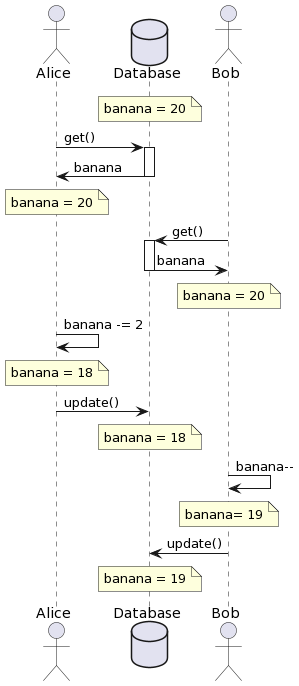
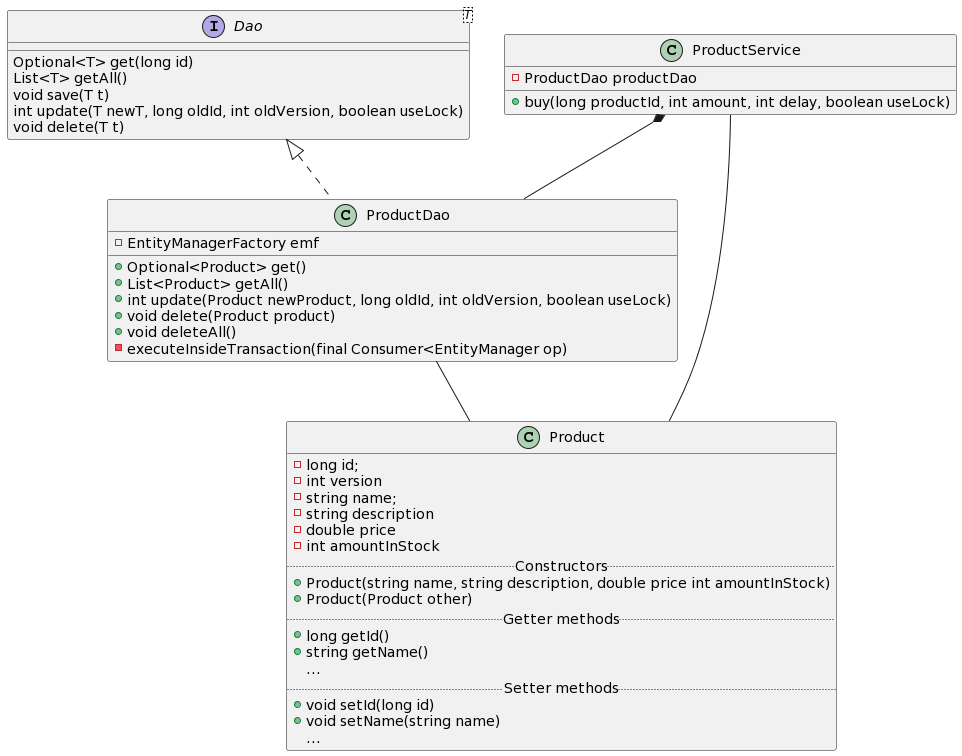
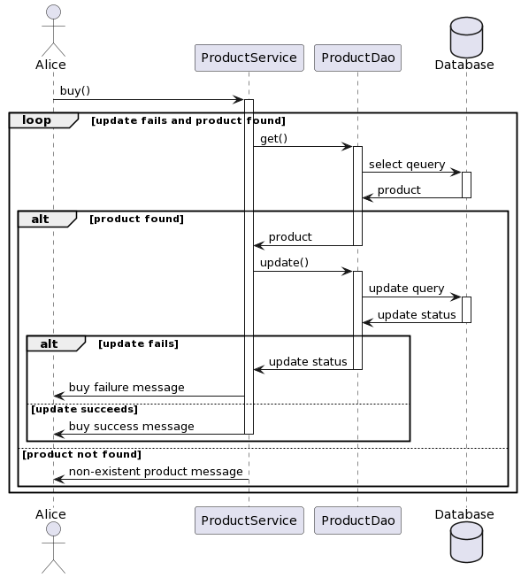

## Intent

Optimistic Concurrency pattern provides a solution to maintain transactional integrity of objects that are concurrently accessed by multiple clients.

## Explanation

An update operation consists of 3 steps:
1. Fetch data from database
2. Make changes to local data
3. Persist changes to the database

These steps are not instantaneous.

It is possible for multiple clients/processes to attempt update on the same entity in the database simultaneously. 
This results in ***Race Condition***. Depending on delays, these steps may or may not overlap. 

If they don't overlap, the execution appear to be normal.
However, when they overlap, the bug will be discovered.

#### Abnormal Condition



As shown in the figure, in between Bob's Step 1 and 3, Alice already performed an update. Thus, Bob has outdated data in his local copy. 
When he finally performs his update, he overrides Alice's update. In the end, banana = 19 when it should be 17. 
This violates the transactional integrity

#### Optimistic Concurrency

To handle race condition, Optimistic Concurrency pattern attaches a version identifier to objects. 
Ultimately, this prevents client from performing update with old version of the data.

1. Fetch object from database and make a local copy. It will be associated with some version number.
2. Make changes to the local copy.
3. Attempt to persist changes to the database with the old version number as a filter condition. 
4. Two things can happen. 
   1. If no one has made any change to the object, then the version number remain the same and the filter finds a match. Then, the update is successful. 
   2. If no match is found, no update will be performed. This will raise an exception and have the clients retry the operation.

## Class diagram



## Sequence diagram



## Programmatic Example

Construct instance of EntityManagerFactory, ProductDao, ProductService to access the database
```java
EntityManagerFactory emf =
        Persistence.createEntityManagerFactory("AdvancedMapping");

ProductDao productDao = new ProductDao(emf);
ProductService productService = new ProductService(emf);
```
Create some instances of Product and insert into database
```java
Product apple = new Product("apple", "The apple is very delicious!",
        applePrice, appleNum);
Product banana = new Product("banana", "The banana is fresh!",
        banaPrice, banaNum);
productDao.save(apple);
productDao.save(banana);
```
Create two threads which performs the buy method with useLock=true
```java
Thread t1 = new Thread(() -> {
    productService.buy(id1, buyAmount1, delay1, true);
});
Thread t2 = new Thread(() -> {
    productService.buy(id1, buyAmount2, delay2, true);
});
```
Start the two threads, wait for them to finish, and query changes from database again.
```java
// start threads
t1.start();
t2.start();
t3.start();
t4.start();

try {
    // wait for threads to finish
    t1.join();
    t2.join();

    Optional<Product> result1 = productDao.get(id1);

    if (result1.isPresent() && result2.isPresent()) {
        apple = result1.get();

        System.out.printf("There are %d apples left.\n", 
                apple.getAmountInStock());
    }

    emf.close();
} catch (InterruptedException e) {
    e.printStackTrace();
}
```

## Reference
https://www.javacodegeeks.com/2012/11/jpahibernate-version-based-optimistic-concurrency-control.html